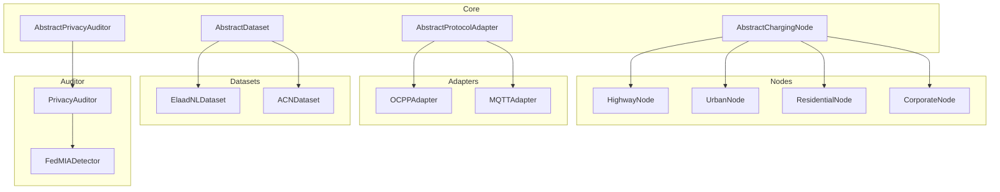

# ChargeShield-FL — Architecture

## Core Principles

- **Core** → no protocols, no datasets, no FL
- **Node** → no datasets
- **Dataset** → no FL
- **FL** → no Privacy Auditor
- Everything connected via **Adapter Pattern**

## Layer Diagram



## Topology — 12 Nodes, 4 Clusters

```mermaid
graph LR
    AGG[Aggregator]

    subgraph Highway
        hw01[highway-01]
        hw02[highway-02]
        hw03[highway-03]
    end

    subgraph Urban
        ur01[urban-01]
        ur02[urban-02]
        ur03[urban-03]
    end

    subgraph Residential
        re01[residential-01]
        re02[residential-02]
        re03[residential-03]
    end

    subgraph Corporate
        co01[corporate-01]
        co02[corporate-02]
        co03[corporate-03]
    end

    hw01 & hw02 & hw03 --> AGG
    ur01 & ur02 & ur03 --> AGG
    re01 & re02 & re03 --> AGG
    co01 & co02 & co03 --> AGG

## Sprint 2 — Concrete Implementations

```mermaid
classDiagram
    class AbstractChargingNode {
        <<abstract>>
        +config: NodeConfig
        +collect_data() dict
        +preprocess(raw) dict
        +get_status() str
    }

    class ChargingNode {
        +protocol_adapter: AbstractProtocolAdapter
        +collect_data() dict
        +preprocess(raw) dict
        +get_status() str
    }

    class AbstractProtocolAdapter {
        <<abstract>>
        +encode(data) bytes
        +decode(raw) bytes
        +get_protocol_name() str
    }

    class OCPP16Adapter {
        +encode(data) bytes
        +decode(raw) bytes
        +get_protocol_name() str
    }

    class AbstractDataset {
        <<abstract>>
        +load(path) None
        +get_sample(index) dict
        +__len__() int
        +get_feature_names() list
    }

    class ElaadNLDataset {
        +load(path) None
        +get_sample(index) dict
        +__len__() int
        +get_feature_names() list
    }

    AbstractChargingNode <|-- ChargingNode
    AbstractProtocolAdapter <|-- OCPP16Adapter
    AbstractDataset <|-- ElaadNLDataset
    ChargingNode --> AbstractProtocolAdapter
```
```
