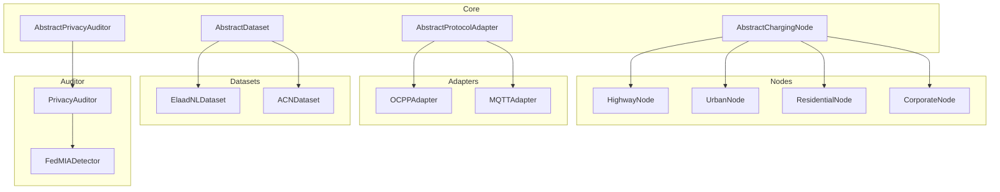
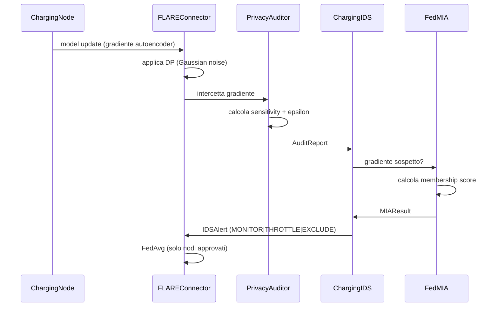
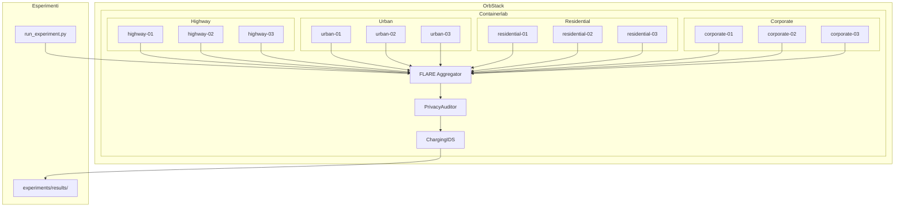
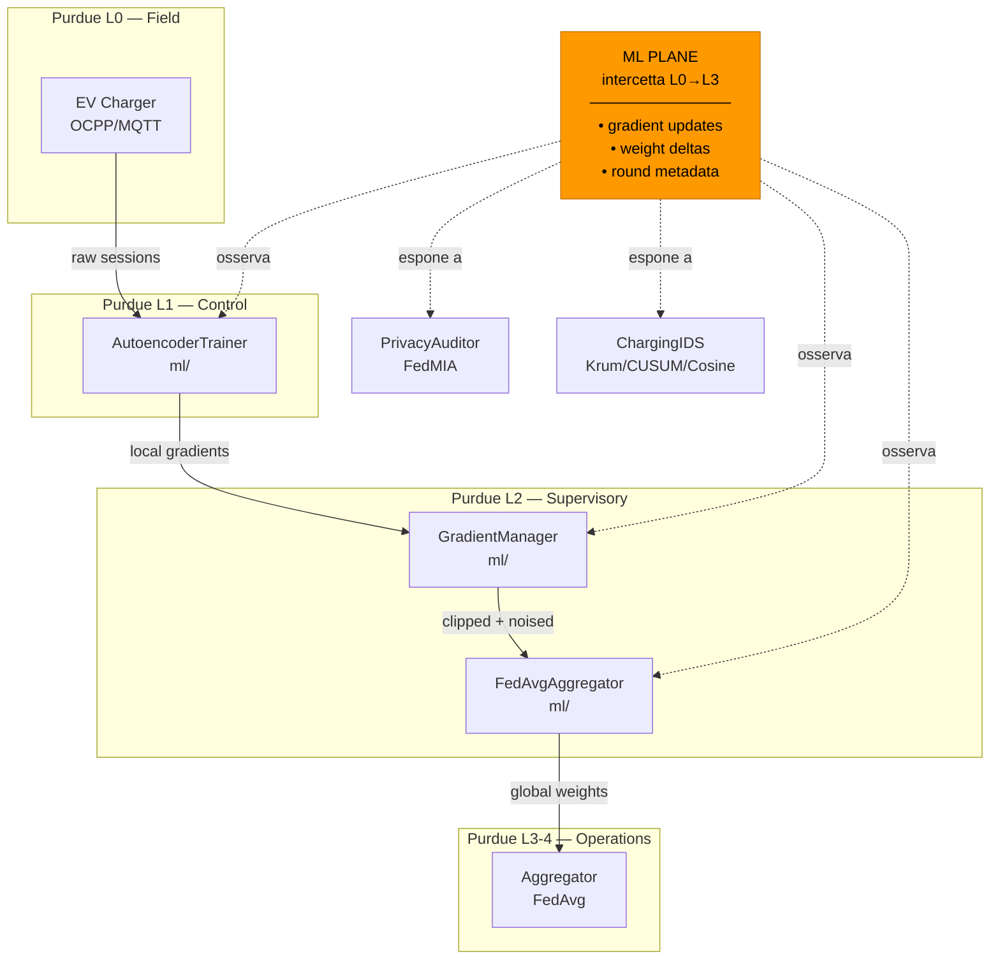

# ChargeShield-FL — Architecture

## Core Principles

- **Core** → no protocols, no datasets, no FL
- **Node** → no datasets
- **Dataset** → no FL
- **FL** → no Privacy Auditor
- Everything connected via **Adapter Pattern**

## Layer Diagram



## Topology — 12 Nodes, 4 Clusters

```mermaid
graph LR
    AGG[Aggregator]

    subgraph Highway
        hw01[highway-01]
        hw02[highway-02]
        hw03[highway-03]
    end

    subgraph Urban
        ur01[urban-01]
        ur02[urban-02]
        ur03[urban-03]
    end

    subgraph Residential
        re01[residential-01]
        re02[residential-02]
        re03[residential-03]
    end

    subgraph Corporate
        co01[corporate-01]
        co02[corporate-02]
        co03[corporate-03]
    end

    hw01 & hw02 & hw03 --> AGG
    ur01 & ur02 & ur03 --> AGG
    re01 & re02 & re03 --> AGG
    co01 & co02 & co03 --> AGG

## Sprint 2 — Concrete Implementations

```mermaid
classDiagram
    class AbstractChargingNode {
        <<abstract>>
        +config: NodeConfig
        +collect_data() dict
        +preprocess(raw) dict
        +get_status() str
    }

    class ChargingNode {
        +protocol_adapter: AbstractProtocolAdapter
        +collect_data() dict
        +preprocess(raw) dict
        +get_status() str
    }

    class AbstractProtocolAdapter {
        <<abstract>>
        +encode(data) bytes
        +decode(raw) bytes
        +get_protocol_name() str
    }

    class OCPP16Adapter {
        +encode(data) bytes
        +decode(raw) bytes
        +get_protocol_name() str
    }

    class AbstractDataset {
        <<abstract>>
        +load(path) None
        +get_sample(index) dict
        +__len__() int
        +get_feature_names() list
    }

    class ElaadNLDataset {
        +load(path) None
        +get_sample(index) dict
        +__len__() int
        +get_feature_names() list
    }

    AbstractChargingNode <|-- ChargingNode
    AbstractProtocolAdapter <|-- OCPP16Adapter
    AbstractDataset <|-- ElaadNLDataset
    ChargingNode --> AbstractProtocolAdapter
```
``
## Sprint 3 — Privacy Auditor, FLARE Integration, Containerlab

### PrivacyAuditor (src/auditor/privacy_auditor.py)
**Ruolo: ATTACCANTE (Membership Inference)**

Non è una difesa. È lo strumento con cui un avversario analizza
i model update dei nodi PRIMA dell'aggregazione per inferire
se un campione specifico è stato usato nel training.


```mermaid
classDiagram
    class AbstractPrivacyAuditor {
        <<abstract>>
        +audit(node_id, round_id, model_update) AuditReport
        +reset() None
        +get_cumulative_epsilon(node_id) float
    }

    class PrivacyAuditor {
        -epsilon_budget: float
        -delta: float
        -cumulative_epsilon: dict
        +audit(node_id, round_id, model_update) AuditReport
        +reset() None
        +get_cumulative_epsilon(node_id) float
        -_compute_sensitivity(model_update) float
        -_detect_threats(model_update, sensitivity) list
    }

    class FLAREConnector {
        -aggregator_url: str
        -n_rounds: int
        +start_round(round_id) None
        +collect_updates(nodes) list
        +aggregate(updates) dict
    }

    class ContainerlabTopology {
        -nodes: list
        -clusters: list
        +generate_topology() None
    }

    AbstractPrivacyAuditor <|-- PrivacyAuditor
    PrivacyAuditor --> FLAREConnector
````
### FedMIA (src/plugins/attacks/fedmia.py) — Sprint 4
**Ruolo: ATTACCO completo di Membership Inference**

Implementa l'attacco descritto in Shokri et al. (IEEE S&P 2017).
Riceve i gradienti intercettati dal PrivacyAuditor e tenta
di inferire la membership dei dati di training.

### AbstractIDS / ChargingIDS (src/ids/) — Sprint 4
**Ruolo: DIFESA**

Monitora il comportamento dei nodi durante i round FL.
Riceve gli AuditReport dal PrivacyAuditor e decide se
un nodo è sospetto (MONITOR | THROTTLE | EXCLUDE).

### Differential Privacy
**Ruolo: CONTROMISURA**

Non è nel PrivacyAuditor — è nel layer FL (src/flare/).
Aggiunge rumore gaussiano ai gradienti PRIMA che vengano
intercettati, rendendo il MIA più difficile.

## Separazione dei ruoli

| Modulo | Ruolo | Sprint |
|--------|-------|--------|
| PrivacyAuditor | Attaccante MIA | 3 |
| FedMIA | Attacco completo | 4 |
| AbstractIDS | Interfaccia difesa | 3 |
| ChargingIDS | Difesa concreta | 4 |
| FLARE + DP | Contromisura | 3 |
| Containerlab | Infrastruttura | 3 |

## Sprint 4 — FedMIA, ChargingIDS, Autoencoder, Esperimenti

```mermaid
classDiagram

    class AbstractIDS {
        <<abstract>>
        +analyze(report) IDSAlert
        +update_baseline(node_id, report) None
        +get_node_risk_score(node_id) float
        +reset() None
    }

    class ChargingIDS {
        -baselines: dict
        -risk_scores: dict
        -alert_threshold: float
        +analyze(report) IDSAlert
        +update_baseline(node_id, report) None
        +get_node_risk_score(node_id) float
        +reset() None
    }

    class FedMIA {
        -shadow_model: Autoencoder
        -attack_threshold: float
        +run_attack(node_id, gradients) MIAResult
        +train_shadow_model(dataset) None
        +compute_membership_score(gradient) float
    }

    class Autoencoder {
        -encoder: Sequential
        -decoder: Sequential
        -threshold: float
        +forward(x) Tensor
        +reconstruction_error(x) float
        +is_anomaly(x) bool
        +fit(dataloader) None
    }

    class MIAResult {
        +node_id: str
        +round_id: int
        +membership_score: float
        +is_member: bool
        +confidence: float
    }

    AbstractIDS <|-- ChargingIDS
    ChargingIDS --> FedMIA
    FedMIA --> Autoencoder
    FedMIA --> MIAResult
```

## Flusso completo Sprint 4


## Sprint 5 — Deploy reale, FLARE, Esperimenti


## ML Plane — Transversal Layer (Sprint 5)

Il ML Plane è **ortogonale** ai layer Core/Node/Dataset/FL.
Attraversa verticalmente tutti i livelli Purdue (L0→L3/L4),
catturando il traffico ML che il modello Purdue non contempla.



### Componenti ML Plane

| Classe | File | Responsabilità |
|---|---|---|
| `AbstractMLModel` | `src/ml/base_ml.py` | interfaccia astratta + eventi ML Plane |
| `AutoencoderTrainer` | `src/ml/autoencoder_trainer.py` | training loop locale, FedAvg/FedProx (L0→L1) |
| `GradientManager` | `src/ml/gradient_manager.py` | gradient clipping + Gaussian noise DP (L1→L2) |
| `FedAvgAggregator` | `src/ml/fedavg_aggregator.py` | FedAvg media pesata per n_samples (L2→L3) |

### FedAvg vs FedProx

`AutoencoderTrainer` supporta entrambi via `proximal_mu` in config:
- `proximal_mu: 0.0` → FedAvg puro (McMahan et al., 2017)
- `proximal_mu: > 0.0` → FedProx (Li et al., 2020): aggiunge termine
  `(mu/2) * ||w - w_global||²` alla loss locale per stabilizzare
  la convergenza su dati non-IID (cluster con pattern di carica eterogenei).

ACN-Data JPL ha cluster non-IID per natura (Highway/Urban/Residential/Corporate):
FedProx è raccomandato per gli esperimenti finali.

### Gap del Purdue Model

Il Purdue Model definisce livelli per il traffico OT (SCADA, MODBUS, OCPP)
ma non contempla il **traffico ML** (gradienti, delta pesi, metadati di round)
che attraversa verticalmente tutti i livelli.

ML Plane colma questo gap: rende il traffico FL **visibile e analizzabile**,
abilitando FedMIA (attacco) e IDS (difesa) su un canale altrimenti cieco.
