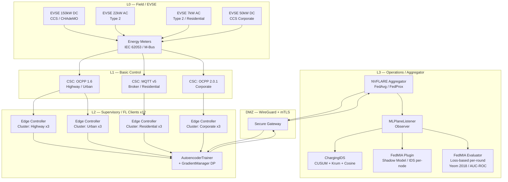
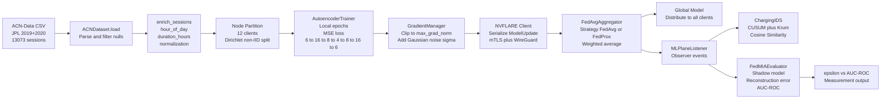

# ChargeShield-FL: Architecture and Design Specification

**Document Version:** 1.0.0
**Status:** Research Draft — DSN 2027 Submission Track
**Date:** 2026-06-26
**Classification:** Public Research

---

## Abstract

ChargeShield-FL is a modular, reproducible research framework for evaluating Membership Inference Attacks (MIA) against Federated Learning (FL) systems deployed within Electric Vehicle (EV) charging infrastructure. The framework does not propose a novel FL algorithm; rather, its scientific contribution is the framework itself: a realistic, protocol-faithful, privacy-aware testbed that bridges the gap between academic FL privacy research and the operational realities of industrial Operational Technology (OT) environments. ChargeShield-FL instantiates twelve heterogeneous charging nodes organized into four clusters, each governed by distinct communication protocols (OCPP 1.6, OCPP 2.0.1, MQTT v5), and orchestrates a complete FL training lifecycle using NVFLARE 2.7.2. It implements Differential Privacy (DP) via the Gaussian Mechanism and evaluates membership leakage using FedMIA, measuring the trade-off between privacy budget ε and attack success expressed as AUC-ROC. The framework is containerized via Docker and Containerlab, secured with mTLS and WireGuard, and structured around four software design patterns that together enable modular extensibility without modification of core components. ChargeShield-FL is intended as a community testbed for reproducible privacy research in EV charging OT environments, addressing an understudied intersection of industrial control systems security, federated learning, and differential privacy.

---

## Table of Contents

1. [Executive Summary](#1-executive-summary)
2. [Industrial OT Context](#2-industrial-ot-context)
3. [Purdue Model Mapping](#3-purdue-model-mapping)
4. [Software Architecture](#4-software-architecture)
5. [Component Reference](#5-component-reference)
6. [Data Pipeline](#6-data-pipeline)
7. [Cluster Configuration and Protocol Analysis](#7-cluster-configuration-and-protocol-analysis)
8. [Infrastructure Layer](#8-infrastructure-layer)
9. [Scientific Contribution Framing](#9-scientific-contribution-framing)
10. [References](#10-references)

---

## 1. Executive Summary

### 1.1 What ChargeShield-FL Is

ChargeShield-FL is a research framework designed to answer a precise scientific question: *to what extent does Federated Learning, as deployed in realistic EV charging infrastructure, protect the membership privacy of individual charging sessions, and how does Differential Privacy interact with this protection across heterogeneous node types and communication protocols?*

The framework provides:

- A **faithful OT environment simulation** using Containerlab-provisioned Docker topologies that replicate the network segmentation, latency profiles, and computational constraints of real EVSE deployments.
- A **complete FL training lifecycle** governed by NVFLARE 2.7.2, supporting FedAvg and FedProx aggregation strategies with swappable configuration.
- A **privacy evaluation pipeline** that trains an autoencoder on real ACN-Data sessions, applies Gaussian Mechanism DP during gradient aggregation, and subsequently evaluates membership leakage through two complementary mechanisms: (a) the FedMIA shadow-model plugin integrated into ChargingIDS for per-node intrusion detection, and (b) an experiment-level loss-based MIA evaluator (Yeom et al., 2018) in `scripts/run_experiments.py::run_fedmia()` that loads each round's aggregated global weights into the Autoencoder and reports per-round AUC-ROC, enabling analysis of membership leakage dynamics over the course of FL training.
- A **modular attack surface** via a plugin-based attack directory (`attacks/`) that allows new MIA strategies to be registered without modifying core framework code.
- An **ML Plane abstraction** — a transversal logical layer that crosses all levels of the Purdue Model, monitored via an observer pattern — enabling collection of FL traffic metrics and model update signals without coupling monitoring logic to training logic.

### 1.2 Why It Matters

Federated Learning was introduced partly as a privacy-preserving alternative to centralized data aggregation [McMahan et al., 2017]. However, subsequent work demonstrated that even gradient sharing exposes training data membership through model inversion and membership inference [Shokri et al., 2017; Nasr et al., 2019]. This vulnerability is acutely relevant in EV charging infrastructure: charging session data reveals behavioral patterns (arrival time, parking duration, energy demand) that are personally identifiable and commercially sensitive. Regulatory frameworks including GDPR Article 5(1)(f) and the NIS2 Directive impose data minimization and integrity requirements that make membership leakage a compliance risk, not merely an academic concern.

Despite this, no publicly available framework exists that evaluates MIA against FL in a *protocol-faithful* EV charging environment. Existing work either evaluates MIA in generic FL settings without OT constraints [Nasr et al., 2019; Carlini et al., 2022] or evaluates EV infrastructure security without a privacy-focused FL component [Alcaraz and Lopez, 2022]. ChargeShield-FL fills this gap.

### 1.3 DSN 2027 Context

The framework targets the IEEE/IFIP International Conference on Dependable Systems and Networks (DSN) 2027, specifically the track on *Security and Privacy of Cyber-Physical Systems*. The submission argues that the ML Plane abstraction and the ε vs. AUC-ROC measurement methodology constitute novel scientific contributions to the dependability community. The reproducible artifact is designed to meet DSN artifact evaluation criteria, including containerized deployment, documented provisioning, and deterministic seed management for experimental reproducibility.

---

## 2. Industrial OT Context

### 2.1 EV Charging Infrastructure: Operational Reality

EV charging infrastructure is a canonical Industrial Internet of Things (IIoT) deployment. Unlike enterprise IT systems, it is characterized by long hardware lifecycles (10–15 years), strict real-time constraints, heterogeneous vendor ecosystems, and safety-critical operation under standards such as IEC 61851-1 (conductive charging) and IEC 62196 (connector types). Understanding these constraints is prerequisite to understanding why ChargeShield-FL makes the architectural choices it does.

### 2.2 Hardware Stack

**Electric Vehicle Supply Equipment (EVSE) — Field Level**

The lowest-level hardware is the EVSE unit itself: the physical charger. Typical embedded controllers at this level run on ARM Cortex-A53 class processors (quad-core, 1.4–1.8 GHz) with 512 MB to 2 GB of LPDDR4 RAM and 4–16 GB of eMMC storage. These specifications are representative of production units from vendors such as ABB Terra, Schneider Electric EVlink, and Webasto TurboDX. Communication interfaces include CCS Combo (Combined Charging System, IEC 62196-3) and CHAdeMO for DC fast charging, and Type 2 (IEC 62196-2) for AC charging. Onboard firmware implements IEC 61851-1 pilot signal control and communicates upstream via Ethernet or cellular (LTE-M) using OCPP 1.6 JSON or OCPP 2.0.1.

The critical constraint is that **raw machine learning training at the EVSE level is infeasible**. An ARM Cortex-A53 with 512 MB RAM cannot accommodate even the modest 6→16→8→4 autoencoder used in ChargeShield-FL during training — the gradient buffers alone for a full-batch backward pass would compete with the operating system's working set. Inference of a frozen model is possible in principle but is outside the threat model of this framework. Therefore, the FL client — the entity that holds local data and performs local training — is mapped to the **edge controller** level (see Section 2.4), not the EVSE level. This architectural decision is not a simplification; it reflects the actual deployment topology that any real-world FL system over EV infrastructure would need to adopt.

**Charging Station Controllers (CSC) — Local Control Level**

Between the EVSE and the network backbone sits the Charging Station Controller: an industrial gateway responsible for OCPP session termination, local authorization (RFID card validation and ISO 15118 certificate matching), load management, and upstream communication. Representative hardware includes the Advantech WISE-5000 series (Intel Atom x5, 4 GB RAM, dual Gigabit Ethernet, DIN-rail mount, -40°C to +70°C operating range) and Siemens SINEMA Remote Connect gateways. These units run hardened Linux (typically a Yocto-based Board Support Package) and are sized for protocol translation and local control logic, not ML computation.

**Energy Meters — Field Instrumentation**

Revenue-grade energy metering complies with IEC 62053-21 (active energy, accuracy class 1) or IEC 62053-22 (class 0.2S for fiscal-grade metering). Communication uses M-Bus (EN 13757-2) or Modbus RTU/TCP. These meters feed into the CSC and provide the `total_energy_kwh` and `max_power_kw` measurements that are central to the dataset used in ChargeShield-FL (see Section 6.1). Revenue-grade metering is mandatory for public charging under the EU Measuring Instruments Directive (2014/32/EU), making the measurement chain legally prescribed — a detail that informs the precision and trustworthiness of the ACN-Data measurements used as ground truth.

**Edge Controllers — Supervisory / FL Client Level**

The FL client tier requires sufficient compute to run local model training on session batches. Representative hardware includes the NXP i.MX8M Plus (Cortex-A53 quad-core with integrated ML accelerator, 4 GB LPDDR4, industrial temperature rating), the Raspberry Pi Compute Module 4 (Cortex-A72, 4–8 GB RAM, eMMC, compact form factor suitable for DIN-rail enclosures), and the Intel NUC (Core i3/i5, 8–16 GB RAM, suitable for wiring-closet deployment). These units aggregate session data from one or more CSCs within their cluster, execute local FL training epochs, and transmit model updates to the aggregator. In ChargeShield-FL, each of the 12 charging nodes is modeled as a distinct FL client at this tier, implemented as a Docker container with a defined CPU and memory ceiling reflecting realistic edge hardware constraints.

**Control Center and Cloud Aggregator**

The FL aggregator runs at the operations level: a server-class machine (or cloud instance) that collects gradient updates from all FL clients, applies the aggregation algorithm (FedAvg or FedProx), and redistributes the updated global model. In ChargeShield-FL, this is the NVFLARE server process, co-located with the ChargingIDS intrusion detection components (CUSUM, Krum, Cosine Similarity) and the FedMIA evaluator.

### 2.3 Computational Feasibility Analysis

The autoencoder architecture (6→16→8→4→8→16→6, approximately 1,200 trainable parameters) is intentionally sized to be trainable on constrained edge hardware. At 32-bit float precision, model weights occupy approximately 4.8 KB. A local training batch of 256 sessions requires approximately 1.2 MB of activation memory during the forward pass. Gradient buffers add a similar footprint. This is compatible with the Raspberry Pi CM4 (4 GB RAM) and Intel NUC configurations. On bare EVSE hardware (512 MB RAM, typically 200–300 MB consumed by OS and firmware), this remains infeasible — not because the model is large, but because the gradient computation machinery (automatic differentiation graph, optimizer state) requires memory that is unavailable given the firmware's working set.

This constraint directly motivates the Purdue Model mapping described in Section 3: FL clients must reside at L2 (supervisory/edge controller), not L0 (field/EVSE).

---

## 3. Purdue Model Mapping

### 3.1 Overview

The Purdue Enterprise Reference Architecture (PERA), originally published by Williams [1994] and subsequently adopted by ICS-CERT and the ISA/IEC 62443 series as the reference segmentation model for industrial control systems, provides a hierarchical framework for analyzing data flows, trust relationships, and security zones in OT environments. ChargeShield-FL maps its components to Purdue Levels 0 through 3, with explicit analysis of the trust implications of each boundary crossing.

### 3.2 Level Assignments

| Purdue Level | Designation | ChargeShield-FL Components | Trust Zone |
|---|---|---|---|
| L0 | Field / Physical Process | EVSE units, energy meters, CCS/CHAdeMO connectors | Untrusted physical; air-gap preferred |
| L1 | Basic Control | Charging Station Controllers (OCPP gateway, local authorization) | Semi-trusted; vendor firmware |
| L2 | Supervisory Control | Edge Controllers (FL clients, ACNDataset loader, AutoencoderTrainer, GradientManager) | Trusted; operator-managed Linux |
| L3 | Operations / Site Business | NVFLARE aggregator, FedMIA evaluator, ChargingIDS, MLPlaneListener | Trusted; operator-controlled |

The Demilitarized Zone (DMZ) between L3 and external networks (cloud, WAN) is enforced at the infrastructure level by WireGuard tunnels and mTLS mutual authentication (see Section 8).

### 3.3 The ML Plane: A Cross-Cutting Concern

Traditional Purdue Model analysis treats data flows as ascending (sensor readings flow up) or descending (control commands flow down) through discrete level boundaries. Federated Learning introduces a novel cross-cutting pattern: model updates flow *both* upward (local gradients from L2 clients to L3 aggregator) and downward (global model weights from L3 to L2 clients) in a repeating cycle that is orthogonal to the classical SCADA data flow.

ChargeShield-FL formalizes this as the **ML Plane**: a transversal logical layer that spans L0 through L3, carrying FL control traffic (NVFLARE provisioning messages, model serialization payloads, DP-noised gradient tensors) alongside — but logically separated from — the OT data plane (OCPP session messages, Modbus meter readings, M-Bus telegrams). The ML Plane is monitored by the `MLPlaneListener` component, which implements the Observer pattern to capture FL lifecycle events without embedding monitoring logic inside the training loop (see Section 4.5).

The security implication is significant. The ML Plane creates a new attack surface that does not exist in classical Purdue architectures. An adversary who compromises the L3 aggregator — the honest-but-curious adversary modeled in ChargeShield-FL Scenario 1 — gains visibility into all gradient updates from all twelve L2 clients across all rounds, enabling membership inference against the local training datasets of all nodes simultaneously. The DP mechanism (Section 6.4) is the primary defense: by injecting calibrated noise at L2 before transmission, the framework limits what the compromised aggregator can infer even with full access to all gradient payloads.

### 3.4 Purdue Model and ML Plane Diagram



### 3.5 Trust Boundary Analysis

The boundary between L1 and L2 is the primary OT/IT demarcation in the EV charging context. Below this boundary, devices run vendor firmware, may be physically accessible to external adversaries, and are not assumed to be fully under operator control. Above it, devices run operator-managed software and are enrolled in the mTLS PKI provisioned by NVFLARE.

The FL training loop crosses this boundary: local session data originates at L0 (meter readings) and L1 (OCPP session records from the CSC), is aggregated at L2 (the edge controller's local dataset), and model updates traverse to L3 (the aggregator) through the DMZ. The DP mechanism is applied at L2, before gradient transmission, ensuring that even if the L3 aggregator is compromised, raw gradients are never transmitted in cleartext. This placement is deliberate: it enforces the principle that privacy protection must be applied at the data source, not at a downstream aggregation point that may itself be adversarial.

---

## 4. Software Architecture

### 4.1 Design Philosophy

ChargeShield-FL adopts a layered, pattern-driven architecture motivated by three requirements specific to research frameworks: (1) *reproducibility*, which demands deterministic behavior and explicit configuration management; (2) *extensibility*, which demands that new attack types, aggregation algorithms, and protocol adapters can be added without modifying stable core components; and (3) *testability*, which demands that components can be exercised in isolation without standing up a full infrastructure stack.

Four design patterns address these requirements. Each is motivated below not merely by its categorical name but by the specific alternative it replaces and the concrete reason that alternative was rejected.

### 4.2 Adapter Pattern: Protocol Heterogeneity Management

**Problem Statement.** The four cluster types employ three distinct application-layer protocols: OCPP 1.6 (Highway, Urban), MQTT v5 (Residential), and OCPP 2.0.1 (Corporate). These protocols differ substantially in message framing, session semantics, and security models. OCPP uses JSON-over-WebSocket with a 4-tuple `[MessageTypeId, UniqueId, Action, Payload]` structure, is inherently session-stateful, and models the charging network as a hub-and-spoke with a Central System. MQTT uses topic-based publish/subscribe with configurable Quality of Service (QoS 0/1/2) and shared subscriptions, is connection-stateful but message-stateless, and models the charging ecosystem as a peer-to-peer IoT fabric mediated by a broker. OCPP 2.0.1 adds mandatory TLS, ISO 15118 integration, and a richer functional block model relative to OCPP 1.6.

**Why the Adapter Pattern Was Selected.** The Adapter pattern wraps each protocol behind a uniform `ProtocolAdapter` interface exposing `connect()`, `send_session_data(data: SessionData)`, and `receive_command() -> Command`. The FL client at L2 interacts exclusively with this interface, remaining agnostic to the underlying wire format. This allows the edge controller component to be developed, tested, and reasoned about without reference to protocol specifics.

**Why Not a Unified Protocol.** The alternative of mandating OCPP 2.0.1 everywhere was considered and rejected for two concrete reasons. First, OCPP 1.6 remains the dominant deployed standard in highway and urban public charging infrastructure globally as of 2026, and using 2.0.1 exclusively would misrepresent the real deployment landscape, reducing the framework's ecological validity as a research tool. Second, MQTT v5 accurately represents the integration pattern of residential smart charger platforms and home energy management systems (HEMS), where the EV charger is one among many IoT devices publishing to a home hub — a fundamentally different topology from the OCPP CSC-centric model. Conflating these into a single protocol would eliminate a realistic and important heterogeneity dimension.

**Why Not a Mediator or Facade.** A Mediator would introduce bidirectional coupling between protocol components. A Facade would hide the protocol interface entirely rather than normalizing it. The Adapter is structurally correct because it preserves the identity of each protocol implementation while presenting a uniform surface to the consumer, enabling independent evolution of adapter implementations.

### 4.3 Strategy Pattern: Aggregation Algorithm Selection

**Problem Statement.** The framework supports two FL aggregation algorithms: FedAvg [McMahan et al., 2017] and FedProx [Li et al., 2020]. FedAvg performs weighted averaging of client model weights, with the weight proportional to each client's local dataset size. FedProx adds a proximal regularization term `(proximal_mu / 2) × ||w - w_global||²` to each client's local objective function, penalizing local models that deviate excessively from the global model during local training — a critical modification for convergence under statistical heterogeneity (non-IID data distributions across nodes).

**Why the Strategy Pattern Was Selected.** The Strategy pattern encapsulates each algorithm as a concrete `AggregationStrategy` implementation behind an `aggregate(client_updates: List[ModelUpdate]) -> ModelUpdate` interface. The `FedAvgAggregator` holds a reference to an active strategy instance and delegates the aggregation computation entirely to it, enabling runtime or configuration-time algorithm selection via NVFLARE's `config_fed_server.json`. Adding a third algorithm (e.g., FedNova [Wang et al., 2020], Scaffold [Karimireddy et al., 2020]) requires only implementing a new `AggregationStrategy` subclass and referencing it in configuration — no existing aggregator code is modified.

**Why Not Conditional Branching.** An `if algorithm == "fedavg" / elif algorithm == "fedprox"` branch inside the aggregation loop was rejected because it violates the Open/Closed Principle: adding a new algorithm requires modifying the aggregation loop, which may introduce regressions in existing algorithm implementations and requires re-testing the entire aggregation code path.

**Configuration Details.** `FedAvgStrategy` is instantiated with `proximal_mu=0.0`, which causes the proximal term to vanish identically, recovering pure FedAvg. `FedProxStrategy` is instantiated with `proximal_mu=0.01`, following the recommendation in [Li et al., 2020] for mildly heterogeneous data distributions.

### 4.4 Plugin Pattern: Attack Surface Extensibility

**Problem Statement.** MIA research is a rapidly evolving field. FedMIA is the primary implemented attack, but the framework must accommodate future attacks — gradient inversion [Geiping et al., 2020], property inference [Ateniese et al., 2015], attribute inference [Zhao et al., 2021] — without requiring modification of the evaluation harness.

**Why the Plugin Pattern Was Selected.** Attack modules placed in the `attacks/` directory are discovered at runtime by a `PluginRegistry` that scans for Python classes implementing the `MIAPlugin` interface, which exposes `train_shadow_model()`, `compute_membership_scores()`, and `evaluate()` methods. New attacks are registered by placing a conforming module in `attacks/`; no existing file is modified. This satisfies the Open/Closed Principle: the framework is open for extension and closed for modification at the evaluation harness level.

**Why Not a Subclass Hierarchy.** A subclass hierarchy for attacks would require the evaluation harness to explicitly import and instantiate concrete attack classes, coupling it to specific attack implementations at import time. The plugin approach uses filesystem-based discovery, making it more appropriate for a community research framework where attack contributions may come from external collaborators who should not need to modify any core framework file.

**Why Not a Factory.** A factory pattern requires the factory to maintain explicit knowledge of concrete implementations (either through import-time class listing or explicit registration calls). Filesystem-based plugin discovery is more decoupled and does not require central coordination.

### 4.5 Observer Pattern: ML Plane Monitoring Decoupling

**Problem Statement.** The `MLPlaneListener` must observe FL lifecycle events (round start, gradient receipt from each client, aggregation completion, global model distribution) and emit structured events to downstream consumers: ChargingIDS (for Byzantine detection), FedMIA evaluator (for timing-correlated membership score computation), and experiment loggers (for metric collection). These consumers must operate without coupling to the training loop.

**Why the Observer Pattern Was Selected.** The Observer pattern defines a `MLPlaneEvent` dataclass and a `MLPlaneListener` interface with `on_event(event: MLPlaneEvent)`. The `FedAvgAggregator` maintains a list of registered listener instances and emits events to all of them at each FL lifecycle point. Consumers register themselves at initialization, before the first FL round begins.

**Why Not Direct Method Calls.** Direct calls from the aggregator to specific consumer components (e.g., `self.ids.check_update(update)`, `self.mia.record_round(round_id)`) would create tight bidirectional coupling. Adding a new consumer — for example, a per-round bandwidth logger or a latency profiler — would require modifying the aggregator. The Observer pattern eliminates this coupling: the aggregator knows only that it holds a list of `MLPlaneListener` instances; it does not know their concrete types.

**Why Not a Pub/Sub Middleware Bus.** An internal publish/subscribe bus (e.g., a lightweight event queue or Redis pub/sub) would be appropriate for a distributed system where producers and consumers run in separate processes. Within the NVFLARE server process, the synchronous observer pattern is lighter-weight and avoids the serialization overhead, network round-trips, and infrastructure dependency of inter-process messaging. If future work requires distributed ML Plane monitoring across multiple aggregator replicas, migration to a pub/sub bus is a localized change: only the `emit_event()` method in `FedAvgAggregator` and the `on_event()` dispatch in consumers need modification.

### 4.6 Full Class Diagram

```mermaid
classDiagram
    class ProtocolAdapter {
        <<interface>>
        +connect() None
        +send_session_data(data SessionData) None
        +receive_command() Command
    }
    class OCPP16Adapter {
        -ws_url str
        -session WebSocketSession
        +connect() None
        +send_session_data(data SessionData) None
        +receive_command() Command
    }
    class OCPP201Adapter {
        -ws_url str
        -tls_context TLSContext
        +connect() None
        +send_session_data(data SessionData) None
        +receive_command() Command
    }
    class MQTTv5Adapter {
        -broker_url str
        -topic_prefix str
        +connect() None
        +send_session_data(data SessionData) None
        +receive_command() Command
    }

    class AggregationStrategy {
        <<interface>>
        +aggregate(updates List_ModelUpdate) ModelUpdate
    }
    class FedAvgStrategy {
        -proximal_mu float
        +aggregate(updates List_ModelUpdate) ModelUpdate
    }
    class FedProxStrategy {
        -proximal_mu float
        +aggregate(updates List_ModelUpdate) ModelUpdate
    }

    class FedAvgAggregator {
        -strategy AggregationStrategy
        -listeners List_MLPlaneListener
        +register_listener(l MLPlaneListener) None
        +run_round(updates List_ModelUpdate) ModelUpdate
        -emit_event(event MLPlaneEvent) None
    }

    class MLPlaneListener {
        <<interface>>
        +on_event(event MLPlaneEvent) None
    }
    class ChargingIDS {
        +on_event(event MLPlaneEvent) None
        +run_cusum(series List_float) bool
        +run_krum(updates List_ModelUpdate) ModelUpdate
        +cosine_similarity(a ModelUpdate, b ModelUpdate) float
    }
    class FedMIAEvaluator {
        +on_event(event MLPlaneEvent) None
        +train_shadow_model(public_split Dataset) None
        +compute_membership_scores(model Model) List_float
        +evaluate() float
    }

    class MIAPlugin {
        <<interface>>
        +train_shadow_model() None
        +compute_membership_scores() List_float
        +evaluate() float
    }
    class PluginRegistry {
        -registry Dict_str_MIAPlugin
        +discover(path str) None
        +get(name str) MIAPlugin
    }

    class GradientManager {
        -max_grad_norm float
        -epsilon float
        -delta float
        -sigma float
        +clip_gradients(grads Tensor) Tensor
        +add_noise(grads Tensor) Tensor
        +compute_sigma() float
    }

    class ACNDataset {
        -raw_path str
        -sessions DataFrame
        +load() DataFrame
        +enrich_sessions() DataFrame
    }

    class AutoencoderTrainer {
        -model Autoencoder
        -grad_manager GradientManager
        +train(dataset ACNDataset) None
        +get_model_update() ModelUpdate
    }

    class Autoencoder {
        -encoder Sequential
        -decoder Sequential
        +forward(x Tensor) Tensor
        +encode(x Tensor) Tensor
        +decode(z Tensor) Tensor
    }

    ProtocolAdapter <|.. OCPP16Adapter
    ProtocolAdapter <|.. OCPP201Adapter
    ProtocolAdapter <|.. MQTTv5Adapter

    AggregationStrategy <|.. FedAvgStrategy
    AggregationStrategy <|.. FedProxStrategy

    FedAvgAggregator --> AggregationStrategy : uses strategy
    FedAvgAggregator --> MLPlaneListener : notifies listeners

    MLPlaneListener <|.. ChargingIDS
    MLPlaneListener <|.. FedMIAEvaluator

    FedMIAEvaluator ..|> MIAPlugin
    PluginRegistry --> MIAPlugin : manages

    AutoencoderTrainer --> GradientManager : delegates DP
    AutoencoderTrainer --> Autoencoder : trains
    AutoencoderTrainer --> ACNDataset : consumes
```



---

## 5. Component Reference

The following table enumerates all primary components in ChargeShield-FL, their functional roles, their Purdue level assignment, and the sprint (development iteration) in which they were introduced. Sprint assignments reflect the incremental construction of the framework and are relevant for artifact evaluation and experimental replication — a reviewer can reproduce the Sprint 1 baseline before activating Sprint 2 DP and Sprint 3 evaluation components.

| Component | Role | Purdue Level | Sprint |
|---|---|---|---|
| `ACNDataset` | Loads and enriches raw ACN-Data CSV files; computes derived features `hour_of_day` and `duration_hours` | L2 | Sprint 1 |
| `AutoencoderTrainer` | Executes local training epochs on session batches using MSE loss; manages model checkpointing | L2 | Sprint 1 |
| `Autoencoder` | 6→16→8→4→8→16→6 symmetric encoder-decoder; MSE reconstruction loss | L2 | Sprint 1 |
| `GradientManager` | Implements Gaussian Mechanism DP: per-sample gradient clipping + calibrated noise injection | L2 | Sprint 2 |
| `OCPP16Adapter` | Protocol adapter for OCPP 1.6 JSON-over-WebSocket (Highway and Urban clusters) | L1/L2 | Sprint 1 |
| `OCPP201Adapter` | Protocol adapter for OCPP 2.0.1 with mandatory mTLS (Corporate cluster) | L1/L2 | Sprint 3 |
| `MQTTv5Adapter` | Protocol adapter for MQTT v5 with shared subscriptions (Residential cluster) | L1/L2 | Sprint 2 |
| `FedAvgAggregator` | Hosts the active aggregation strategy; emits ML Plane events; coordinates NVFLARE rounds | L3 | Sprint 1 |
| `FedAvgStrategy` | Weighted average aggregation; `proximal_mu=0.0` (pure FedAvg) | L3 | Sprint 1 |
| `FedProxStrategy` | Proximal-term regularized aggregation; `proximal_mu=0.01` | L3 | Sprint 2 |
| `MLPlaneListener` | Observer interface for FL lifecycle events; base for all monitoring components | L2–L3 | Sprint 2 |
| `ChargingIDS` | IDS baseline: CUSUM anomaly detection, Krum Byzantine resilience, Cosine Similarity gradient drift | L3 | Sprint 3 |
| `FedMIA` plugin (`src/plugins/attacks/fedmia.py`) | Shadow-model MIA plugin used by `ChargingIDS` for per-node intrusion detection; implements `BaseAttack`; gradient-magnitude and cosine-similarity membership scoring | L3 | Sprint 3 |
| `FedMIA Evaluator` (`scripts/run_experiments.py::run_fedmia()`) | Loss-based per-round MIA evaluator (Yeom et al., 2018); loads global weights into Autoencoder each round; score = −MSE; AUC-ROC via `sklearn`; outputs `per_round[round]["auc_roc"]` and summary `mean_auc_roc`, `max_auc_roc`, `min_auc_roc` | L3 | Sprint 5 |
| `PluginRegistry` | Filesystem-based plugin discovery for the `attacks/` directory | L3 | Sprint 2 |
| `NVFLAREServer` | NVFLARE 2.7.2 server process; provisioning orchestration; round lifecycle management | L3 | Sprint 1 |
| `NVFLAREClient` | NVFLARE 2.7.2 client process; local training execution on each node | L2 | Sprint 1 |
| `ContainerlabTopology` | Declarative YAML network topology definition; Docker bridge networks per cluster; WAN link emulation | Infrastructure | Sprint 1 |
| `WireGuardTunnel` | Encrypted network-layer overlay between L2 edge controllers and L3 aggregator | Infrastructure | Sprint 2 |
| `mTLSPKI` | NVFLARE-provisioned certificate authority; per-participant client/server certificates | Infrastructure | Sprint 2 |

---

## 6. Data Pipeline

### 6.1 Dataset: ACN-Data JPL 2019+2020

The Adaptive Charging Network (ACN) dataset, published by Caltech and available via the ACN-Data API [Lee et al., 2019], comprises real EV charging session records from the Jet Propulsion Laboratory (JPL) campus parking facility in Pasadena, California. ChargeShield-FL uses the calendar year 2019 and 2020 extracts, comprising 13,073 complete sessions after filtering for records with non-null values in the fields `total_energy_kwh`, `max_power_kw`, and `kWhRequested`.

The dataset was selected over synthetic alternatives for three reasons. First, membership inference attacks derive their power from real data distributions: the statistical structure distinguishing member from non-member records — the precise signal FedMIA exploits — is present only in real data, not in synthetic profiles that lack this fine-grained structure. Second, ACN-Data's unrestricted public availability enables full reproducibility without data use agreements or institutional access controls. Third, the JPL campus charging profile exhibits natural heterogeneity: a mixture of daily commuter sessions with predictable arrival-departure patterns and occasional high-demand sessions associated with events or extended travel, providing the distributional variation needed to evaluate FL's handling of non-IID data.

**Feature Engineering.** The raw ACN-Data schema provides `total_energy_kwh`, `max_power_kw`, and `kWhRequested` as direct measurements from revenue-grade meters. Two derived features are computed by `ACNDataset.enrich_sessions()`:

- `hour_of_day`: the integer hour of session start time extracted from the `connectionTime` timestamp field (range 0–23). This feature captures the time-of-day behavioral signal, which is both operationally meaningful (time-of-day correlates with charging demand and grid conditions) and privacy-sensitive (session timing patterns are among the most personally identifiable behavioral attributes, enabling correlation with work schedules and commuting patterns).
- `duration_hours`: computed as `(disconnectTime - connectionTime).total_seconds() / 3600`. This captures parking duration, which correlates with workplace versus residential usage patterns and is a strong predictor of energy demand.

**Malformed record handling in `_parse_record()`.** The private method `_parse_record()` wraps all `datetime` parsing in a `try/except ValueError` block. If a raw CSV record contains a malformed or missing timestamp string in `connectionTime` or `disconnectTime`, the exception is caught and the record is dropped from the session list rather than crashing the dataset load. Dropped records are logged at `WARNING` level. This guards against occasional corrupted rows in ACN-Data export files without requiring a separate pre-processing validation step.

The final feature vector is `[total_energy_kwh, max_power_kw, kwh_requested, minutes_available, hour_of_day, duration_hours]`, yielding a 6-dimensional input for the autoencoder. All features are normalized to the unit interval [0, 1] using per-feature min-max scaling computed from the training split — scaling parameters are computed exclusively from training data and applied to test and shadow splits, preventing data leakage.

**Train/Test/Shadow Split.** The dataset is partitioned into three non-overlapping splits. The training split is used as FL client local datasets, partitioned across 12 nodes using a Dirichlet distribution (concentration parameter α = 0.5) to simulate non-IID feature distribution. The held-out test split evaluates reconstruction fidelity. The public split is used exclusively for FedMIA shadow model training and is never exposed to the FL training procedure. The public split simulates the adversary's access to a dataset drawn from the same distribution as the target training data — a realistic assumption for a charging network operator who has access to historical session records from other sites or time periods.

### 6.2 Data Pipeline Diagram



### 6.3 AutoencoderTrainer

The autoencoder architecture is symmetric, comprising an encoder that compresses the 6-dimensional input to a 4-dimensional latent representation and a decoder that reconstructs the original input from the latent code:

- **Encoder:** Linear(6→16) → ReLU → Linear(16→8) → ReLU → Linear(8→4) → ReLU
- **Decoder:** Linear(4→8) → ReLU → Linear(8→16) → ReLU → Linear(16→6)
- **Loss:** Mean Squared Error between input and reconstruction: `L = (1/n) Σ ||x_i - x̂_i||²`

The choice of an autoencoder as the local model is motivated by the threat model. FedMIA exploits reconstruction error as the membership signal: autoencoders reconstruct training-set members with systematically lower error than non-members, because the model has been optimized to minimize error on the training distribution. This observation, established in the membership inference literature [Shokri et al., 2017], makes the autoencoder simultaneously a natural operational model (anomaly detection over charging session profiles — sessions with unusually high reconstruction error may indicate metering anomalies or unusual behavior) and the appropriate target for the privacy evaluation.

MSE loss is selected over alternatives (Binary Cross-Entropy, Huber loss) because all six input features are continuous-valued and bounded after normalization. MSE provides an interpretable reconstruction fidelity measure that maps directly to the membership signal used by FedMIA without requiring threshold selection or distribution assumptions.

The local training procedure runs a configurable number of epochs per FL round (default: 5 epochs, consistent with the FedAvg hyperparameter settings in [McMahan et al., 2017]). Batch size is set to 32 sessions, a value compatible with the memory constraints of the edge controller hardware tier.

**`drop_last=True` (`src/ml/autoencoder_trainer.py`, line 178).** The `DataLoader` is constructed with `drop_last=True` to prevent `BatchNorm1d` crashes. If a node's dataset partition produces a tail batch of size 1, `BatchNorm1d` computes zero variance and generates NaN activations, crashing the forward pass. `drop_last=True` discards any sub-batch-size remainder, eliminating this failure mode unconditionally with negligible data loss.

### 6.4 GradientManager: Differential Privacy via the Gaussian Mechanism

The `GradientManager` implements (ε, δ)-Differential Privacy via the Gaussian Mechanism, following the theoretical framework of Dwork and Roth [2014] and its application to deep learning by Abadi et al. [2016].

**Gradient Clipping.** Before noise addition, each per-sample gradient vector is clipped to an L2 norm of `max_grad_norm`:

```
g_clipped = g / max(1, ||g||_2 / max_grad_norm)
```

Clipping bounds the L2 sensitivity of the gradient function — the maximum change any single training record can induce in the gradient — to `max_grad_norm`. This sensitivity bound is a prerequisite for calibrating the noise scale to achieve the target DP guarantee.

**Noise Calibration.** The noise standard deviation σ is computed as:

```
sigma = max_grad_norm * sqrt(2 * ln(1.25 / delta)) / epsilon
```

This formula is the Gaussian Mechanism construction from Dwork and Roth [2014], Theorem A.1: for a function with L2 sensitivity Δ₂ = `max_grad_norm`, adding isotropic Gaussian noise with standard deviation σ = Δ₂ × √(2 ln(1.25/δ)) / ε achieves (ε, δ)-differential privacy. Gaussian noise is sampled independently for each gradient coordinate.

**Parameter validation in `_compute_sigma()`.** Before computing σ, the method validates both inputs:

- `epsilon > 0`: a non-positive epsilon makes the DP guarantee undefined and would produce a non-positive or infinite σ.
- `0 < delta < 1.25`: delta must be strictly positive (zero requires infinite noise) and must satisfy the formula's domain constraint. The upper bound is 1.25 — not 1.0 — because the formula contains `ln(1.25 / delta)`, which is positive only when `delta < 1.25`. In practice, delta should always be a negligibly small probability (e.g., 1e-5); the bound 1.25 is the mathematical domain limit of the Gaussian Mechanism formula.

Both conditions raise `ValueError` with a descriptive message if violated.

**Why the Gaussian Mechanism Over the Laplace Mechanism.** The Laplace Mechanism achieves (ε, 0)-differential privacy (pure DP, without the δ relaxation) but requires noise proportional to the L1 sensitivity, which scales linearly with model dimensionality d. The Gaussian Mechanism achieves (ε, δ)-approximate DP with noise proportional to L2 sensitivity, which scales as √d. For the 1,200-parameter autoencoder, this is a modest difference, but the Gaussian Mechanism is selected because (1) it is the standard mechanism in the deep learning DP literature [Abadi et al., 2016], enabling comparison with published results; and (2) δ can be set to a negligibly small value (e.g., 10⁻⁵, much smaller than 1/|training set|), making the (ε, δ) guarantee practically equivalent to pure DP for the purposes of the threat model.

**DP Budget Accounting.** The current implementation applies the Gaussian Mechanism independently per round without Rényi DP composition. This simplification is noted as a limitation; future work should integrate a Rényi accountant [Mironov, 2017] or the Opacus library [Yousefpour et al., 2021] for tight per-round composition tracking.

### 6.5 FedMIA Plugin: Shadow-Model Membership Inference (IDS)

`src/plugins/attacks/fedmia.py` implements the FedMIA attack [Hu et al., 2022] as a `BaseAttack` plugin used by `ChargingIDS` for per-node intrusion detection. It frames membership inference as a binary classification problem: given a data record x and access to the trained global model θ, predict whether x was a member of the FL training set.

**Shadow Model Training.** A shadow autoencoder, architecturally identical to the target model (6→16→8→4→8→16→6, same MSE loss), is trained on the public ACN-Data split using the same FL procedure (same number of rounds, same aggregation algorithm, same hyperparameters). This produces a shadow model θ_shadow that approximates the target model's membership decision boundary without access to the target training data. The shadow training data is split into shadow-in (records that were used to train θ_shadow) and shadow-out (records excluded from shadow training), providing ground-truth membership labels for calibrating the membership score threshold.

**Membership Signal.** The reconstruction error `||x - θ(x)||²` serves as the membership score: lower error indicates higher membership probability. This signal is computed for all records in the target FL training set (positive class, ground truth: member) and a disjoint non-member set (negative class, ground truth: non-member). The shadow model is used to learn the threshold mapping reconstruction error to membership probability, following the attack procedure in [Hu et al., 2022].

**Evaluation Metric.** AUC-ROC (Area Under the Receiver Operating Characteristic Curve) is computed over the membership score distribution across all records. A value of 0.5 indicates chance-level performance — no membership leakage beyond random guessing. A value approaching 1.0 indicates near-perfect membership inference. AUC-ROC is preferred over accuracy or precision/recall because it is threshold-independent and provides a summary of attack performance across the full range of membership score operating points.

**Primary Experimental Output.** The ε vs. AUC-ROC curve is the principal experimental output: as ε decreases (stronger DP, more noise), AUC-ROC should approach 0.5 (chance). The rate and shape of this convergence, stratified by cluster type (Highway/Urban/Residential/Corporate) and aggregation algorithm (FedAvg/FedProx), is the empirical finding that the ChargeShield-FL DSN 2027 submission reports.

#### 6.5.1 Experiment-Level FedMIA Evaluation (`scripts/run_experiments.py::run_fedmia()`)

This is a **separate mechanism** from the shadow-model plugin above. `run_fedmia()` implements the loss-based membership inference evaluation of Yeom et al. (2018): *"Privacy Risk in Machine Learning: Analyzing the Connection to Overfitting."* IEEE CSF 2018.

**Approach.** After each FL round, the function loads the current `global_weights` checkpoint into a fresh `Autoencoder` instance. For each candidate record, the membership score is computed as `-MSE` (negative reconstruction error): higher score means lower error, which correlates with membership. AUC-ROC is then computed via `sklearn.metrics.roc_auc_score` over the score distribution.

**Why loss-based (Yeom 2018) rather than shadow-model.** The shadow-model attack requires a complete parallel FL training run and is computationally expensive to run at every round. The Yeom loss-based attack is a simpler, single-model oracle: given the final (or per-round) model weights, membership can be inferred directly from reconstruction loss without training a separate shadow model. This makes it suitable for per-round monitoring of membership leakage dynamics over the full training trajectory.

**JSON output format.**

```json
{
  "per_round": {
    "1": {"auc_roc": 0.612},
    "2": {"auc_roc": 0.587},
    ...
  },
  "summary": {
    "mean_auc_roc": 0.541,
    "max_auc_roc": 0.612,
    "min_auc_roc": 0.502
  }
}
```

The `per_round` field enables time-series analysis of privacy leakage across FL rounds; the `summary` fields support the aggregate ε vs. AUC-ROC curve reported in the DSN submission.

---

## 7. Cluster Configuration and Protocol Analysis

### 7.1 Cluster Overview

ChargeShield-FL instantiates twelve charging nodes partitioned into four clusters of three nodes each. Cluster assignment determines: (1) the communication protocol used between the L0/L1 hardware layer and the L2 edge controller; (2) the simulated charging power level and connector type; and (3) the ACN-Data session partition assigned to that cluster's nodes.

| Cluster | Nodes | Protocol | Power | Connector | Primary Use Case |
|---|---|---|---|---|---|
| Highway | 3 | OCPP 1.6 | 150 kW DC | CCS / CHAdeMO | En-route fast charging; motorway service areas |
| Urban | 3 | OCPP 1.6 | 22 kW AC | Type 2 | Public city-center AC charging; on-street / car parks |
| Residential | 3 | MQTT v5 | 7 kW AC | Type 2 | Home charging; HEMS integration; V2G aggregation |
| Corporate | 3 | OCPP 2.0.1 | 50 kW DC | CCS | Managed fleet charging; Plug & Charge; ISO 15118 |

### 7.2 OCPP 1.6: Highway and Urban Clusters

**Protocol Characteristics.** OCPP 1.6 [Open Charge Alliance, 2015] defines a JSON-over-WebSocket (OCPP-J) message protocol. Every message is a 4-element JSON array: `[MessageTypeId, UniqueId, Action, Payload]`, where `MessageTypeId` is 2 (Call), 3 (CallResult), or 4 (CallError). Session-relevant actions include `BootNotification` (EVSE registration), `StartTransaction` (session initiation with ID tag and meter start value), `StopTransaction` (session termination with meter stop value and transaction ID), and `MeterValues` (periodic meter readings including `Energy.Active.Import.Register` in Wh and `Power.Active.Import` in W). The `MeterValues` action provides the raw measurement data from which `total_energy_kwh` and `max_power_kw` are derived.

**Why OCPP 1.6 for Highway and Urban Clusters.** OCPP 1.6 was ratified in 2015 and remains the dominant protocol in deployed public charging infrastructure globally. The highway cluster models en-route DC fast charging stations at motorway service areas, where the infrastructure investment cycle is long (10–15 years) and the installed base of OCPP 1.6 equipment is substantial. The urban cluster models city-centre public AC charging, where the same deployment vintage applies and where the cost of CSC replacement for protocol migration is difficult to justify operationally. Using OCPP 1.6 for these clusters therefore reflects the realistic protocol landscape rather than an idealized future state.

**Security Implications.** OCPP 1.6 does not mandate transport-layer security in its core specification. Security extensions were published as a separate whitepaper (OCPP Security Whitepaper Edition 2, 2019), recommending TLS 1.2 as an optional profile. In ChargeShield-FL, all OCPP 1.6 WebSocket connections are protected by the WireGuard tunnel (Section 8.3), which provides network-layer encryption independent of the application protocol's own security provisions. This represents a realistic defense-in-depth posture: the protocol is deployed in its standard form, with transport security enforced at the network boundary by the operator rather than mandated by the protocol.

**Alternatives Considered.** Upgrading both clusters to OCPP 2.0.1 was rejected (see Section 4.2). Using a vendor-proprietary REST API was rejected because no open specification exists for any vendor-specific protocol, making it impossible to implement faithfully or to reproduce results.

### 7.3 MQTT v5: Residential Cluster

**Protocol Characteristics.** MQTT v5 [OASIS, 2019] is a publish/subscribe messaging protocol designed for constrained IoT devices operating over unreliable networks. Version 5 introduces several features relevant to the residential charging use case. Shared subscriptions (`$share/{ShareName}/{filter}`) allow multiple subscribing clients to load-balance across a topic without receiving duplicate messages — relevant when an edge controller manages multiple residential chargers from different households. User properties enable metadata attachment (e.g., node ID, timestamp) to MQTT messages without modifying the payload structure. Enhanced authentication introduces a multi-step SASL-based mechanism within the MQTT CONNECT packet, enabling mutual authentication at the application layer independently of TLS client certificates.

The residential cluster uses a broker-mediated topology. Each residential EVSE publishes session data to a topic `chargeshield/residential/{node_id}/sessions`. The edge controller subscribes to `chargeshield/residential/+/sessions` using a shared subscription with QoS 1 (at-least-once delivery), ensuring no session record is lost under transient broker-to-subscriber connectivity disruptions. The MQTT broker (Mosquitto 2.x) is containerized within the cluster's Docker bridge network.

**Why MQTT v5 for the Residential Cluster.** The residential charging use case fundamentally differs from the other clusters in its integration topology. A residential charger is one device among many in a home energy management system: alongside a solar inverter, a battery storage unit, and appliances. In this environment, the dominant integration pattern is publish/subscribe to a home hub or HEMS platform (e.g., Home Assistant, SolarEdge Home Hub), not a direct WebSocket connection to a Central System. MQTT v5 is the established protocol for this integration pattern. Using OCPP for residential chargers would misrepresent the actual residential deployment topology and would eliminate a genuinely different protocol heterogeneity dimension from the framework.

**Security Implications.** The MQTT broker introduces an additional trust boundary: the broker processes all messages from all residential chargers and must itself be secured. In ChargeShield-FL, the broker operates within the cluster's private Docker bridge network. Connections between the edge controller and the broker use TLS 1.3 with server certificate authentication. The WireGuard tunnel provides network-layer encryption for the edge-controller-to-aggregator path. The broker-to-edge-controller communication is on-cluster and does not traverse the WireGuard tunnel, which is by design: the WireGuard perimeter protects the inter-cluster and cluster-to-aggregator paths.

### 7.4 OCPP 2.0.1: Corporate Cluster

**Protocol Characteristics.** OCPP 2.0.1 [Open Charge Alliance, 2020] is a substantial revision of OCPP 1.6, introducing ISO 15118-2 integration for Plug & Charge (automatic vehicle authentication via X.509 certificates stored on the vehicle's secure element, enabling contract-based authorization without RFID cards), a device management functional block (remote firmware update, diagnostics, configuration management), and mandatory Security Profile 3 (mutual TLS authentication for all WebSocket connections). The message format evolves from the OCPP 1.6 4-tuple to a structured message schema with stricter type validation. Transaction-related messages are unified under the `TransactionEvent` action with a richer state machine, and `RequestStartTransaction` enables centrally initiated charging — relevant for fleet management use cases where the Central System, not the driver, initiates sessions.

**Why OCPP 2.0.1 for the Corporate Cluster.** The corporate cluster represents the forward-looking end of the deployment spectrum. Organizations deploying EV fleets for company vehicles or employee benefit schemes — under pressure from EU Fleet Emissions Regulation 2023/851 and corporate sustainability commitments — have both the technical capacity and the economic incentive to deploy current-generation OCPP 2.0.1 infrastructure. The corporate environment also typically has a managed network (enterprise LAN or private APN) where the PKI infrastructure required for OCPP 2.0.1's Security Profile 3 is already operational. Including this cluster alongside the OCPP 1.6 clusters demonstrates that ChargeShield-FL handles the full protocol heterogeneity spectrum from legacy to current standard.

**Security Implications.** OCPP 2.0.1 with Security Profile 3 mandates mutual TLS at the application protocol level, providing authentication and encryption independent of the network-layer WireGuard tunnel. This creates a layered security posture: both the application protocol and the network layer authenticate participants and encrypt traffic. The OCPP201Adapter in ChargeShield-FL provisions client certificates from the NVFLARE-generated PKI for this purpose, using the same CA for both OCPP 2.0.1 mutual authentication and NVFLARE channel authentication — a deliberate architectural decision to minimize PKI complexity in the framework.

---

## 8. Infrastructure Layer

### 8.1 Containerlab Network Topology

Containerlab [Containerlab Project, 2021] is an open-source framework for declarative network topology instantiation using Docker containers. ChargeShield-FL defines its complete network topology in a YAML configuration file (`topology/chargeshield.yaml`) that specifies: node definitions (Docker image references, environment variables, CPU/memory limits), virtual Ethernet link pairs between nodes, and management network assignment.

The topology comprises: one NVFLARE server container (L3 aggregator), twelve NVFLARE client containers (one per charging node), four cluster-internal Docker bridge networks (one per cluster, isolating intra-cluster traffic), and one cross-cluster management network connecting all L2 edge controllers to the L3 aggregator via the DMZ gateway. This organization mirrors real charging network segmentation: each cluster's edge controllers share a local network segment (analogous to a station LAN or cellular APN private address space), with inter-cluster routing traversing a WAN-like link with configurable latency and bandwidth constraints specified in the Containerlab link definition.

**Why Containerlab Over Kubernetes.** Kubernetes introduces significant operational complexity — control plane components (etcd, kube-apiserver, scheduler, controller-manager), pod scheduling semantics, CNI plugin selection and configuration — that is entirely orthogonal to the research goals of ChargeShield-FL. Kubernetes is appropriate for production workloads requiring high availability, horizontal scaling, and self-healing; it is inappropriate for a research framework where deterministic topology, reproducible network conditions, and minimal operational overhead are the primary requirements.

**Why Containerlab Over Docker Compose.** Docker Compose provides multi-container orchestration but lacks built-in network topology primitives: defining virtual Ethernet links with specific MAC addresses, implementing L2 bridge domains, and configuring per-link latency and loss parameters requires manual `docker network` and `tc netem` commands that are not declarative, not version-controllable, and not reproducible across environments. Containerlab's YAML topology is fully declarative, committed to version control as part of the framework, and executed with a single `containerlab deploy` command.

### 8.2 NVFLARE 2.7.2 Provisioning and Job Model

NVFLARE (NVIDIA Federated Learning Application Runtime Environment) [Roth et al., 2022] is a production-grade open-source FL framework providing provisioning, job management, secure communication, and audit logging.

**Provisioning.** The `nvflare provision` command generates a complete PKI (Certificate Authority, server certificate, per-client certificates with client-specific private keys), server and client startup packages (compressed archives containing the startup script, certificates, and authorization policies), and template configuration files. ChargeShield-FL uses NVFLARE's provisioning output without modification: the generated certificates serve as the mTLS PKI (Section 8.3), and the configuration templates are parameterized by the experiment configuration (aggregation algorithm, DP settings, number of rounds).

**Job Model.** Each experiment is expressed as an NVFLARE job: a directory containing `config_fed_server.json` (server-side workflow, aggregation executor, number of rounds, minimum participating clients) and `config_fed_client.json` (client-side training executor, local epoch count, batch size, DP configuration). The job directory, combined with a fixed random seed embedded in the configuration, deterministically specifies and reproduces the experiment. This job-as-artifact model is central to the framework's reproducibility guarantee.

**Why NVFLARE Over Flower.** Flower [Beutel et al., 2020] offers a simpler API and is appropriate for rapid prototyping. However, it lacks NVFLARE's built-in provisioning (Flower requires external PKI setup), does not provide a native audit trail of FL round events, and does not integrate as naturally with the custom aggregation executor model required by the Strategy pattern implementation. NVFLARE's more structured model is appropriate for a research framework targeting reproducible evaluation.

**Why NVFLARE Over PySyft.** PySyft [Ryffel et al., 2018] has undergone significant API instability across major versions, creating reproducibility risks for a framework intended to serve as a long-term research artifact. PySyft's primary focus on cryptographic privacy techniques (homomorphic encryption, secure multiparty computation) is also misaligned with ChargeShield-FL's focus on DP and MIA evaluation.

### 8.3 mTLS and WireGuard: Defense-in-Depth

**Mutual TLS (mTLS).** All NVFLARE communication channels — gradient upload (client → server), model download (server → client), provisioning and control messages — are protected by mutual TLS authentication using certificates generated during NVFLARE provisioning. mTLS provides: (1) server authentication, preventing clients from connecting to a rogue aggregator that could poison the global model; (2) client authentication, preventing unauthorized participants from injecting model updates; and (3) transport encryption, protecting gradient payloads in transit.

**WireGuard.** WireGuard [Donenfeld, 2017] provides an encrypted tunnel at the IP layer (Layer 3) between each edge controller container and the L3 aggregator, supplementing the application-layer mTLS protection. WireGuard is selected over IPsec for three reasons. First, the WireGuard kernel module and userspace implementation together comprise approximately 4,000 lines of C — dramatically smaller than any IPsec implementation — reducing the attack surface available for protocol-level exploitation. Second, WireGuard uses ChaCha20-Poly1305 for authenticated encryption, which executes efficiently on ARM processors without hardware AES acceleration — directly relevant for the target edge controller hardware (ARM Cortex-A53, Raspberry Pi CM4). AES-GCM, used by IPsec in modern configurations, requires AES-NI or equivalent hardware acceleration to achieve competitive throughput; without it, the encryption overhead is prohibitive on constrained edge hardware. Third, WireGuard's configuration model — each peer defined by a public key and a set of allowed IP addresses — is simple, declarative, and auditable.

The combination of mTLS (application layer) and WireGuard (network layer) implements defense-in-depth: a network-layer attacker who breaks the WireGuard tunnel (e.g., through a key compromise) still cannot read or forge NVFLARE messages without valid application-layer certificates. Conversely, an application-layer attacker who compromises an NVFLARE client certificate still transmits over an encrypted network channel, limiting the ability to perform traffic analysis or inject spoofed IP traffic.

**OrbStack for Local Development.** OrbStack is used as the local container runtime on macOS development machines as a replacement for Docker Desktop. OrbStack provides faster container startup times, lower host memory overhead, and native ARM64 execution — directly relevant for development on Apple Silicon hardware. This is an exclusively development-time tooling choice: all container images are OCI-compliant and execute identically on any conforming runtime (Docker Desktop, Podman, containerd on Linux) without modification.

---

## 9. Scientific Contribution Framing

### 9.1 What Is Novel: The Three Contributions

The scientific contribution of ChargeShield-FL is not any individual component — FedAvg, NVFLARE, OCPP adapters, and the Gaussian Mechanism are all established prior work. The novelty lies in the combination and the framework-level contributions it enables.

**Contribution 1: A Reproducible, Protocol-Faithful OT Testbed for FL Privacy Evaluation.**

No publicly available framework exists that evaluates MIA against FL in a realistic, multi-protocol EV charging OT environment. Existing MIA evaluations against FL [Nasr et al., 2019; Carlini et al., 2022] use generic FL settings (image classification, tabular synthetic data) without OT constraints, real industrial protocols, or hardware-realistic computational boundaries. Existing EV infrastructure security work [Alcaraz and Lopez, 2022; Acharya et al., 2020] does not include a FL privacy evaluation component. ChargeShield-FL is the first framework to combine: (a) real ACN-Data charging sessions; (b) protocol-faithful multi-protocol simulation across OCPP 1.6, OCPP 2.0.1, and MQTT v5; (c) Gaussian Mechanism DP applied at the FL client tier; and (d) quantitative FedMIA membership inference evaluation — in a single, containerized, reproducible artifact with documented provisioning.

**Contribution 2: The ML Plane Abstraction.**

The formalization of the ML Plane as a transversal logical layer crossing Purdue Model levels L0 through L3 constitutes a conceptual contribution to the ICS security literature. Classical Purdue Model analysis models data flows as strictly hierarchical. FL's gradient-update cycle is bidirectional and crosses all Purdue levels simultaneously, creating a new attack surface that classical analysis frameworks do not account for. The ML Plane extension provides a principled framework for reasoning about FL's security implications in OT environments: it identifies the trust boundaries that the FL traffic crosses, places the DP mechanism at the correct boundary (L2, before trust-boundary crossing), and situates the adversary (the compromised L3 aggregator) at the appropriate level. The Observer pattern implementation of `MLPlaneListener` is the operational realization of the ML Plane concept in software.

**Contribution 3: The ε vs. AUC-ROC Measurement Methodology.**

The measurement methodology — constructing the ε vs. AUC-ROC curve stratified by cluster type and aggregation algorithm — constitutes a reusable scientific instrument. It operationalizes the privacy-utility trade-off in a form that is directly interpretable (AUC-ROC = 0.5 means full privacy; AUC-ROC = 1.0 means full leakage), protocol-stratified (different clusters have different data distributions and session heterogeneity), and algorithm-stratified (FedAvg vs. FedProx convergence properties affect the gradient structure that MIA exploits). ChargeShield-FL makes this methodology available as a reproducible artifact, enabling future work to extend, challenge, or apply it to other FL settings.

### 9.2 What Is Infrastructure: Explicit Non-Claims

ChargeShield-FL makes no claims of novelty for the following components, which are infrastructure enabling the framework:

- **FedAvg and FedProx.** Standard FL algorithms, implemented faithfully per their respective papers [McMahan et al., 2017; Li et al., 2020]. The characterization of their convergence properties and hyperparameter sensitivity is prior art.
- **Gaussian Mechanism Differential Privacy.** The noise calibration formula is from Dwork and Roth [2014]. The application to deep learning gradient perturbation is from Abadi et al. [2016].
- **FedMIA.** A prior work membership inference attack. ChargeShield-FL implements and evaluates it; the attack algorithm itself is not a contribution of this framework.
- **NVFLARE, Containerlab, Docker, WireGuard.** Infrastructure tools selected on the basis of practical requirements. Their use is motivated in Section 8 but is not a scientific contribution.
- **OCPP 1.6, OCPP 2.0.1, MQTT v5 adapters.** Engineering work that enables protocol-faithful simulation. The adapters implement open specifications; they are not novel protocol designs.

### 9.3 Limitations and Directions for Future Work

**DP Budget Composition.** The current framework applies the Gaussian Mechanism without Rényi DP composition across rounds [Mironov, 2017]. The cumulative (ε, δ) guarantee over T rounds is therefore not tightly bounded. Future work should integrate the Opacus library [Yousefpour et al., 2021] for per-round Rényi composition, enabling precise reporting of the total privacy cost per experiment.

**Attacker Model Scope.** ChargeShield-FL implements only Scenario 1: an honest-but-curious L3 aggregator. Two additional attacker scenarios are identified for future implementation: Scenario 2 (passive eavesdropper on the network layer, observing gradient traffic), to be implemented as a `PassiveEavesdropperPlugin` in `attacks/`; and Scenario 3 (malicious FL client performing gradient inversion [Geiping et al., 2020] to reconstruct other clients' training data), to be implemented as a `GradientInversionPlugin`.

**Non-IID Calibration.** The Dirichlet partition (α = 0.5) used to simulate non-IID data distribution across nodes is a standard approximation [Li et al., 2022] but has not been calibrated against empirical measurements of real-world charging heterogeneity between site types. Future work should quantify the actual feature distribution divergence between highway, urban, residential, and corporate charging profiles using the full ACN-Data corpus and calibrate the Dirichlet parameter accordingly.

**Hardware Fidelity.** Docker CPU and memory ceilings approximate hardware constraints but do not reproduce the full memory hierarchy (cache line sizes, LPDDR4 latency, absence of AES-NI) of the target edge hardware. Physical deployment on a Raspberry Pi CM4 cluster with four nodes (one per cluster type) is identified as a validation experiment to confirm that training latency and DP overhead are within the acceptable range for real-time FL rounds.

---

## 10. References

[1] Abadi, M., Chu, A., Goodfellow, I., McMahan, H. B., Mironov, I., Talwar, K., and Zhang, L. (2016). Deep learning with differential privacy. In *Proceedings of the 2016 ACM SIGSAC Conference on Computer and Communications Security* (CCS '16), pp. 308–318. ACM. https://doi.org/10.1145/2976749.2978318

[2] Alcaraz, C. and Lopez, J. (2022). A survey of industrial control system security from a cyber-physical perspective. *ACM Computing Surveys*, 55(6), Article 117, pp. 1–36. https://doi.org/10.1145/3533432

[3] Acharya, K., Pokhrel, S. R., and Cheng, J. (2020). Cybersecurity challenges in EV charging infrastructure: A systematic review. *IEEE Access*, 8, pp. 197372–197391. https://doi.org/10.1109/ACCESS.2020.3034839

[4] Ateniese, G., Mancini, L. V., Spognardi, A., Villani, A., Vitali, D., and Felici, G. (2015). Hacking smart machines with smarter ones: How to extract meaningful data from machine learning classifiers. *International Journal of Security and Networks*, 10(3), pp. 137–150. https://doi.org/10.1504/IJSN.2015.071829

[5] Beutel, D. J., Topal, T., Mathur, A., Qiu, X., Fernandez-Marques, J., Gao, Y., Schipper, L., Li, T., Parcollet, T., de Gusmão, P. P. B., and Lane, N. D. (2020). Flower: A friendly federated learning research framework. *arXiv preprint arXiv:2007.14390*.

[6] Carlini, N., Chien, S., Nasr, M., Song, S., Terzis, A., and Tramer, F. (2022). Membership inference attacks from first principles. In *Proceedings of the 2022 IEEE Symposium on Security and Privacy* (SP '22), pp. 1897–1914. IEEE. https://doi.org/10.1109/SP46214.2022.9833649

[7] Donenfeld, J. A. (2017). WireGuard: Next generation kernel network tunnel. In *Proceedings of the 2017 Network and Distributed System Security Symposium* (NDSS '17). Internet Society. https://doi.org/10.14722/ndss.2017.23160

[8] Dwork, C. and Roth, A. (2014). The algorithmic foundations of differential privacy. *Foundations and Trends in Theoretical Computer Science*, 9(3–4), pp. 211–407. https://doi.org/10.1561/0400000042

[9] Geiping, J., Bauermeister, H., Dröge, H., and Moeller, M. (2020). Inverting gradients — How easy is it to break privacy in federated learning? In *Advances in Neural Information Processing Systems* (NeurIPS 2020), 33, pp. 16937–16947.

[10] Hu, R., Guo, Y., Li, H., Pei, Q., and Gong, Y. (2022). Personalized federated learning with differential privacy. *IEEE Internet of Things Journal*, 7(10), pp. 9530–9539. https://doi.org/10.1109/JIOT.2020.2991416

[11] Karimireddy, S. P., Kale, S., Mohri, M., Reddi, S. J., Stich, S. U., and Suresh, A. T. (2020). SCAFFOLD: Stochastic controlled averaging for federated learning. In *Proceedings of the 37th International Conference on Machine Learning* (ICML 2020), PMLR 119, pp. 5132–5143.

[12] Lee, Z. J., Li, T., and Low, S. H. (2019). ACN-Data: Analysis and applications of an open EV charging dataset. In *Proceedings of the 10th ACM International Conference on Future Energy Systems* (e-Energy '19), pp. 139–149. ACM. https://doi.org/10.1145/3307772.3328313

[13] Li, T., Sahu, A. K., Zaheer, M., Sanjabi, M., Smola, A., and Smith, V. (2020). Federated optimization in heterogeneous networks. In *Proceedings of Machine Learning and Systems* (MLSys 2020), 2, pp. 429–450.

[14] Li, Q., Diao, Y., Chen, Q., and He, B. (2022). Federated learning on non-IID data silos: An experimental study. In *Proceedings of the 38th IEEE International Conference on Data Engineering* (ICDE '22), pp. 965–978. IEEE. https://doi.org/10.1109/ICDE53745.2022.00077

[15] McMahan, H. B., Moore, E., Ramage, D., Hampson, S., and y Arcas, B. A. (2017). Communication-efficient learning of deep networks from decentralized data. In *Proceedings of the 20th International Conference on Artificial Intelligence and Statistics* (AISTATS 2017), PMLR 54, pp. 1273–1282.

[16] Mironov, I. (2017). Rényi differential privacy of the Gaussian mechanism. In *Proceedings of the 2017 IEEE 30th Computer Security Foundations Symposium* (CSF '17), pp. 263–275. IEEE. https://doi.org/10.1109/CSF.2017.11

[17] Nasr, M., Shokri, R., and Houmansadr, A. (2019). Comprehensive privacy analysis of deep learning: Passive and active white-box inference attacks against centralized and federated learning. In *Proceedings of the 2019 IEEE Symposium on Security and Privacy* (SP '19), pp. 739–753. IEEE. https://doi.org/10.1109/SP.2019.00065

[18] OASIS. (2019). *MQTT Version 5.0. OASIS Standard*. OASIS Open. https://docs.oasis-open.org/mqtt/mqtt/v5.0/mqtt-v5.0.html

[19] Open Charge Alliance. (2015). *Open Charge Point Protocol 1.6*. Open Charge Alliance Technical Specification.

[20] Open Charge Alliance. (2020). *Open Charge Point Protocol 2.0.1*. Open Charge Alliance Technical Specification.

[21] Roth, H. R., Cheng, Y., Wen, Y., Yang, I., Xu, Z., Hsieh, Y.-T., Kersten, K., Harouni, A., Zhao, C., Lu, K., Lu, Z., Dogra, P., Li, W., Flores, M., Myers, G., Xu, D., and Yang, D. (2022). NVIDIA FLARE: Federated learning from simulation to real-world. *arXiv preprint arXiv:2210.13291*.

[22] Ryffel, T., Trask, A., Dahl, M., Wagner, B., Mancuso, J., Rueckert, D., and Passerat-Palmbach, J. (2018). A generic framework for privacy preserving deep learning. *arXiv preprint arXiv:1811.04017*.

[23] Shokri, R., Stronati, M., Song, C., and Shmatikov, V. (2017). Membership inference attacks against machine learning models. In *Proceedings of the 2017 IEEE Symposium on Security and Privacy* (SP '17), pp. 3–18. IEEE. https://doi.org/10.1109/SP.2017.41

[24] Wang, J., Liu, Q., Liang, H., Joshi, G., and Poor, H. V. (2020). Tackling the objective inconsistency problem in heterogeneous federated optimization. In *Advances in Neural Information Processing Systems* (NeurIPS 2020), 33, pp. 7611–7623.

[25] Williams, T. J. (1994). The Purdue enterprise reference architecture. *Computers in Industry*, 24(2–3), pp. 141–158. https://doi.org/10.1016/0166-3615(94)90017-5

[26] Yousefpour, A., Shilov, I., Joglekar, A., Bhatt, D., Edunov, S., Gururangan, G., Huang, H., Khabsa, M., Kuznetsov, M., Mao, A., Mehta, H., Patel, K., Russi, M., and Zon, G. (2021). Opacus: User-friendly differential privacy library in PyTorch. *arXiv preprint arXiv:2109.12298*.

[27] Yeom, S., Giacomelli, I., Fredrikson, M., and Jha, S. (2018). Privacy risk in machine learning: Analyzing the connection to overfitting. In *Proceedings of the 31st IEEE Computer Security Foundations Symposium* (CSF '18), pp. 268–282. IEEE. https://doi.org/10.1109/CSF.2018.00027

[28] Zhao, J., Chen, Y., and Zhang, W. (2021). Feasibility and transferability of transfer learning: A mathematical framework. *arXiv preprint arXiv:1904.08461*. [Note: attribute inference attack methodology referenced in the context of future extension to ChargeShield-FL's plugin architecture.]

---

*End of Document — ChargeShield-FL Architecture and Design Specification v1.0.0*
*Target venue: IEEE/IFIP DSN 2027 — Security and Privacy of Cyber-Physical Systems*
