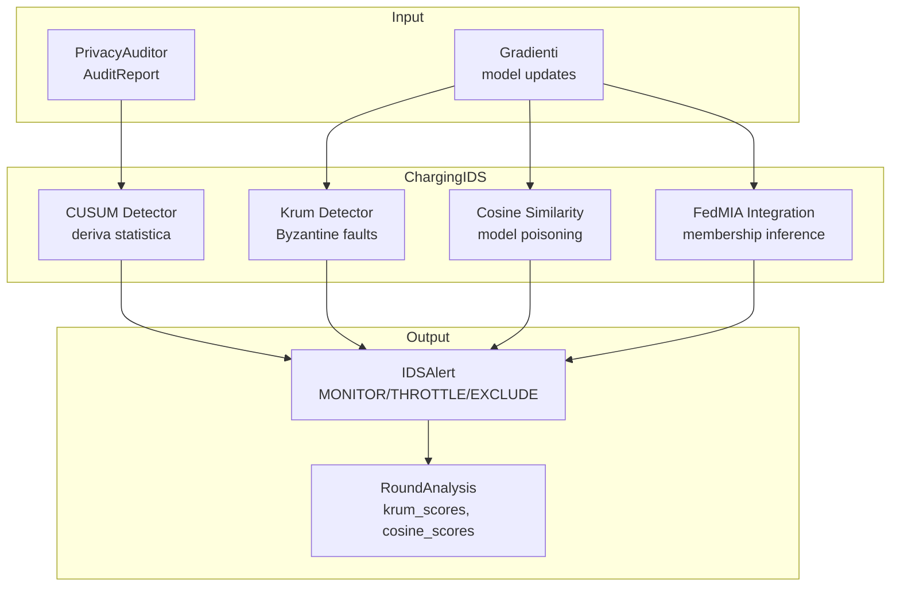

# ChargeShield-FL — Intrusion Detection System

## Ruolo

Il ChargingIDS è la **difesa** del framework ChargeShield-FL.
NON è un attaccante — è il sistema che rileva comportamenti
anomali nei nodi FL e decide se escluderli dall'aggregazione.

Riceve input da due fonti:
- **PrivacyAuditor** → AuditReport con privacy score ed epsilon
- **Gradienti** → model update di tutti i nodi del round corrente

Produce come output:
- **IDSAlert** → alert per singolo nodo (MONITOR | THROTTLE | EXCLUDE)
- **RoundAnalysis** → analisi completa del round con tutti i detector

---

## Architettura



---

## Detector implementati

### 1. CUSUM (Cumulative Sum Control Chart)
**File:** `src/ids/charging_ids.py` → `CUSUMDetector`

Rileva derive statistiche nel comportamento di un nodo nel tempo.
A differenza delle soglie fisse, CUSUM accumula le deviazioni
dalla baseline storica e genera alert solo quando la deriva
è sostenuta — non su spike isolati.

**Parametri configurabili:**
- `threshold`: soglia oltre cui scatta l'alert (default 5.0)
- `drift`: sensibilità — deviazione minima prima di accumulare (default 0.5)

**Warm-up:** le prime 10 osservazioni calibrano la baseline.
Durante il warm-up non vengono emessi alert.

**Monitora:**
- `privacy_score` per ogni nodo
- `epsilon` consumato per ogni nodo

**Riferimento:** Page, *Continuous Inspection Schemes*, Biometrika 1954

---

### 2. Krum Byzantine Fault Detector
**File:** `src/ids/charging_ids.py` → `KrumDetector`

Identifica nodi Byzantine confrontando geometricamente i gradienti.
Un nodo Byzantine invia gradienti molto distanti da tutti gli altri
→ alto Krum score → classificato come sospetto.

**Algoritmo:**
1. Calcola distanze euclidee al quadrato tra tutti i nodi
2. Per ogni nodo: somma le `n-f-2` distanze più piccole (Krum score)
3. Normalizza i score in [0.0, 1.0]
4. Nodi con score > threshold → Byzantine suspects

**Garanzia teorica:** robusto a `f` nodi Byzantine su `n` totali,
con `n >= 2f+3`.

**Parametri:**
- `byzantine_tolerance` (f): nodi Byzantine tollerati (default 1)
- `krum_threshold`: soglia per identificare Byzantine (default 0.8)

**Riferimento:** Blanchard et al., *Byzantine Tolerant SGD*, NeurIPS 2017

---

### 3. Cosine Similarity Analysis
**File:** `src/ids/charging_ids.py` → `GradientAnalyzer`

Rileva model poisoning confrontando la direzione geometrica
dei gradienti tra i nodi dello stesso cluster.

**Interpretazione:**
- Cosine similarity ≈ 1.0 → gradienti nella stessa direzione (normale)
- Cosine similarity ≈ 0.0 → gradienti ortogonali (sospetto)
- Cosine similarity < 0.0 → gradienti opposti (poisoning)

**Algoritmo:**
1. Appiattisce ogni gradiente in un vettore di float
2. Calcola la cosine similarity media di ogni nodo vs tutti gli altri
3. Nodi con similarità media < threshold → sospetti

**Parametri:**
- `cosine_threshold`: soglia sotto cui il nodo è sospetto (default 0.3)

---

### 4. FedMIA Integration
**File:** `src/ids/charging_ids.py` → `ChargingIDS.analyze_round()`

Integra i risultati dell'attacco FedMIA nella pipeline IDS.
Se il shadow model è addestrato, esegue `run_cluster_attack()`
per ogni round e genera alert per i nodi con alto membership score.

**Condizione di alert:**
- `membership_score > 0.5` (is_member = True)
- `confidence > 0.7`

**Azione consigliata:** THROTTLE (non EXCLUDE — il MIA è un rischio,
non una certezza di comportamento malevolo)

---

## Livelli di analisi

### analyze(report) — Singolo nodo
Chiamato per ogni nodo, ad ogni round.
Usa CUSUM + regole esplicite sulle minacce del PrivacyAuditor.

```python
alert = ids.analyze(audit_report)
if alert:
    print(alert.recommended_action)  # MONITOR | THROTTLE | EXCLUDE
```

### analyze_round(round_id, reports, gradients) — Cluster completo
Chiamato una volta per round, dopo aver raccolto tutti i gradienti.
Usa Krum + Cosine Similarity + FedMIA.

```python
analysis = ids.analyze_round(round_id, reports, gradients)
excluded = analysis.byzantine_nodes
print(analysis.krum_scores)
print(analysis.cosine_scores)
```

---

## Azioni consigliate

| Azione | Trigger | Significato |
|--------|---------|-------------|
| `MONITOR` | Anomalia lieve | Tieni d'occhio i round successivi |
| `THROTTLE` | Anomalia media | Limita frequenza di partecipazione |
| `EXCLUDE` | Anomalia grave | Escludi dall'aggregazione corrente |

---

## Risk Score

Il ChargingIDS mantiene un risk score per ogni nodo in [0.0, 1.0].

- Aumenta di **+0.2** per ogni anomalia rilevata nel round
- Decade del **10%** per ogni round senza anomalie (riabilitazione)

Questo permette ai nodi di "riabilitarsi" dopo comportamenti
anomali temporanei (es. problemi di rete, non attacchi reali).

```python
score = ids.get_node_risk_score("highway-01")
# 0.0 = nessun rischio storico
# 1.0 = rischio massimo accumulato
```

---

## Baseline e EMA

La baseline comportamentale di ogni nodo viene aggiornata
con **Exponential Moving Average (EMA, alpha=0.3)**:
baseline_new = 0.3 * valore_corrente + 0.7 * baseline_precedente
Alpha=0.3 bilancia:
- Adattamento ai cambiamenti legittimi nel tempo
- Resistenza agli outlier temporanei

---

## Alert e storico

Tutti gli alert vengono salvati in memoria per analisi post-esperimento:

```python
history = ids.get_alert_history()   # lista IDSAlert
rounds = ids.get_round_history()     # lista RoundAnalysis
```

Utile per:
- Analisi delle performance nel paper
- Debug di round specifici
- Calcolo di precision/recall per il threat model

---

## Configurazione

L'IDS legge i parametri da `config/auditor.yaml`:

```yaml
auditor:
  alert_threshold: 0.7
```

I parametri Krum e cosine sono configurabili nel costruttore:

```python
ids = ChargingIDS(
    byzantine_tolerance=1,   # f per Krum
    cosine_threshold=0.3,    # sotto = sospetto
    krum_threshold=0.8,      # sopra = Byzantine
)
```

---

## Riferimenti

- Blanchard et al., *Machine Learning with Adversaries: Byzantine
  Tolerant SGD*, NeurIPS 2017
- Fung et al., *Mitigating Sybils in Federated Learning Poisoning*, 2020
- Page, *Continuous Inspection Schemes*, Biometrika 1954
- Nasr et al., *Comprehensive Privacy Analysis of Deep Learning*,
  IEEE S&P 2019

