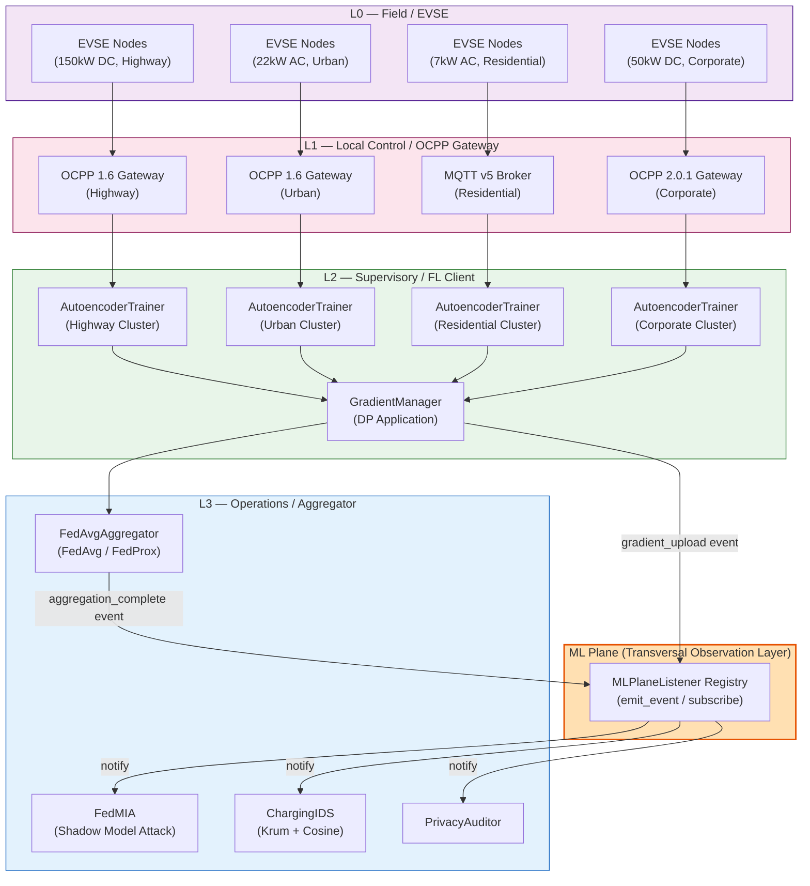
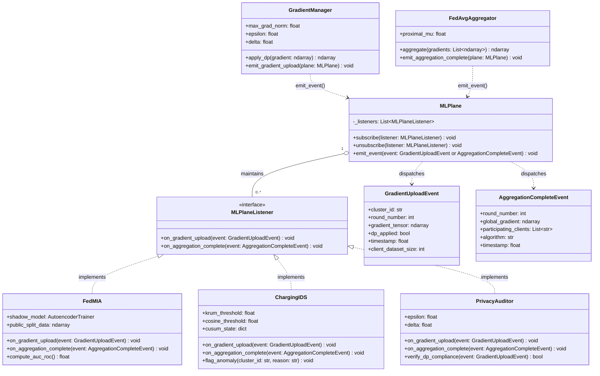
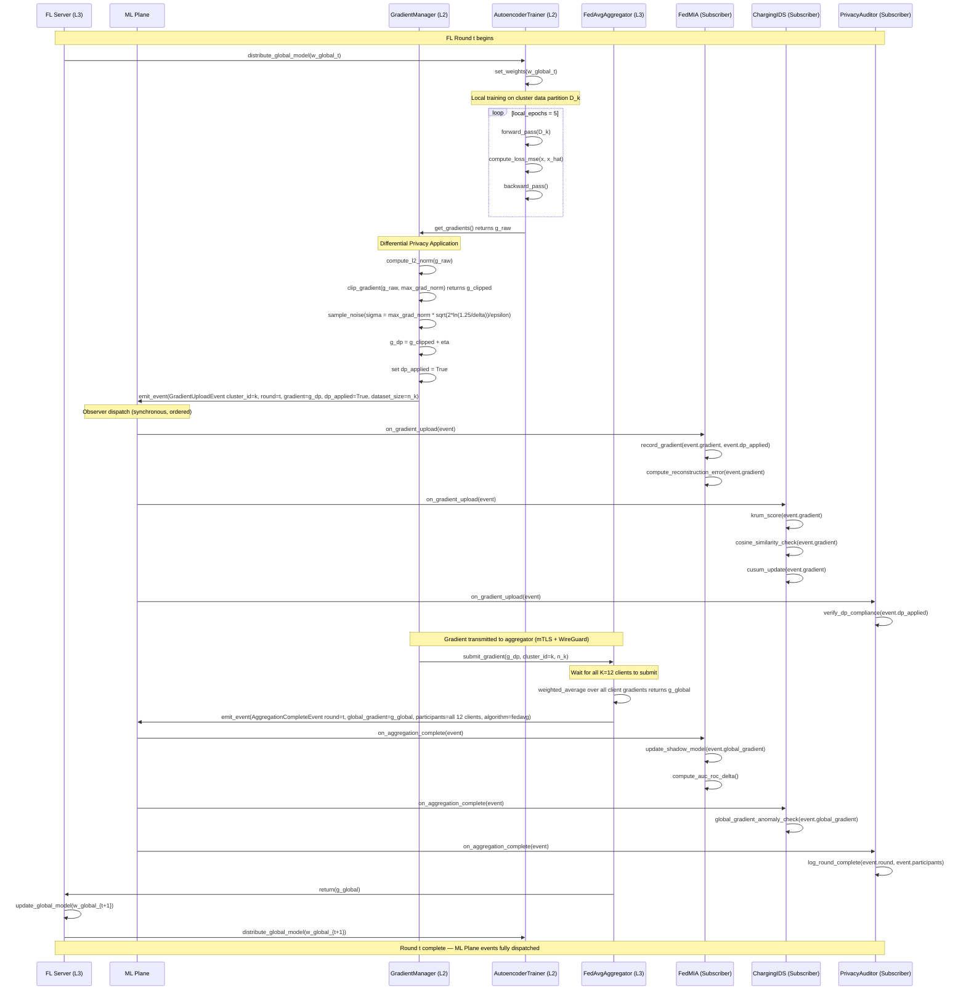

# The ML Plane: A Transversal Architectural Abstraction for Federated Learning Observability in OT-Deployed EV Charging Infrastructure

**Document version:** 1.0  
**Framework:** ChargeShield-FL  
**Status:** Research Contribution — Primary Architectural Contribution  
**Author note:** This document describes the ML Plane as a standalone architectural contribution within the ChargeShield-FL evaluation framework. It is intended to be self-contained and suitable for expansion into an independent paper section or workshop submission targeting venues such as DSN, CPS-SPC, or IEEE S&P workshops on privacy in cyber-physical systems.

---

## Abstract

Federated Learning (FL) deployed in operational technology (OT) environments such as electric vehicle (EV) charging infrastructure introduces a category of network traffic — gradient uploads and aggregation signals — that is architecturally invisible to existing OT security frameworks. The Purdue Model, IEC 62443, and ISA-99, which govern the communication architecture of industrial control systems, define well-structured hierarchical communication planes for field bus, supervisory, and enterprise traffic. None of these standards provide a principled abstraction for machine learning gradient traffic, which crosses Purdue levels L0 through L3 in a manner that is structurally distinct from, yet entangled with, standard SCADA and charging protocol traffic (OCPP 1.6, OCPP 2.0.1, MQTT v5).

This document introduces and formally describes the **ML Plane**: a transversal logical observation layer that intercepts, annotates, and routes ML-specific events across all Purdue levels without modifying the underlying FL training or aggregation logic. The ML Plane is not a new Purdue level; it is an observation plane analogous to a monitoring plane in software-defined networking, enabling both attack components (FedMIA) and defense components (ChargingIDS) to operate on FL gradient traffic that would otherwise appear as generic encrypted data indistinguishable from standard operational traffic.

The ML Plane is implemented via the Observer pattern: an `MLPlaneListener` interface, an `emit_event()` dispatch method, and a `subscribe()` registration mechanism. This design ensures that adding a new attack, defense, or auditing component requires no modification to core training or aggregation code — a strict satisfaction of the Open/Closed Principle. The ML Plane is the primary architectural contribution of ChargeShield-FL and the foundational abstraction enabling rigorous, reproducible evaluation of Membership Inference Attacks (MIA) against FL in EV charging deployments.

---

## 1. Motivation: The Purdue Model Gap

### 1.1 The Purdue Reference Model in OT Security

The Purdue Enterprise Reference Architecture (PERA), standardized through ISA-99 and incorporated into IEC 62443, organizes industrial control system (ICS) communication into a strict hierarchy of levels:

- **Level 0 (L0):** Field devices — physical sensors, actuators, and in the EV context, the Electric Vehicle Supply Equipment (EVSE) hardware itself.
- **Level 1 (L1):** Local control — programmable logic controllers (PLCs), OCPP gateways, and local protocol translation units that aggregate field-level signals.
- **Level 2 (L2):** Supervisory control — SCADA systems, HMIs, and in the FL context, the FL client software running on edge controllers co-located with charging clusters.
- **Level 3 (L3):** Operations management — manufacturing execution systems (MES), energy management systems, and in the FL context, the FL aggregator server.
- **Level 4 and above:** Enterprise IT — corporate networks, cloud infrastructure, external APIs.

The Purdue Model prescribes communication channels that are strictly hierarchical and level-bounded. Data flows upward from L0 to L3 through well-defined operational channels: field bus protocols (Modbus, CAN) between L0 and L1; OCPP, MQTT, or IEC 61850 between L1 and L2; and enterprise protocols between L2 and L3. Each channel carries a semantically well-understood payload: meter readings, control commands, status updates, and alarm notifications. IEC 62443 requires that security monitoring systems (intrusion detection systems, firewalls, data diodes) be positioned at level boundaries precisely because the payload semantics at each boundary are known and auditable.

### 1.2 The Structural Invisibility of FL Gradient Traffic

Federated Learning breaks the Purdue hierarchy's assumption of semantically uniform traffic at each level boundary. In a standard FL deployment over EV charging infrastructure:

1. FL clients (running at L2, co-located with charging cluster edge controllers) train local models on charging session data.
2. Clients transmit model gradient updates to the FL aggregator (at L3).
3. The aggregator computes a new global model and distributes it back to clients.

This gradient traffic is transmitted over TLS-encrypted channels — in ChargeShield-FL specifically, over mTLS tunnels secured with WireGuard at the network layer. From the perspective of any OT-layer intrusion detection system positioned at the L2/L3 boundary, this traffic is indistinguishable from any other encrypted application-layer communication. An IDS examining the L2/L3 boundary sees encrypted blobs crossing the boundary at regular intervals; without knowledge that these blobs are FL gradient tensors, it cannot:

- Apply gradient-space anomaly detection (e.g., Krum, cosine similarity);
- Identify whether a gradient submission originated from a Byzantine client;
- Audit whether differential privacy was applied before transmission;
- Reconstruct the data flow required to evaluate membership inference risk.

This is the **Purdue Model Gap**: the Purdue hierarchy, as defined by IEC 62443 and ISA-99, provides no abstraction for ML gradient traffic. The gap is not merely a documentation oversight — it reflects a fundamental mismatch between the design assumptions of OT security standards (deterministic, semantically rich, low-bandwidth operational traffic) and the characteristics of FL gradient traffic (stochastic, semantically opaque as raw tensors, high-bandwidth relative to field bus norms).

### 1.3 Existing FL Literature Ignores the OT Context

The foundational FL literature — McMahan et al. (2017) introducing FedAvg, Li et al. (2020) introducing FedProx, Abadi et al. (2016) introducing DP-SGD — uniformly assumes a deployment context of internet-connected data centers or mobile devices. The security model in these works considers honest-but-curious aggregators and external eavesdroppers on internet-grade encrypted channels, but never an OT environment where:

- The network topology is a legally mandated hierarchy (IEC 62443 zone/conduit model);
- The nodes at each level have distinct trust levels, physical security postures, and operational responsibilities;
- A subset of "clients" are embedded controllers with constrained compute budgets and real-time operational obligations;
- The regulatory environment (NERC CIP, EU NIS2) may require auditability of all data crossing zone boundaries.

Membership Inference Attack literature (Shokri et al., 2017; Nasr et al., 2019) similarly assumes a generic distributed ML context. No prior work addresses the specific observability problem that arises when FL is deployed within the Purdue Model hierarchy: the attacker (an honest-but-curious aggregator at L3) can observe gradient submissions but cannot distinguish them from other encrypted traffic without an explicit architectural mechanism to make FL traffic visible.

### 1.4 The Fundamental Motivation

The ML Plane is motivated by a single observation: **making FL gradient traffic an explicitly observable, semantically annotated stream is a prerequisite for any meaningful security evaluation — whether offensive (MIA) or defensive (IDS) — in an OT-deployed FL system.** Without this abstraction, both attackers and defenders are operating blind on encrypted network payloads; neither FedMIA nor ChargingIDS can function correctly. The ML Plane resolves the Purdue Model Gap by providing exactly this observability layer, implemented in a way that is zero-cost to normal FL operation and zero-modification to existing training and aggregation code.

---

## 2. The ML Plane as Architectural Abstraction

### 2.1 What the ML Plane Is (and Is Not)

The ML Plane is a **transversal logical observation layer** that crosses Purdue levels L0 through L3. It is not:

- A new Purdue level (it does not carry operational traffic);
- A network intermediary (it does not route or forward gradient traffic);
- A modification to the FL protocol (FedAvg/FedProx semantics are preserved exactly);
- A hardware component (it is purely logical, implemented in software).

The ML Plane is best understood by analogy to monitoring planes in software-defined networking. In SDN architecture, the data plane forwards packets, the control plane computes routing decisions, and the management/monitoring plane observes both without interfering with either. The ML Plane occupies the analogous role: the FL training and aggregation logic constitute the "data plane" of the FL system; the ML Plane is the "monitoring plane" that makes FL events observable to security and analysis components without modifying the forwarding (training/aggregation) behavior.

### 2.2 How the ML Plane Makes FL Traffic Observable

The ML Plane intercepts FL traffic at two canonical event points:

1. **`gradient_upload` events:** Emitted by `GradientManager` after differential privacy application, immediately before gradient transmission to the aggregator. The event payload includes the gradient tensor (or a reference to it), the emitting cluster identifier, the round number, and the `dp_applied` boolean metadata flag.

2. **`aggregation_complete` events:** Emitted by `FedAvgAggregator` after computing the global model update from all received client gradients. The event payload includes the aggregated gradient tensor, the set of participating clients, and the aggregation algorithm identifier (FedAvg or FedProx).

By subscribing to these two event types, any component registered with the ML Plane receives a complete, semantically annotated view of every FL round: who submitted gradients, whether DP was applied, what the aggregator produced. This is the information substrate required for both FedMIA (which uses gradient submissions as membership signals) and ChargingIDS (which applies Krum and cosine similarity to the gradient space).

### 2.3 The ML Plane Crossing the Purdue Hierarchy

The following diagram illustrates how the ML Plane crosses the Purdue levels vertically, intercepting gradient traffic at the points where it crosses level boundaries, while the operational traffic (OCPP, MQTT) continues through its normal hierarchical channels.



### 2.4 The Visibility Argument

The key architectural claim of the ML Plane is that **visibility must be made explicit**. In the absence of the ML Plane, FedMIA would need to either (a) tap the encrypted mTLS/WireGuard channel — which is operationally unrealistic and would require breaking the transport security — or (b) be embedded directly in the aggregator code — which conflates the attack logic with the system under test, violating experimental isolation. Similarly, ChargingIDS would need to be hard-coded into the aggregator, making it impossible to evaluate IDS-absent baseline scenarios without code modification.

The ML Plane resolves both problems: it provides a clean architectural interface through which any observer can access gradient data without modifying the core FL system, and through which experimental configurations (FedMIA enabled/disabled, IDS enabled/disabled, DP enabled/disabled) can be controlled purely through subscription management.

---

## 3. Observer Pattern Implementation

### 3.1 Design Pattern Selection

The ML Plane is implemented using the **Observer (Event Listener) pattern** as described in the Gang of Four design pattern taxonomy. The choice of Observer over alternatives is deliberate and motivated by the research testbed context:

- **Direct coupling (alternative 1):** If `FedAvgAggregator` directly called `FedMIA.on_gradient_received()` and `ChargingIDS.on_gradient_received()`, adding a new observer would require modifying `FedAvgAggregator`. This violates the Open/Closed Principle and makes the system under test aware of the evaluating components — a fundamental experimental integrity violation.

- **Message queue (Kafka, Redis Pub/Sub) (alternative 2):** A message broker would provide publish-subscribe semantics with persistence and scalability. However, introducing Kafka or Redis as a dependency in a containerized research testbed adds operational complexity (broker deployment, topic management, consumer group configuration, serialization schemas) that provides no research benefit. The ML Plane operates synchronously within a single experimental run; persistence and distributed fan-out are not required. A message queue would also introduce non-deterministic timing behavior that would complicate reproducibility analysis.

- **gRPC streaming (alternative 3):** gRPC provides a strongly-typed, language-agnostic streaming interface. It is appropriate for cross-process or cross-machine event distribution. In ChargeShield-FL, all ML Plane components run within the same NVFLARE 2.7.2 process tree and share memory; the overhead of gRPC serialization/deserialization for in-process communication is unjustified.

- **Observer pattern (selected):** Synchronous, zero-dependency, in-process. Subscribers execute in the same thread as the emitter, which guarantees ordering (all gradient_upload subscribers execute before the gradient is transmitted to the aggregator) and avoids the need for external infrastructure. The interface contract is minimal and stable.

### 3.2 The MLPlaneListener Interface



**FedMIA plugin vs. experiment evaluator distinction.** The class diagram above accurately describes `src/plugins/attacks/fedmia.py` — the FedMIA plugin used by ChargingIDS for per-node IDS scoring via the ML Plane event system. This plugin is **unchanged**. There is a separate, architecturally distinct FedMIA evaluator in `scripts/run_experiments.py::run_fedmia()` that is used to measure per-round AUC-ROC in the experimental case studies. The evaluator does **not** use a shadow model and does not subscribe to ML Plane events. Instead, it runs post-round: after FedAvg aggregation completes, it reads `global_weights` from the `AggregatedUpdate`, loads them into an Autoencoder instance, and computes `score = -MSE` for each evaluation sample. AUC-ROC is computed via `sklearn.metrics.roc_auc_score` for each FL round (Yeom et al. 2018). The per-round results are stored in the experiment JSON as `per_round[round]["auc_roc"]`, with summary statistics `mean_auc_roc`, `max_auc_roc`, and `min_auc_roc`.

### 3.3 The `emit_event()` Method

`emit_event()` is the single dispatch point for all ML Plane events. It accepts an event object (either `GradientUploadEvent` or `AggregationCompleteEvent`), iterates over the registered listener list, and calls the appropriate handler method on each listener based on event type dispatch. The implementation is deliberately simple: no priority ordering, no event filtering at the plane level (filtering is the listener's responsibility), no asynchronous dispatch. This simplicity is a feature, not a limitation — it ensures that the ML Plane introduces zero non-determinism into the experimental loop.

Callers of `emit_event()`:
- `GradientManager.emit_gradient_upload()`: called after DP application, before gradient transmission. Constructs a `GradientUploadEvent` with the DP-noised gradient tensor and `dp_applied=True`.
- `FedAvgAggregator.emit_aggregation_complete()`: called after computing the weighted average (FedAvg) or proximal-regularized average (FedProx), before distributing the global model to clients.

### 3.4 The `subscribe()` Method

`subscribe(listener: MLPlaneListener)` appends a listener to the internal registry. In ChargeShield-FL, subscriptions are established at experiment initialization time and held for the duration of the FL run. The subscription state is part of the experimental configuration: enabling FedMIA corresponds to subscribing a `FedMIA` instance; enabling ChargingIDS corresponds to subscribing a `ChargingIDS` instance. This means that toggling attack/defense components requires only configuration changes, not code modification — a critical property for reproducible experimental design.

### 3.5 Architectural Significance of the Decoupling

The Observer pattern's most important property in ChargeShield-FL is that it cleanly separates the **system under test** (the FL training and aggregation logic) from the **experimental instruments** (FedMIA, ChargingIDS, PrivacyAuditor). This separation is the difference between a research evaluation framework and a modified FL implementation. Without it, results would be confounded by the question of whether the FL system behaves differently in the presence of an attack or defense component.

---

## 4. Component Descriptions with Purdue Annotations

### 4.1 AbstractMLModel

**Purpose:** `AbstractMLModel` is the abstract base class for all machine learning models in ChargeShield-FL. It defines the canonical interface through which the FL framework interacts with model implementations, decoupling the FL orchestration logic from any specific model architecture.

**Purdue Level:** L2-L3. The abstract base class is instantiated at L2 (FL client, edge controller) for training and at L3 (aggregator) for model parameter manipulation.

**Interface:**
- `train(data: ndarray, epochs: int) -> None`: Executes local training for the specified number of epochs on the provided data partition.
- `predict(data: ndarray) -> ndarray`: Returns model predictions (reconstruction vectors for the autoencoder).
- `get_gradients() -> ndarray`: Returns the gradient of the model parameters with respect to the most recent training loss, as a flat vector suitable for DP application and FL aggregation.
- `set_weights(weights: ndarray) -> None`: Loads a weight vector into the model, used for distributing the global model from aggregator to clients.

**Design rationale:** The abstract base class enables the Strategy Pattern for model substitution. ChargeShield-FL's evaluation scenarios require running different model configurations (with/without DP, FedAvg vs. FedProx) while keeping the FL orchestration code constant. `AbstractMLModel` provides the stable interface that makes this substitution possible. An alternative design — hard-coding the autoencoder architecture into the FL client — would require code duplication across scenario configurations and would make it impossible to extend ChargeShield-FL to evaluate other model types without modifying the FL client.

### 4.2 AutoencoderTrainer

**Purpose:** `AutoencoderTrainer` implements `AbstractMLModel` with a symmetric autoencoder architecture designed for unsupervised anomaly detection on tabular EV charging session data.

**Purdue Level:** L2-L3. Training runs at L2 (FL client on cluster edge controller). The trained model parameters are aggregated at L3 (FL aggregator) and distributed back to L2 clients.

**Architecture:** The autoencoder follows a 6→16→8→4→8→16→6 topology:
- **Encoder:** Input layer (6 features) → Dense(16, ReLU) → Dense(8, ReLU) → Dense(4, ReLU) [bottleneck]
- **Decoder:** Dense(8, ReLU) → Dense(16, ReLU) → Output layer (6 features, linear activation)

The bottleneck dimension of 4 is chosen to force the model to learn a compressed representation that retains only the dominant variance structure of the 6-feature input. A bottleneck of 3 would risk discarding discriminative features (particularly the circadian `hour_of_day` signal, which has high within-cluster variance); a bottleneck of 8 would reduce the compression ratio to the point where the autoencoder memorizes rather than generalizes, undermining its utility as an anomaly detector.

**Loss function:** Mean Squared Error (MSE) over the 6-dimensional reconstruction:

$$\mathcal{L}_{\text{MSE}} = \frac{1}{6} \sum_{j=1}^{6} (x_j - \hat{x}_j)^2$$

MSE is selected for three reasons: (1) it is directly interpretable as a per-session reconstruction error, which doubles as the membership inference signal for FedMIA — the hypothesis being that member sessions have lower reconstruction error than non-member sessions; (2) it produces smooth gradients suitable for DP clipping and noise addition; (3) it does not require any labeled anomaly data, which is unavailable at training time in a real deployment — the autoencoder is trained exclusively on normal charging sessions from the ACN-Data JPL dataset (13,073 real EV sessions from 2019-2020).

**Activations:** ReLU for all hidden layers, linear for the output layer. ReLU is chosen over sigmoid or tanh because: (a) it does not saturate for large positive inputs, which is relevant for `total_energy_kwh` and `max_power_kw` features that may take large values after normalization outliers; (b) it produces sparser activations, encouraging the bottleneck to use a subset of its 4 dimensions actively; (c) its gradient is 1 for positive inputs and 0 for negative inputs, which interacts favorably with gradient clipping in the DP mechanism (clipped gradients through ReLU layers maintain their sign information).

**DataLoader configuration note.** The `AutoencoderTrainer` DataLoader is configured with `drop_last=True` (see `src/ml/autoencoder_trainer.py:178`). This means the last incomplete batch is dropped during training if the dataset size is not evenly divisible by the batch size. This ensures consistent batch size across all training steps, which is important for the stability of the DP Gaussian Mechanism noise calibration (the noise scale is calibrated to the configured batch size; variable-size batches would alter the effective per-sample privacy guarantee).

**Why autoencoder, not a supervised classifier:** No labeled anomaly data exists for EV charging session data at the time of training. Supervised approaches (random forests, SVMs) require labeled positive (anomalous) and negative (normal) examples. In the EV charging domain, anomalous sessions are rare, domain-specific, and not systematically labeled in ACN-Data. The autoencoder circumvents this by training only on normal sessions; anomalies manifest as high reconstruction error at inference time without requiring labels.

**Why this architecture, not deeper/wider:** The 6-feature input dimensionality constrains the meaningful architecture space. A 6-feature input with a 4-dimensional bottleneck achieves a 33% compression ratio — sufficient to learn dominant charging patterns (energy level, temporal slot, duration class) while discarding session-specific noise. Deeper architectures (6→32→16→8→4→8→16→32→6) would overfit on the available 13,073 sessions at the FL client level, where each cluster receives only a subset of sessions. The chosen architecture balances capacity against overfitting risk and against the computational budget of edge controller hardware in a containerized simulation environment.

### 4.3 GradientManager

**Purpose:** `GradientManager` applies the Differential Privacy mechanism to raw gradients computed by `AutoencoderTrainer` before they are transmitted to the FL aggregator via the ML Plane.

**Purdue Level:** L2-L3 (client side). The DP mechanism is applied at the FL client, before gradient transmission. This is architecturally significant: client-side DP means the FL aggregator at L3 never sees unnoised gradients, providing a **local differential privacy** guarantee — the aggregator cannot infer membership from individual client updates even with full knowledge of the aggregation algorithm.

**Processing pipeline:**

1. **Gradient computation:** `AutoencoderTrainer.get_gradients()` returns the raw gradient vector `g` where the dimension equals the total number of model parameters.

2. **L2 norm computation:** Compute the Euclidean norm of g.

3. **Gradient clipping:** If the norm exceeds `max_grad_norm`, replace `g` with the clipped gradient `g_clipped = g * (max_grad_norm / norm(g))`. This ensures all gradients have L2 norm at most `max_grad_norm`, bounding the sensitivity of the gradient function.

4. **Gaussian noise addition:** Sample noise from N(0, sigma^2 * I) where `sigma = max_grad_norm * sqrt(2 * ln(1.25/delta)) / epsilon`. Add this noise to `g_clipped` to produce `g_dp`.

5. **Metadata annotation:** Set `dp_applied = True` in the gradient event metadata.

6. **ML Plane emission:** Call `mlplane.emit_event(GradientUploadEvent(gradient=g_dp, dp_applied=True, ...))`.

**Why client-side DP, not server-side:** Server-side DP (where the aggregator adds noise to the aggregated gradient) provides a weaker guarantee: the aggregator sees all individual client gradients before noise addition, and an honest-but-curious aggregator (ChargeShield-FL Scenario 1) can perform MIA on the unnoised submissions. Client-side DP ensures that even the aggregator receives only DP-protected updates. The `dp_applied` flag allows experimental scenarios where DP is disabled (to establish MIA effectiveness baselines) to be implemented without code modification — `GradientManager` simply skips steps 3-4 and sets `dp_applied = False`.

**The `dp_applied` flag:** This flag is carried in the `GradientUploadEvent` payload and is visible to all ML Plane subscribers. `PrivacyAuditor` uses it to verify that all gradient submissions in a DP-enabled experimental run carry `dp_applied = True`. `FedMIA` uses it as a conditioning variable — MIA effectiveness is expected to differ between DP-protected and unprotected submissions, and the flag enables stratified analysis.

### 4.4 FedAvgAggregator

**Purpose:** `FedAvgAggregator` implements both FedAvg and FedProx aggregation strategies, computing a new global model from the set of client gradient submissions received in each FL round.

**Purdue Level:** L3-L4. The aggregator runs on the FL server, which in the ChargeShield-FL deployment corresponds to the operations management level — above the supervisory FL clients at L2.

**FedAvg aggregation:** The global gradient update is computed as a weighted average of client submissions, with weights proportional to each client's local dataset size:

$$g_{\text{global}} = \frac{\sum_{k=1}^{K} n_k \cdot g_k}{\sum_{k=1}^{K} n_k}$$

where `K` is the number of participating clients, `n_k` is the dataset size of client `k`, and `g_k` is the (potentially DP-noised) gradient submission from client `k`. In ChargeShield-FL, `K = 12` (12 charging nodes across 4 clusters) and dataset sizes reflect the unequal distribution of ACN-Data sessions across cluster types.

**FedProx:** When `proximal_mu > 0.0`, the client-side local objective is augmented with a proximal term:

$$\mathcal{L}_{\text{FedProx}} = \mathcal{L}_{\text{local}} + \frac{\mu}{2} \| w - w_{\text{global}} \|^2$$

The proximal term penalizes deviation of the local model parameters `w` from the current global model `w_global`. In ChargeShield-FL, `proximal_mu = 0.01` for FedProx runs and `proximal_mu = 0.0` (exact FedAvg) for baseline runs.

**Why FedProx is available:** The four ChargeShield-FL clusters — Highway (OCPP 1.6, 150kW DC fast charging), Urban (OCPP 1.6, 22kW AC level-2 charging), Residential (MQTT v5, 7kW AC overnight charging), and Corporate (OCPP 2.0.1, 50kW DC workplace charging) — exhibit fundamentally different charging session distributions. This constitutes a **non-IID data distribution** across clients, for which FedProx's proximal term limits local model drift.

**Why mu = 0.01, not larger or smaller:** At mu = 0.1, the proximal term dominates the local objective for the more heterogeneous clusters (Highway, Residential), effectively preventing meaningful local adaptation and collapsing the FL system toward a single-point solution that ignores cluster-specific charging patterns. At mu = 0.001, the proximal correction is negligible — the client gradient trajectories are nearly identical to FedAvg, providing no meaningful regularization for non-IID data. mu = 0.01 is the standard value from Li et al. (2020) for moderate heterogeneity regimes and is the appropriate choice for the ChargeShield-FL cluster distribution.

---

## 5. Feature Engineering

### 5.1 The 6-Feature Design Space

ChargeShield-FL uses exactly six features drawn from the ACN-Data JPL 2019+2020 dataset (13,073 real EV charging sessions). The feature set is the result of a deliberate design process governed by three constraints: (1) the features must be computable from ACN-Data's per-session aggregate record format; (2) the features must encode meaningful behavioral signal for cluster discrimination; (3) the features must not include direct identifiers that would trivialize membership inference.

### 5.2 Raw ACN-Data Features

**`total_energy_kwh`:** Total energy delivered to the vehicle during the session (kWh). This is the primary session outcome variable. It captures the state of charge deficit of the arriving vehicle and the efficiency of the charging session. Across ChargeShield-FL clusters, `total_energy_kwh` exhibits the strongest inter-cluster discriminating power: highway DC fast chargers deliver high energy in short sessions; residential AC chargers deliver moderate energy over long sessions; urban and corporate chargers occupy intermediate regimes.

**`max_power_kw`:** Peak power draw during the session (kW). This feature characterizes both the charger hardware (a 7kW residential AC charger cannot physically exceed 7kW regardless of vehicle capability) and the vehicle battery management system (BMS) behavior (BMS-imposed power limits during high-SOC charging phases produce characteristic `max_power_kw` signatures). `max_power_kw` is a strong cluster discriminator and a weak vehicle-type discriminator.

**`kwh_requested`:** Energy requested by the vehicle at session start (kWh). This is a driver-intent signal: it reveals how much energy the driver expected to need, which correlates with the vehicle's remaining range anxiety and the driver's behavioral pattern. `kwh_requested` is distinct from `total_energy_kwh` because sessions may terminate before fulfilling the request (driver departs early) or the vehicle's BMS may accept less than requested (battery reaches full SOC).

**`minutes_available`:** Time window declared as available for charging (minutes). This is a driver-schedule signal derived from the driver's declared departure time minus arrival time. It captures behavioral patterns that are cluster-specific: residential drivers declare long overnight windows; corporate drivers declare workday windows; highway drivers declare short windows consistent with rest-stop charging behavior.

### 5.3 Derived Features

**`hour_of_day` (DERIVED from `connectionTime`):** The hour of day (0-23) at which the charging session began, extracted from the `connectionTime` timestamp field in ACN-Data. This feature is **derived** — it does not appear as a raw field in ACN-Data records but is computed from `connectionTime` via `connectionTime.hour`. It encodes the circadian behavioral pattern of charging: residential sessions cluster strongly at evening hours (17:00-23:00); corporate sessions cluster at morning hours (07:00-09:00); highway sessions are distributed more uniformly across hours. `hour_of_day` is arguably the single most powerful cluster discriminator in the feature set despite being derivable from a single timestamp.

**`duration_hours` (DERIVED from `connectionTime` / `disconnectTime`):** Session duration in hours, computed as `(disconnectTime - connectionTime).total_seconds() / 3600`. This feature is **derived** from two raw timestamp fields. It encodes the total time the vehicle was physically connected to the charger, which is correlated with but distinct from `minutes_available` (the declared window) and `total_energy_kwh / max_power_kw` (the theoretical minimum charging time). Long `duration_hours` relative to `total_energy_kwh / max_power_kw` indicates idle connected time — a behavioral pattern that varies strongly across clusters.

### 5.4 Absent Features and Their Justification

**Voltage, current, state-of-charge (SOC):** ACN-Data JPL provides per-session **aggregate** records, not time-series measurements. Sub-second voltage and current telemetry is collected by EVSE hardware at L0 and may be available from some OCPP 2.0.1 deployments, but ACN-Data does not expose it at the session level. Including these features would require EVSE-level data collection infrastructure not present in ACN-Data, and would reduce the dataset from 13,073 sessions to a small subset for which time-series data is available.

**`station_id`, `user_id`:** These are direct session identifiers. Including them in the autoencoder's input would trivialize membership inference — a trivial MIA need only check whether a session's station_id appears in the training set. The purpose of ChargeShield-FL's MIA evaluation is to assess the privacy risk of the **learned feature representations**, not the trivial privacy risk of identifier leakage. Excluding direct identifiers is therefore a prerequisite for a meaningful MIA evaluation.

### 5.5 Normalization

All six features are normalized using StandardScaler (zero-mean, unit-variance normalization): for each feature `j`, apply `x'_j = (x_j - mu_j) / sigma_j` where `mu_j` and `sigma_j` are the mean and standard deviation of feature `j` computed over the training split. StandardScaler is appropriate for tabular autoencoder input because: (a) the six features span different physical scales (`total_energy_kwh` ranges from approximately 0 to 100, `hour_of_day` ranges from 0 to 23, `duration_hours` ranges from approximately 0.1 to 20), and without normalization the MSE loss would be dominated by the largest-scale features; (b) StandardScaler preserves the distribution shape (unlike MinMaxScaler, it does not compress outliers into a fixed range), which is important because extreme sessions (e.g., a very long residential session) should produce high reconstruction error as potential anomalies; (c) zero-mean, unit-variance input is standard practice for neural networks with ReLU activations, as it centers the pre-activation inputs in the linear region of the ReLU.

---

## 6. Differential Privacy Mechanics

### 6.1 Formal Definition

A randomized mechanism `M: D → R` satisfies **(epsilon, delta)-differential privacy** if for all pairs of adjacent datasets `D`, `D'` (differing in a single record) and all measurable subsets `S` of the output range:

$$\Pr[M(D) \in S] \leq e^{\varepsilon} \cdot \Pr[M(D') \in S] + \delta$$

The parameter epsilon > 0 (privacy budget) bounds the worst-case distinguishability of the mechanism's output on adjacent inputs; smaller epsilon implies stronger privacy. The parameter delta > 0 (failure probability) allows the bound to be violated with probability at most delta; by convention delta should be negligibly small relative to the dataset size, typically delta << 1/|D|.

### 6.2 The Gaussian Mechanism

For a function `f: D → R^d` with L2-sensitivity `Delta_2 f = max_{D,D'} ||f(D) - f(D')||_2`, the Gaussian Mechanism `M(D) = f(D) + N(0, sigma^2 * I)` satisfies (epsilon, delta)-DP when:

$$\sigma = \Delta_2 f \cdot \frac{\sqrt{2 \ln(1.25/\delta)}}{\varepsilon}$$

This formula is the standard result from Dwork and Roth (2014) and is the mechanism implemented in ChargeShield-FL's `GradientManager`.

### 6.3 Application to Gradient Privacy in ChargeShield-FL

In the FL gradient context, the function `f` maps a client's local dataset to its gradient vector. The L2-sensitivity of this function is bounded by the gradient clipping threshold: because all gradients are clipped to L2 norm at most `max_grad_norm`, replacing a single training example can change `f` by at most `2 * max_grad_norm` in the worst case (adding and removing a sample). The clipping operation is therefore essential not merely as a training stability technique but as the **sensitivity-bounding step** that makes the Gaussian Mechanism applicable with a known, finite sensitivity.

The full step-by-step process in `GradientManager`:

| Step | Operation | Description |
|------|-----------|-------------|
| 1 | Compute gradient | Raw gradient g from autoencoder backpropagation |
| 2 | Compute L2 norm | Euclidean norm of g |
| 3 | Clip if necessary | g_clipped = g * min(1, max_grad_norm / norm(g)) |
| 4 | Sample noise | eta ~ N(0, sigma^2 * I), sigma = max_grad_norm * sqrt(2*ln(1.25/delta)) / epsilon |
| 5 | Add noise | g_dp = g_clipped + eta |
| 6 | Annotate | dp_applied = True |
| 7 | Emit event | MLPlane.emit_event(GradientUploadEvent(g_dp, dp_applied=True, ...)) |

### 6.4 Why (epsilon, delta)-DP Over Pure epsilon-DP

Pure epsilon-DP (i.e., delta = 0) requires a Laplace mechanism for gradient-valued functions, adding Laplace noise with scale `Delta_f / epsilon`. For high-dimensional gradient vectors (the ChargeShield-FL autoencoder has hundreds of parameters), the Laplace mechanism adds noise independently to each dimension with scale proportional to the L1 sensitivity, which is sqrt(d) times larger than the L2 sensitivity for the same clipping bound. The Gaussian mechanism's use of the L2 norm means it adds substantially less noise per dimension for the same privacy guarantee, resulting in better utility (lower reconstruction error on normal sessions) for equivalent privacy protection. The (epsilon, delta) relaxation admits the Gaussian mechanism while maintaining a meaningful privacy guarantee for all practical values of delta.

### 6.5 The Honest-But-Curious Aggregator Threat Model

ChargeShield-FL Scenario 1 assumes an **honest-but-curious aggregator**: the aggregator at L3 follows the FL protocol faithfully (computes correct weighted averages, distributes correct global models) but attempts to infer membership of individual training samples from the gradient submissions it receives. Under client-side DP with the Gaussian Mechanism, the aggregator observes only the DP-noised, clipped gradient. The (epsilon, delta)-DP guarantee bounds the aggregator's ability to distinguish the gradient computed on a dataset containing a target record from the gradient computed on a dataset without that record. FedMIA's AUC-ROC metric operationalizes this bound empirically: if DP is effective, FedMIA's AUC-ROC should approach 0.5 (random guessing); if DP is insufficient (epsilon too large, or DP disabled), AUC-ROC should be significantly above 0.5.

---

## 7. FedAvg vs. FedProx Trade-off Analysis

### 7.1 The Non-IID Problem in ChargeShield-FL

The four ChargeShield-FL clusters exhibit fundamentally heterogeneous charging session distributions:

| Cluster | Protocol | Power | Session type | Typical duration | Typical energy |
|---------|----------|-------|-------------|-----------------|----------------|
| Highway | OCPP 1.6 | 150kW DC | Transit fast charge | Short (< 1h) | High (30-80 kWh) |
| Urban | OCPP 1.6 | 22kW AC | Opportunistic | Medium (2-4h) | Medium (10-30 kWh) |
| Residential | MQTT v5 | 7kW AC | Overnight | Long (6-12h) | Moderate (10-40 kWh) |
| Corporate | OCPP 2.0.1 | 50kW DC | Workday | Medium (4-8h) | Medium (20-50 kWh) |

These distributions are drawn from real ACN-Data JPL sessions. The non-IID nature of the data — in the sense that sessions assigned to each cluster by their cluster label have substantially different marginal distributions — creates the conditions under which FedAvg may underperform relative to locally trained models.

### 7.2 FedAvg Client Drift Under Non-IID Data

Under FedAvg with multiple local training epochs, each client minimizes its local MSE objective over its local data partition. Because the loss landscape differs across clusters (the MSE surface is different for highway vs. residential sessions), clients may converge to different local minima. Gradient averaging of locally diverged models can produce a global model that performs poorly for all clusters simultaneously — the gradient averaging step implicitly assumes that the local loss surfaces share a common minimum, which is violated under non-IID distributions.

### 7.3 FedProx as a Drift-Limiting Mechanism

FedProx augments the local objective with a proximal term:

$$\mathcal{L}_k^{\text{FedProx}}(w) = \mathcal{L}_k(w) + \frac{\mu}{2} \| w - w^{(t)} \|^2$$

where `w^{(t)}` is the current global model at round `t`. The proximal term penalizes deviation of the local model from the global consensus, bounding the L2 distance between the local model and the global model during local optimization. This has two effects: (1) it limits client drift, keeping local models in a neighborhood of the global model where gradient averaging is better justified; (2) it reduces the variance of gradient submissions across clients, since all clients are regularized toward the same point.

### 7.4 The MIA-FedProx Interaction (Research Question CS3)

ChargeShield-FL Scenario CS3 investigates whether FedProx's drift reduction also reduces MIA effectiveness. The theoretical intuition: FedMIA exploits per-session variance in reconstruction error (the membership signal) against a threshold derived from the shadow model. If FedProx causes all clients' gradients to cluster more tightly around the global model, the per-session gradient variance decreases, potentially reducing the signal-to-noise ratio of the reconstruction error membership signal.

However, this effect may be counterbalanced by the following consideration: FedProx reduces **inter-client** gradient variance (across clusters), but the **intra-client** per-session gradient variance (within a single cluster's training set) may be unaffected by the proximal term. FedMIA's membership inference operates at the level of individual sessions within a client's training set, not across clients. The empirical evaluation of FedMIA AUC-ROC under FedAvg vs. FedProx is therefore a non-trivial research question with no clear a priori answer.

### 7.5 Parameter Justification: mu = 0.01

The proximal parameter mu = 0.01 is selected based on the following reasoning:

- **mu = 0.1 (too large):** At this value, the proximal term contributes significantly to the local objective, which for typical weight magnitudes in the ChargeShield-FL autoencoder would dominate the reconstruction MSE. Local training would converge to a point near `w_global` regardless of the local data distribution, effectively preventing any cluster-specific adaptation. The resulting global model would have poor reconstruction quality for all clusters.

- **mu = 0.001 (too small):** At this value, the proximal correction is negligible. The difference in gradient submissions between mu = 0.0 (FedAvg) and mu = 0.001 (nominal FedProx) would be within noise tolerance of the DP mechanism, making it impossible to attribute any experimental difference to the FedProx mechanism rather than random variation.

- **mu = 0.01 (selected):** This is the standard value from the FedProx paper (Li et al., 2020) for moderate data heterogeneity. It provides meaningful regularization toward the global model while preserving sufficient local adaptation capacity. It represents a meaningful experimental contrast with mu = 0.0 (FedAvg) without dominating the local objective.

---

## 8. ML Plane Configuration YAML

The following representative YAML block illustrates the configuration schema for a single ChargeShield-FL experimental run. Each field is annotated with its purpose and the component that consumes it.

```yaml
# ChargeShield-FL ML Plane Configuration
# Scenario: CS2 — FedAvg + DP enabled + FedMIA + ChargingIDS active

ml_plane:
  # Observer subscriptions: list of components to register as MLPlaneListeners
  # Toggling attack/defense components requires only modifying this list
  subscribers:
    - fedmia          # FedMIA membership inference attack
    - charging_ids    # ChargingIDS intrusion detection
    - privacy_auditor # DP compliance auditor

federated_learning:
  # FL algorithm selection: "fedavg" | "fedprox"
  # fedavg: proximal_mu is ignored (set to 0.0 internally)
  # fedprox: proximal_mu controls regularization strength
  fl_algorithm: fedavg
  proximal_mu: 0.0        # 0.0 = FedAvg; 0.01 for FedProx runs
  num_rounds: 50          # Number of FL rounds per experiment
  local_epochs: 5         # Local training epochs per round per client
  min_clients: 12         # Minimum participating clients per round
  nvflare_version: "2.7.2"

differential_privacy:
  # DP enabled: GradientManager applies Gaussian Mechanism
  # dp_applied flag set in GradientUploadEvent metadata
  enabled: true
  epsilon: 1.0            # Privacy budget; lower = stronger privacy
  delta: 1.0e-5           # Failure probability; must be << 1/n_sessions
  max_grad_norm: 1.0      # L2 clipping threshold (= sensitivity bound Delta_f)
  # Noise std: sigma = max_grad_norm * sqrt(2 * ln(1.25/delta)) / epsilon
  # At epsilon=1.0, delta=1e-5: sigma ~= 4.79

model:
  # AutoencoderTrainer architecture
  architecture: "autoencoder"
  input_dim: 6                      # total_energy_kwh, max_power_kw, kwh_requested,
                                    # minutes_available, hour_of_day, duration_hours
  encoder_dims: [16, 8, 4]          # Encoder hidden layer widths
  decoder_dims: [8, 16, 6]          # Decoder hidden layer widths (output = input_dim)
  hidden_activation: "relu"         # ReLU for all hidden layers
  output_activation: "linear"       # Linear for reconstruction output
  loss: "mse"                       # Mean Squared Error
  learning_rate: 0.001
  batch_size: 32
  normalization: "standard_scaler"  # Zero-mean, unit-variance per feature

dataset:
  source: "acn_data_jpl"
  years: [2019, 2020]
  n_sessions: 13073
  # Raw features from ACN-Data
  raw_features:
    - total_energy_kwh
    - max_power_kw
    - kwh_requested
    - minutes_available
  # Derived features (computed from ACN-Data timestamps)
  derived_features:
    - name: hour_of_day
      source: connectionTime
      transform: "connectionTime.hour"
    - name: duration_hours
      source: [connectionTime, disconnectTime]
      transform: "(disconnectTime - connectionTime).total_seconds() / 3600"
  train_split: 0.8
  test_split: 0.1
  fedmia_public_split: 0.1         # Public split used to train FedMIA shadow model

clusters:
  - id: highway
    protocol: "ocpp_1.6"
    power_kw: 150
    current_type: "DC"
    n_nodes: 3
  - id: urban
    protocol: "ocpp_1.6"
    power_kw: 22
    current_type: "AC"
    n_nodes: 3
  - id: residential
    protocol: "mqtt_v5"
    power_kw: 7
    current_type: "AC"
    n_nodes: 3
  - id: corporate
    protocol: "ocpp_2.0.1"
    power_kw: 50
    current_type: "DC"
    n_nodes: 3

infrastructure:
  network_emulation: "containerlab"
  container_runtime: "docker"
  vm_platform: "orbstack"
  transport_security:
    - "mtls"
    - "wireguard"
```

**Field annotations:**

- `ml_plane.subscribers`: Controls which `MLPlaneListener` implementations are registered at experiment initialization. Removing `fedmia` from this list completely disables the MIA without any code change — this is the baseline scenario.
- `differential_privacy.epsilon` and `delta`: The primary experimental variables in DP scenarios. The noise standard deviation sigma approximately 4.79 at the default settings is high enough to provide meaningful privacy but introduces substantial gradient perturbation that degrades model utility.
- `differential_privacy.max_grad_norm`: The sensitivity bound. Setting this too high makes the noise term proportionally larger; setting it too low clips too many gradients and introduces bias. The value 1.0 is standard in DP-SGD literature (Abadi et al., 2016).
- `dataset.fedmia_public_split`: FedMIA requires a public dataset to train its shadow model. The public split (10% of ACN-Data sessions, held out from all FL training) simulates the attacker's access to a representative public dataset drawn from the same distribution as the private training data.

---

## 9. Full FL Round Sequence Diagram

The following sequence diagram illustrates one complete FL round as observed through the ML Plane. All events passing through `emit_event()` are shown explicitly. The `dp_applied` flag is annotated at the point of emission.



**Annotations on the sequence:**

The `GradientUploadEvent` emission from `GradientManager` to the ML Plane occurs **before** the gradient is transmitted to the aggregator. This ordering is architecturally critical: it ensures that `ChargingIDS` can inspect the gradient and potentially flag it as anomalous before aggregation occurs. In a production system, an anomaly flag from `ChargingIDS` could be used to exclude a gradient submission from aggregation; in ChargeShield-FL as a research framework, the flag is recorded for post-hoc analysis without modifying the aggregation outcome.

The `dp_applied=True` flag is visible to all three subscribers simultaneously. `PrivacyAuditor` uses it for compliance verification; `FedMIA` uses it as a conditioning variable for stratified AUC-ROC analysis; `ChargingIDS` uses it to adjust its anomaly detection thresholds (DP noise changes the expected gradient norm distribution, which must be accounted for in Krum and cosine similarity computations to avoid false positive anomaly flags on legitimately DP-noised gradients).

The `AggregationCompleteEvent` emission occurs at L3, after all clients have submitted. Within the ML Plane event system, FedMIA (plugin) uses this event to update its shadow model — a key step in the attack loop, since the shadow model is trained to mimic the FL global model's evolution and thereby calibrate the membership inference threshold across FL rounds.

**Plugin IDS vs. experiment evaluator on AggregationCompleteEvent.** The `AggregationCompleteEvent` is consumed differently by the two FedMIA implementations:
- **FedMIA plugin (`fedmia.py`):** Subscribes to this event via the ML Plane observer interface. On receipt, the plugin calls `update_shadow_model(event.global_gradient)` to refine its shadow model in sync with each FL round.
- **Experiment evaluator (`run_experiments.py::run_fedmia()`):** Does **not** use the ML Plane event system. Instead, it directly reads `global_weights` from the `AggregatedUpdate` object after FedAvg completes, bypassing the event bus. This path is for per-round AUC-ROC measurement (Yeom et al. 2018), not for IDS per-node scoring.

**Note on the sequence diagram above.** The sequence diagram illustrates the event-based architecture used by the FedMIA plugin and ChargingIDS for per-node IDS evaluation. In the experiment pipeline, `run_experiments.py::run_fedmia()` performs FedMIA evaluation post-round by reading `global_weights` from the `AggregatedUpdate` after FedAvg — not through the event system shown here. The event-based architecture is the IDS path; the direct `global_weights` read is the experiment evaluator path.

---

## 10. References

**[McMahan 2017]** McMahan, H. B., Moore, E., Ramage, D., Hampson, S., and Aguera y Arcas, B. (2017). Communication-efficient learning of deep networks from decentralized data. In *Proceedings of the 20th International Conference on Artificial Intelligence and Statistics (AISTATS)*, Fort Lauderdale, FL, USA. PMLR 54:1273-1282.

**[Li 2020]** Li, T., Sahu, A. K., Zaheer, M., Sanjabi, M., Talwalkar, A., and Smith, V. (2020). Federated optimization in heterogeneous networks. In *Proceedings of Machine Learning and Systems (MLSys) 2020*, Austin, TX, USA. arXiv:1812.06127.

**[Dwork 2014]** Dwork, C. and Roth, A. (2014). The algorithmic foundations of differential privacy. *Foundations and Trends in Theoretical Computer Science*, 9(3-4):211-407. Now Publishers.

**[Abadi 2016]** Abadi, M., Chu, A., Goodfellow, I., McMahan, H. B., Mironov, I., Talwar, K., and Zhang, L. (2016). Deep learning with differential privacy. In *Proceedings of the 23rd ACM Conference on Computer and Communications Security (CCS 2016)*, Vienna, Austria. ACM.

**[Shokri 2017]** Shokri, R., Stronati, M., Song, C., and Shmatikov, V. (2017). Membership inference attacks against machine learning models. In *Proceedings of the 38th IEEE Symposium on Security and Privacy (S&P 2017)*, San Jose, CA, USA. IEEE.

**[Nasr 2019]** Nasr, M., Shokri, R., and Houmansadr, A. (2019). Comprehensive privacy analysis of deep learning: Passive and active white-box inference attacks against centralized and federated learning. In *Proceedings of the 40th IEEE Symposium on Security and Privacy (S&P 2019)*, San Francisco, CA, USA. IEEE.

**[IEC 62443]** International Electrotechnical Commission. (2018). *IEC 62443: Industrial Communication Networks — Network and System Security*. IEC, Geneva, Switzerland. Series of standards covering security for industrial automation and control systems.

**[ISA-99]** International Society of Automation. (2009-2023). *ISA/IEC 62443 Series: Security for Industrial Automation and Control Systems*. ISA, Research Triangle Park, NC, USA. See especially ISA-99.02.01 (Security Management System) and ISA-99.03.03 (System Security Requirements and Security Levels).

**[ACN-Data]** Lee, Z. J., Li, T., and Low, S. H. (2019). ACN-Data: Analysis and Applications of an Open EV Charging Dataset. In *Proceedings of the 10th ACM International Conference on Future Energy Systems (e-Energy 2019)*, Phoenix, AZ, USA. ACM. Dataset available at https://ev.caltech.edu/dataset.

---

*End of ML Plane architectural specification — ChargeShield-FL v1.0*
