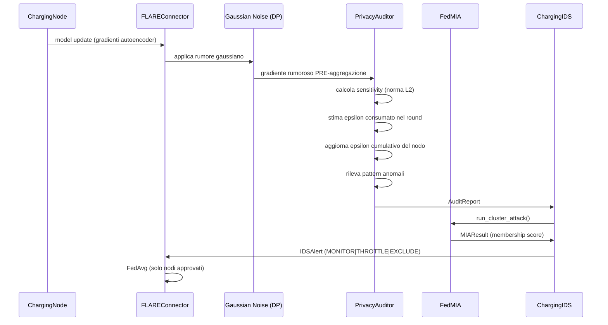

# ChargeShield-FL — Privacy Auditor

## Ruolo

Il PrivacyAuditor è il **punto di intercettazione** del framework.

NON è una difesa — è lo strumento che:
1. Cattura i gradienti dei nodi **prima** dell'aggregazione
2. Misura il rischio di membership inference
3. Passa i risultati al ChargingIDS per la decisione finale

Il contributo scientifico del PrivacyAuditor è misurare
**quanto i dati di sessione EV sono vulnerabili a FedMIA**
in funzione dell'epsilon di Differential Privacy consumato.

---

## Posizione nel flusso FL



---

## Cosa misura

### Sensitivity
La sensitivity misura quanto il gradiente di un nodo
può influenzare il modello aggregato.

Calcolata come **norma L2** del gradiente appiattito:
sensitivity = ||gradiente||₂ = sqrt(Σ wᵢ²)
**Interpretazione:**
- Sensitivity alta → il nodo ha memorizzato fortemente i dati
- Memorizzazione forte → alta vulnerabilità a FedMIA
- Sensitivity anomalmente bassa → possibile tentativo di evasione

### Epsilon consumato
Stima l'epsilon di Differential Privacy consumato nel round.
epsilon_round = sensitivity / max_grad_norm

epsilon_cumulative += epsilon_round
Questa è una stima semplificata (Gaussian Mechanism).
La calibrazione completa con composizione avanzata
arriva nella Sprint 5.

### Privacy score
Misura la privacy residua del nodo rispetto al budget totale:
privacy_score = max(0.0, 1.0 - epsilon_cumulative / epsilon_budget)
- **1.0** → budget intatto, massima privacy
- **0.0** → budget esaurito, nodo ad alto rischio MIA

---

## AuditReport

Prodotto per ogni nodo, per ogni round FL,
**prima** che i gradienti vengano aggregati.

| Campo | Tipo | Descrizione |
|-------|------|-------------|
| `node_id` | str | Nodo analizzato |
| `round_id` | int | Round FL corrente |
| `privacy_score` | float | Privacy residua [0.0, 1.0] |
| `epsilon` | float | Epsilon consumato in questo round |
| `threats_detected` | list | Pattern anomali rilevati |
| `metadata` | dict | Sensitivity, epsilon cumulativo, budget |

### Esempio AuditReport
```python
AuditReport(
    node_id="highway-01",
    round_id=5,
    privacy_score=0.72,
    epsilon=0.08,
    threats_detected=[],
    metadata={
        "sensitivity": 0.42,
        "cumulative_epsilon": 0.28,
        "epsilon_budget": 1.0,
        "budget_exhausted": False,
    }
)
```

---

## Pattern anomali rilevati

| Pattern | Condizione | Significato | Azione IDS |
|---------|------------|-------------|------------|
| `GRADIENT_EXPLOSION` | sensitivity > max_grad_norm × 10 | Possibile model poisoning | EXCLUDE |
| `PRIVACY_BUDGET_NEAR_EXHAUSTION` | epsilon_cum > budget × alert_threshold | Nodo vicino al limite MIA | THROTTLE |
| `PRIVACY_BUDGET_EXHAUSTED` | epsilon_cum >= budget | Nodo ad alto rischio MIA | EXCLUDE |
| `FEDMIA_SUSPICIOUS_LOW_SENSITIVITY` | sensitivity < 1e-6 | Possibile evasione dell'auditor | MONITOR |

Il PrivacyAuditor **rileva** i pattern — il ChargingIDS **decide** l'azione.

---

## Relazione con FedMIA

Il PrivacyAuditor è il punto di ingresso per FedMIA.

PrivacyAuditor               FedMIA

─────────────────            ─────────────────────────

intercetta gradiente    →    riceve gradiente

calcola sensitivity     →    usa sensitivity come feature

produce AuditReport     →    ChargingIDS chiama run_cluster_attack()

calcola membership score [0.0, 1.0]

produce MIAResult

FedMIA usa il shadow model addestrato su ACN-Data pubblico
per confrontare il gradiente target e inferire la membership.

---

## Relazione con Differential Privacy

La DP è la **contromisura** al PrivacyAuditor + FedMIA.

Nodo → gradiente → [DP: +rumore gaussiano] → PrivacyAuditor → FedMIA

L'ordine è fondamentale:
1. DP aggiunge rumore **prima** dell'intercettazione
2. Il PrivacyAuditor vede il gradiente già rumoroso
3. FedMIA tenta l'inferenza sul gradiente rumoroso

La ricerca misura come epsilon (intensità del rumore DP)
influenza il membership score di FedMIA:

epsilon alto → poco rumore → FedMIA efficace → alta vulnerabilità

epsilon basso → molto rumore → FedMIA meno efficace → bassa utilità

Questo trade-off **privacy/utility** è il cuore dei Case Studies
pianificati nella Sprint 5.

---

## Configurazione

Tutti i parametri sono in `config/auditor.yaml`:

```yaml
auditor:
  dp:
    mechanism: Gaussian
    epsilon: 1.0          # budget totale di privacy
    delta: 1.0e-5         # probabilità di fallimento DP
    max_grad_norm: 1.0    # soglia gradient clipping
  attacks:
    - FedMIA              # attacchi abilitati
  alert_threshold: 0.7   # soglia per PRIVACY_BUDGET_NEAR_EXHAUSTION
```

---

## Uso nel framework

```python
from src.auditor.privacy_auditor import PrivacyAuditor

auditor = PrivacyAuditor(config_path="config/auditor.yaml")

# Per ogni nodo, per ogni round FL, PRE-aggregazione:
report = auditor.audit(
    node_id="highway-01",
    round_id=5,
    model_update=gradient_dict,
)

print(report.privacy_score)       # 0.72
print(report.epsilon)              # 0.08
print(report.threats_detected)    # []
print(report.metadata["sensitivity"])  # 0.42

# Epsilon cumulativo per un nodo:
eps = auditor.get_cumulative_epsilon("highway-01")

# Reset tra esperimenti:
auditor.reset()
```

---

## Metriche per il paper

| Metrica | Descrizione | Dove |
|---------|-------------|------|
| Privacy score per round | Traccia la deriva della privacy nel tempo | `AuditReport.privacy_score` |
| Epsilon cumulativo | Budget consumato per nodo | `get_cumulative_epsilon()` |
| Sensitivity distribution | Distribuzione della norma L2 per cluster | `AuditReport.metadata` |
| Threat frequency | Frequenza dei pattern anomali per round | `threats_detected` |

---

## Riferimenti

- Shokri et al., *Membership Inference Attacks Against ML Models*,
  IEEE S&P 2017
- Nasr et al., *Comprehensive Privacy Analysis of Deep Learning*,
  IEEE S&P 2019
- Dwork & Roth, *Algorithmic Foundations of Differential Privacy*, 2014
- Carlini et al., *Membership Inference Attacks From First Principles*,
  IEEE S&P 2022

