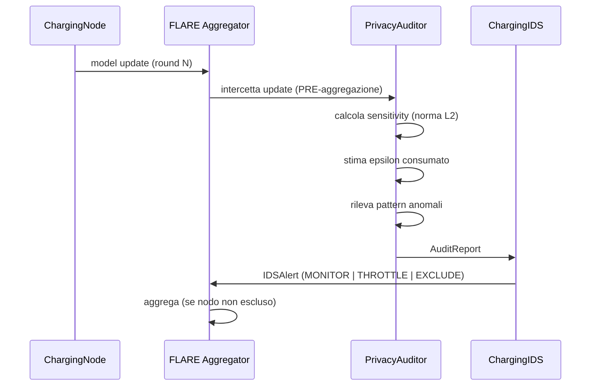

# Privacy Auditor — Membership Inference Attacker

## Ruolo

Il Privacy Auditor NON è una difesa.
È lo strumento con cui un avversario tenta di inferire
se un campione specifico è stato usato nel training di un nodo FL.

Questo approccio — simulare l'attaccante — permette di:
1. Misurare la vulnerabilità reale del sistema
2. Calibrare le contromisure (DP, IDS)
3. Produrre risultati riproducibili per il paper

## Flusso

## AuditReport

Prodotto per ogni nodo, per ogni round FL.

| Campo | Tipo | Descrizione |
|-------|------|-------------|
| `node_id` | str | Nodo analizzato |
| `round_id` | int | Round FL corrente |
| `privacy_score` | float | 1.0=privacy intatta, 0.0=budget esaurito |
| `epsilon` | float | Epsilon consumato in questo round |
| `threats_detected` | list | Minacce rilevate |
| `metadata` | dict | Sensitivity, epsilon cumulativo, budget |

## Minacce rilevate

| Minaccia | Condizione | Azione consigliata |
|----------|------------|-------------------|
| `GRADIENT_EXPLOSION` | sensitivity > max_grad_norm × 10 | EXCLUDE |
| `PRIVACY_BUDGET_NEAR_EXHAUSTION` | epsilon > alert_threshold | THROTTLE |
| `PRIVACY_BUDGET_EXHAUSTED` | epsilon >= budget | EXCLUDE |
| `FEDMIA_SUSPICIOUS_LOW_SENSITIVITY` | sensitivity < 1e-6 | MONITOR |

## Configurazione

Vedi `config/auditor.yaml` per tutti i parametri configurabili:
- `dp.epsilon`: budget totale di privacy
- `dp.delta`: probabilità di fallimento DP
- `dp.max_grad_norm`: soglia per gradient clipping
- `alert_threshold`: soglia per gli alert
- `attacks`: lista attacchi abilitati

## Relazione con FedMIA (Sprint 4)

Il PrivacyAuditor è il punto di intercettazione.
FedMIA (`src/plugins/attacks/fedmia.py`) implementerà
l'attacco completo descritto in Shokri et al. (IEEE S&P 2017).

## Riferimenti

- Shokri et al., "Membership Inference Attacks Against ML Models", IEEE S&P 2017
- Dwork & Roth, "Algorithmic Foundations of Differential Privacy", 2014
- Nasr et al., "Comprehensive Privacy Analysis of Deep Learning", IEEE S&P 2019
