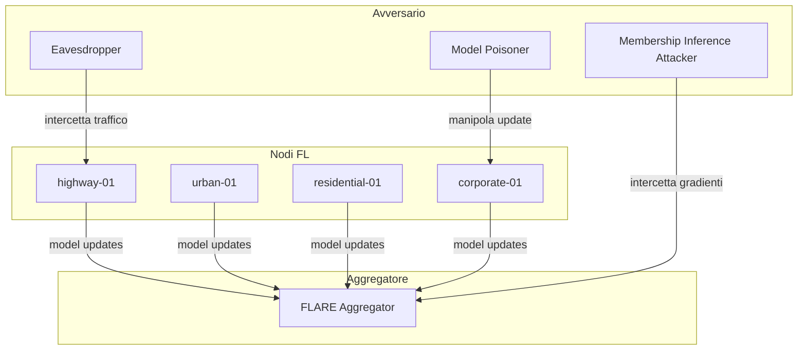

# ChargeShield-FL — Threat Model

## Scenario

Framework di Federated Learning per reti di colonnine di ricarica EV.
12 nodi distribuiti in 4 cluster (Highway, Urban, Residential, Corporate).
Ogni nodo addestra un modello locale su dati di sessione di ricarica.
Un aggregatore centrale raccoglie i model update e produce un modello globale.

## Assunzioni

- Il server aggregatore è **trusted** (non è un avversario)
- I nodi possono essere **semi-honest** o **malicious**
- La rete di comunicazione è **non trusted** (intercettabile)
- I dati di training sono **privati** e non devono essere inferibili dai gradienti
- La connettività dei nodi può essere **intermittente**

## Superficie di attacco

## Attacchi considerati

### 1. Membership Inference Attack (MIA) — Priorità ALTA
**Cosa fa:** Un avversario analizza i model update per inferire
se un campione specifico è stato usato nel training di un nodo.

**Modulo:** `src/auditor/privacy_auditor.py` + `src/plugins/attacks/fedmia.py` (Sprint 4)

**Rischio:** Alto — i dati di sessione di ricarica contengono
informazioni sensibili (utenti, orari, localizzazione).

**Contromisura:** Differential Privacy nel layer FL (`src/flare/`)

---

### 2. Model Poisoning — Priorità MEDIA
**Cosa fa:** Un nodo malicious invia gradienti manipolati
per degradare il modello globale o inserire backdoor.

**Segnale:** Gradient explosion (norma L2 >> max_grad_norm)

**Modulo:** `src/ids/charging_ids.py` (Sprint 4)

**Contromisura:** IDS con rilevamento anomalie sui gradienti

---

### 3. Byzantine Fault — Priorità MEDIA
**Cosa fa:** Un nodo si comporta in modo arbitrario
(crash, corruzione dati, comportamento erratico).

**Modulo:** `src/ids/charging_ids.py` (Sprint 4)

**Contromisura:** Aggregazione robusta (FedMedian, Krum)

---

### 4. Eavesdropping — Priorità BASSA
**Cosa fa:** Un avversario intercetta il traffico tra nodi e aggregatore.

**Contromisura:** mTLS tra nodi e aggregatore (layer Containerlab, Sprint 3)

---

### 5. Connettività intermittente — Priorità BASSA
**Cosa fa:** Un nodo si disconnette durante un round FL,
causando aggregazioni incomplete o asimmetriche.

**Modulo:** `src/nodes/charging_node.py` (stato DISCONNECTED, Sprint 3)

**Contromisura:** Round FL asincroni con timeout configurabile

## Difese implementate per Sprint

| Sprint | Difesa | Modulo |
|--------|--------|--------|
| 3 | Membership Inference Auditing | `src/auditor/privacy_auditor.py` |
| 3 | AbstractIDS interface | `src/ids/base_ids.py` |
| 3 | mTLS (infrastruttura) | `containerlab/` |
| 4 | FedMIA attacco completo | `src/plugins/attacks/fedmia.py` |
| 4 | ChargingIDS difesa concreta | `src/ids/charging_ids.py` |
| 4 | Differential Privacy | `src/flare/` |

## Non in scope

- Attacchi fisici alle colonnine
- Compromissione del server aggregatore
- Side-channel attacks sull'hardware
