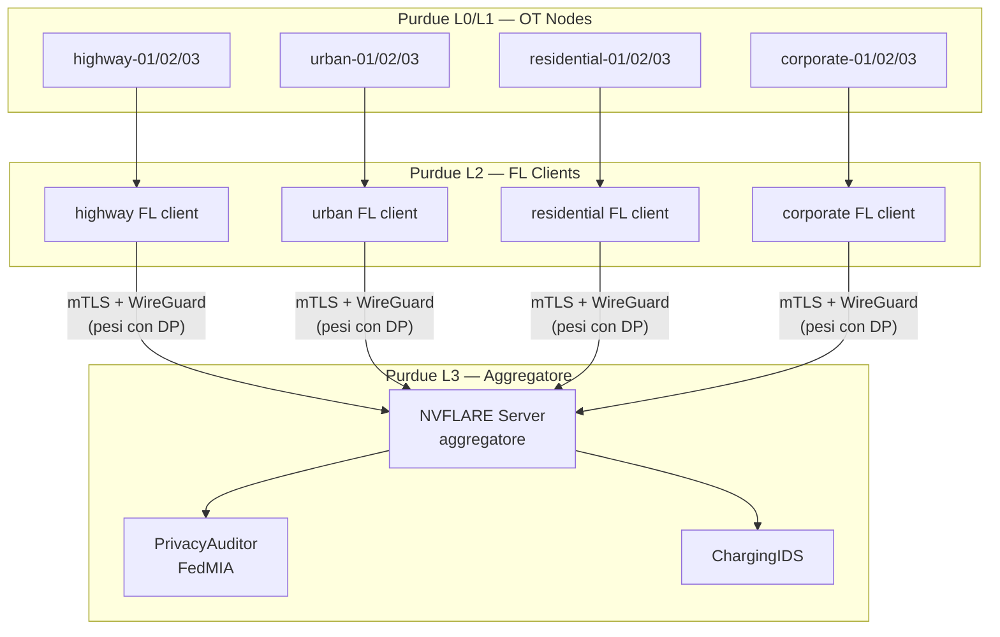
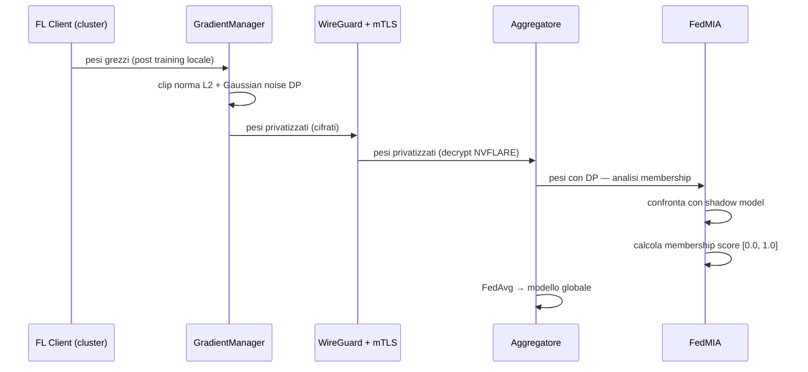

# ChargeShield-FL — Threat Model

## Scope e contributo scientifico

ChargeShield-FL studia la vulnerabilità delle reti FL per colonnine EV
agli attacchi di **Membership Inference (MIA)**.

Il contributo principale è:

> Dimostrare che i dati di sessione di ricarica EV sono vulnerabili
> alla membership inference tramite analisi dei gradienti FL,
> e misurare questa vulnerabilità in un contesto OT reale —
> **anche in presenza di Differential Privacy**.

Le difese implementate (Krum, Cosine Similarity, CUSUM) sono
**baseline di confronto** — non il contributo principale.

---

## Scenario

Rete FL di 12 colonnine EV in 4 cluster (highway, urban, residential,
corporate). Ogni cluster ha un FL client che addestra un autoencoder
locale su dati di sessione. Un aggregatore centrale raccoglie i model
update e produce un modello globale via FedAvg/FedProx.

---

## Assunzioni

- I nodi FL client sono **semi-honest** — seguono il protocollo FL
  senza deviazioni, ma il loro operatore può osservare i dati locali
- Il server aggregatore è **honest-but-curious** (Scenario 1):
  rispetta il protocollo NVFLARE ma analizza i gradient update
  ricevuti per inferire membership
- Il canale di rete è **cifrato** — WireGuard + mTLS proteggono
  i pesi in transito; un attaccante esterno vede solo traffico cifrato
- I dati di training sono **privati** — le sessioni di ricarica
  contengono informazioni sensibili su utenti, orari, localizzazione
- **FedMIA opera sui pesi dopo decrypt e con DP applicato** —
  vede pesi privatizzati da GradientManager, non pesi grezzi

---

## Attacco principale — Membership Inference Attack (MIA)

### Descrizione

L'aggregatore honest-but-curious (Scenario 1) riceve i gradient update
da tutti i cluster, li decifra (NVFLARE gestisce mTLS) e — prima di
aggregarli — li analizza tramite FedMIA per inferire se una specifica
sessione EV era nel training set di un nodo.

**Perché è rilevante per le colonnine EV:**

I dati di sessione rivelano:
- Quando un utente usa il veicolo (orari)
- Dove si trova (location della colonnina)
- Quanto percorre (energy/SoC)
- Pattern comportamentali (charging_mode, durata)

Un attacco MIA riuscito espone questi dati anche senza accesso
diretto al dataset — e **anche con DP applicato**.

### Flusso dell'attacco (Scenario 1 — Aggregatore curioso)

**Nota critica:** FedMIA vede pesi **già privatizzati da DP**.
Questo è lo scenario peggiore per l'attaccante — e il più
realistico. L'esperimento misura quanto MIA sia ancora efficace
nonostante DP.

### Scenari attacco

**Scenario 1 — Aggregatore curioso (implementato)**
- Attaccante = aggregatore NVFLARE
- Vede tutti i gradient update di tutti i cluster
- Non genera alert IDS (comportamento legittimo sul protocollo)
- FedMIA opera sui pesi post-decrypt, post-DP

**Scenario 2 — Client curioso (future work)**
- Attaccante = un FL client che vuole inferire dati di altri client
- Vede solo il modello globale aggregato
- Attacco più difficile: meno informazioni disponibili
- Non implementato in questa versione

### Fasi dell'attacco FedMIA

1. **Shadow model training** — addestra un autoencoder su dati
   pubblici ACN-Data (stessa distribuzione del target)
2. **Calibrazione** — calcola errori di ricostruzione di riferimento
   per campioni members e non-members
3. **Ricezione pesi** — l'aggregatore riceve i pesi privatizzati (DP)
   dai cluster dopo decrypt mTLS
4. **Membership score** — confronta l'errore di ricostruzione
   del target con i riferimenti calibrati → score [0.0, 1.0]
5. **Cluster analysis** — confronta il membership score del nodo
   con la media del cluster per rilevare deviazioni

### Metriche di valutazione

| Metrica | Descrizione |
|---|---|
| `membership_score` | Probabilità di membership [0.0, 1.0] |
| `confidence` | Distanza dalla soglia di decisione |
| `cluster_deviation` | Scostamento dal membership score medio del cluster |
| `AUC-ROC` | Performance complessiva dell'attacco |
| `ε vs AUC-ROC` | Privacy/utility trade-off (curva principale del paper) |

### Perché WireGuard + mTLS non sono sufficienti

WireGuard e mTLS proteggono il **canale di trasporto** — cifrano
i pesi in transito. Ma l'aggregatore li deve decriptare per
aggregarli. A quel punto, FedMIA li vede in chiaro (con DP).

La catena di difesa corretta è quindi:
DP (GradientManager)  →  mTLS  →  WireGuard

protegge i pesi       protegge il canale

dal MIA interno        dall'attaccante esterno

Nessuna delle due da sola è sufficiente.

---

## Difese baseline — Contesto di confronto

### CUSUM — Deriva statistica
**Modulo:** `src/ids/charging_ids.py` → `CUSUMDetector`
Rileva derive nel membership score e nella loss dei nodi nel tempo.
**Parametri:** threshold=5.0, drift=0.5
**Riferimento:** Page, *Continuous Inspection Schemes*, Biometrika 1954

### Krum — Byzantine Fault Detection
**Modulo:** `src/ids/charging_ids.py` → `KrumDetector`
Identifica nodi con gradienti geometricamente isolati dal cluster.
**Garanzia:** robusto a f Byzantine su n nodi, con n ≥ 2f+3
**Riferimento:** Blanchard et al., *Byzantine Tolerant SGD*, NeurIPS 2017

### Cosine Similarity — Model Poisoning Detection
**Modulo:** `src/ids/charging_ids.py` → `GradientAnalyzer`
Rileva gradienti con direzione anomala rispetto al cluster.
**Soglia:** cosine < 0.85 → sospetto

---

## Case Studies (Sprint 5/6)
### CS1 — JPL Network: epsilon vs AUC-ROC
Misura la vulnerabilità MIA su 13,073 sessioni reali ACN-Data JPL
(acndata_sessions_2019.json + acndata_sessions_2020.json).
FedMIA opera sui pesi post-DP dell'aggregatore.
Shadow model addestrato su 50% delle sessioni (members),
valutato su 100% (members + non-members) → AUC-ROC.
**Domanda:** A quale epsilon FedMIA diventa statisticamente
non migliore del random (AUC-ROC → 0.5)?
**Variabili:** ε ∈ {0.1, 0.5, 1.0, 2.0, 5.0}
**Status:** 🔄 Primo run in corso — 100 round, ε=1.0

### CS2 — Multi-Cluster Heterogeneous
Misura il membership score FedMIA su cluster con pattern diversi
(dati non-IID: highway DC 150kW vs residential AC 7kW).

**Domanda:** Il membership score varia tra cluster con
distribuzione di dati molto diversa?

### CS3 — DP vs No-DP
Confronto diretto FedMIA con DP attiva (proximal_mu=0.01, ε=1.0)
vs FedMIA senza DP (ε=∞).

**Domanda:** Quanto DP riduce l'AUC-ROC di FedMIA?
FedProx migliora o peggiora la privacy rispetto a FedAvg?

---

## Non in scope

- Attacchi fisici alle colonnine
- Compromissione del server aggregatore (assume honest-but-curious)
- Side-channel attacks sull'hardware
- Model poisoning come attacco principale
- Scenario 2 (client curioso) — future work
- Intercettazione di rete esterna (WireGuard + mTLS la rendono non praticabile)

---

## Riferimenti

- Shokri et al., *Membership Inference Attacks Against ML Models*,
  IEEE S&P 2017
- Nasr et al., *Comprehensive Privacy Analysis of Deep Learning*,
  IEEE S&P 2019
- Dwork & Roth, *Algorithmic Foundations of Differential Privacy*, 2014
- Blanchard et al., *Byzantine Tolerant SGD*, NeurIPS 2017
- Page, *Continuous Inspection Schemes*, Biometrika 1954
- McMahan et al., *Communication-Efficient Learning*, AISTATS 2017
- Li et al., *Federated Optimization in Heterogeneous Networks*,
  MLSys 2020 — FedProx
