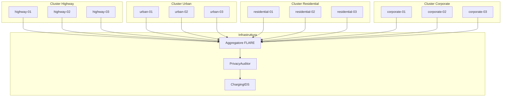
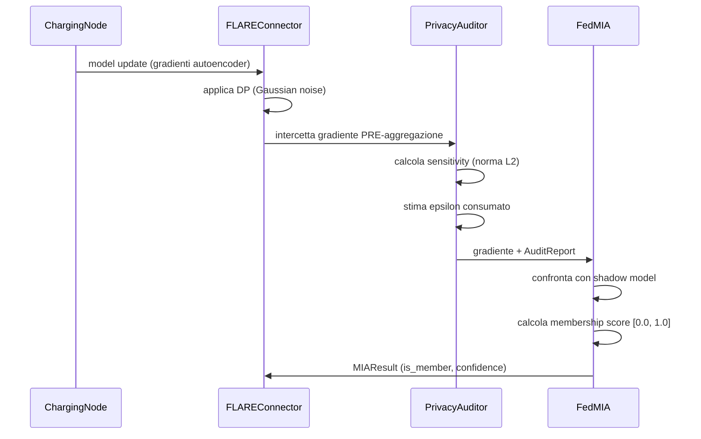
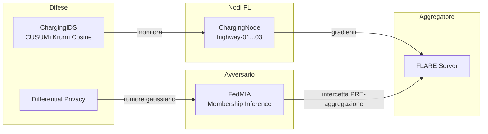

# ChargeShield-FL — Threat Model

## Scope e contributo scientifico

ChargeShield-FL studia la vulnerabilità delle reti FL per colonnine EV
agli attacchi di **Membership Inference (MIA)**.

Il contributo principale è:
> Dimostrare che i dati di sessione di ricarica EV sono vulnerabili
> alla membership inference tramite analisi dei gradienti FL,
> e misurare questa vulnerabilità in un contesto OT reale.

Le difese implementate (Krum, Cosine Similarity, CUSUM) sono
**baseline di confronto** — non il contributo principale.
Servono a misurare quanto FedMIA sia efficace anche in presenza
di difese state-of-the-art.

---

## Scenario

Rete FL di 12 colonnine EV distribuite in 4 cluster.
Ogni nodo addestra un autoencoder locale su dati di sessione di ricarica.
Un aggregatore centrale raccoglie i model update e produce un modello globale.

---

## Assunzioni

- Il server aggregatore è **trusted**
- I nodi sono **semi-honest** — seguono il protocollo ma
  un avversario può osservare i loro gradienti
- La rete di comunicazione è **non trusted** — i gradienti
  possono essere intercettati prima dell'aggregazione
- I dati di training sono **privati** — le sessioni di ricarica
  contengono informazioni sensibili su utenti, orari, localizzazione
- La connettività dei nodi può essere **intermittente**

---

## Attacco principale — Membership Inference Attack (MIA)

### Descrizione
Un avversario osserva i model update (gradienti) dei nodi FL
e tenta di inferire se un campione specifico è stato usato
nel training di un nodo.

**Perché è rilevante per le colonnine EV:**
I dati di sessione di ricarica rivelano:
- Quando un utente usa il veicolo (orari)
- Dove si trova (location della colonnina)
- Quanto percorre (energy/SoC)
- Pattern comportamentali (charging_mode, durata)

Un attacco MIA riuscito espone questi dati privati
anche senza accesso diretto al dataset.

### Implementazione nel framework
**Modulo:** `src/plugins/attacks/fedmia.py` → `FedMIA`
**Intercettazione:** `src/auditor/privacy_auditor.py` → `PrivacyAuditor`

### Fasi dell'attacco FedMIA
1. **Shadow model training** — addestra un autoencoder
   su dati pubblici ACN-Data (stessa distribuzione del target)
2. **Calibrazione** — calcola errori di riferimento per
   campioni membri e non membri
3. **Intercettazione** — cattura i gradienti PRE-aggregazione
4. **Membership score** — confronta l'errore di ricostruzione
   del gradiente target con i riferimenti calibrati
5. **Cluster analysis** — confronta il membership score del nodo
   con la media del cluster per rilevare anomalie

### Metriche di valutazione
- **Membership score** [0.0, 1.0] — probabilità di membership
- **Confidence** — distanza dalla soglia di decisione
- **Cluster deviation** — quanto il nodo si discosta dal cluster
- **AUC-ROC** — performance complessiva dell'attacco (Sprint 5)
- **Privacy/Utility trade-off** — epsilon vs AUC-ROC (Sprint 5)

### Contromisura
**Differential Privacy (Gaussian Mechanism)**
Aggiunge rumore gaussiano N(0, σ²) ai gradienti PRIMA
dell'intercettazione. Rende l'inferenza più difficile
al costo di una riduzione dell'utilità del modello.

Implementato in: `src/flare/flare_connector.py` → `_add_gaussian_noise()`
Calibrazione completa: Sprint 5

---

## Difese baseline — Contesto di confronto

Le seguenti difese sono implementate come **baseline di confronto**
per misurare l'efficacia di FedMIA in presenza di protezioni
state-of-the-art. Non sono il contributo principale del framework.

### CUSUM — Deriva statistica
**Modulo:** `src/ids/charging_ids.py` → `CUSUMDetector`

Rileva derive nel privacy score ed epsilon di ogni nodo nel tempo.
Utile come primo livello di detection prima di applicare FedMIA.

**Parametri:** threshold=5.0, drift=0.5
**Riferimento:** Page, *Continuous Inspection Schemes*, Biometrika 1954

### Krum — Byzantine Fault Detection
**Modulo:** `src/ids/charging_ids.py` → `KrumDetector`

Identifica nodi con gradienti geometricamente isolati dal cluster.
Usato come baseline per confrontare l'efficacia di FedMIA
rispetto a un detector puramente geometrico.

**Garanzia:** robusto a f Byzantine su n nodi, con n >= 2f+3
**Riferimento:** Blanchard et al., *Byzantine Tolerant SGD*, NeurIPS 2017

### Cosine Similarity — Model Poisoning Detection
**Modulo:** `src/ids/charging_ids.py` → `GradientAnalyzer`

Rileva gradienti con direzione anomala rispetto al cluster.
Complementare a Krum — rileva poisoning che Krum può non vedere.

**Soglia:** cosine < 0.3 → sospetto

---

## Superficie di attacco

---

## Case Studies pianificati

### CS1 — JPL Network (Sprint 5)
Misura la vulnerabilità MIA su 13,073 sessioni reali ACN-Data JPL.
Domanda: quanto è vulnerabile un nodo JPL con diversi valori di epsilon?

### CS2 — Multi-Cluster Heterogeneous (Sprint 5)
Misura il membership score FedMIA su cluster con pattern diversi.
Domanda: il membership score varia tra Highway (DC, 150kW)
e Residential (AC, 7kW)?

### CS3 — Adversarial Simulation (Sprint 5)
Simula FedMIA con e senza Differential Privacy attiva.
Domanda: epsilon=1.0 è sufficiente a rendere FedMIA inefficace?

---

## Non in scope

- Attacchi fisici alle colonnine
- Compromissione del server aggregatore
- Side-channel attacks sull'hardware
- Model poisoning come attacco principale
  (implementato solo come baseline difensiva)

---

## Riferimenti

- Shokri et al., *Membership Inference Attacks Against ML Models*,
  IEEE S&P 2017
- Nasr et al., *Comprehensive Privacy Analysis of Deep Learning*,
  IEEE S&P 2019
- Dwork & Roth, *Algorithmic Foundations of Differential Privacy*, 2014
- Blanchard et al., *Byzantine Tolerant SGD*, NeurIPS 2017
- Page, *Continuous Inspection Schemes*, Biometrika 1954
- McMahan et al., *Communication-Efficient Learning*, AISTATS 2017
