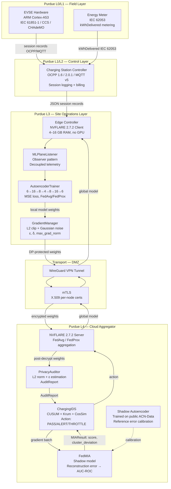
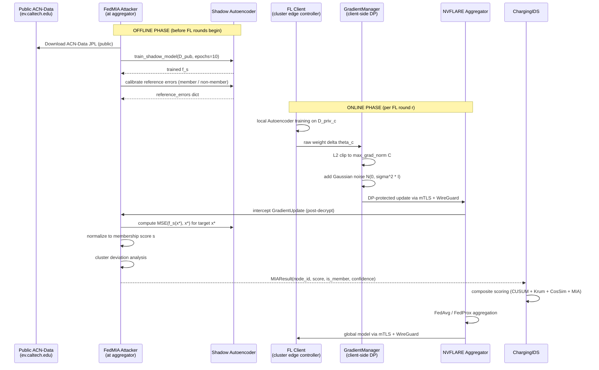

# ChargeShield-FL — Threat Model and Privacy Analysis

**Version:** 1.0.0 | **Status:** DSN 2027 Submission Draft | **Date:** 2026-06-26

---

## Abstract

ChargeShield-FL is a research framework for empirically evaluating the effectiveness of Membership Inference Attacks (MIA) against Federated Learning (FL) systems deployed in Electric Vehicle (EV) charging infrastructure. The scientific contribution is neither a new FL algorithm nor a new privacy mechanism: it is a **realistic, modular, and fully reproducible methodology for quantifying the privacy/utility trade-off under Differential Privacy in an Operational Technology (OT) context**. Unlike prior MIA evaluations conducted on generic image or medical datasets with idealized threat models, ChargeShield-FL models the exact physical, protocol, and computational stack of a real EV charging deployment — including OCPP 1.6/2.0.1 and MQTT v5 signaling layers, edge hardware constraints, and the ACN-Data JPL 2019+2020 dataset of 13,073 real sessions.

This document defines: (i) the formal threat model governing adversarial assumptions and capabilities; (ii) the system model including all participants, protocols, and data flows; (iii) the privacy sensitivity of EV charging data and its legal status under EU and US law; (iv) the FedMIA attack algorithm and its theoretical justification; (v) the Differential Privacy countermeasure and its formal parameterization; (vi) the experimental case studies that constitute the empirical core of the paper; and (vii) an explicit enumeration of out-of-scope threats with motivations for each exclusion.

The central research question is: *for what values of the privacy budget ε does Differential Privacy sufficiently degrade the AUC-ROC of a shadow-model MIA, and at what cost to autoencoder reconstruction utility?* This question is non-trivial in the OT setting because the global FL model serves a safety-critical function (anomaly detection for EV charging faults), and degrading its utility has operational consequences that do not arise in purely academic benchmarks.

---

## 1. EV Data Sensitivity and Legal Linkability

### 1.1 Why EV Charging Sessions Are Uniquely Privacy-Sensitive

Electric vehicle charging session data occupies a peculiar position in the taxonomy of IoT telemetry: it is simultaneously mundane (a record of energy transfer) and deeply personal (a precise behavioral trace tied to a physical vehicle, a natural person, a location, and a time). The ACN-Data JPL dataset used in ChargeShield-FL consists of real charging sessions recorded at the Jet Propulsion Laboratory campus in Pasadena, California. Each raw session record captures `userID`, `stationID`, `connectionTime`, `disconnectTime`, `doneChargingTime`, `kWhDelivered`, `kWhRequested`, `minutesAvailable`, and pilot signal data. From this set of fields, six training features are derived: `total_energy_kwh`, `max_power_kw`, `kwh_requested`, `minutes_available`, `hour_of_day`, and `duration_hours`.

The following table enumerates the privacy-sensitive inferences that a well-resourced adversary can extract from this feature set, even in its aggregated and de-identified form.

| Inferred Attribute | Source Field(s) | Sensitivity Level | Attack Vector |
|---|---|---|---|
| Home/work anchor location | `stationID`, cluster assignment | **Critical** | Station ID directly identifies a physical address; cluster membership (Highway, Urban, Residential, Corporate) narrows geolocation to site type |
| Daily schedule and working hours | `hour_of_day`, `duration_hours` | **High** | Residential overnight sessions imply the EV owner is home at night; corporate daytime sessions imply presence at workplace 9–17h |
| Vehicle range and approximate daily travel distance | `total_energy_kwh`, `kwh_requested` | **High** | `kwh_requested` reveals the State of Charge (SoC) at plug-in; combined with battery capacity (inferable from `max_power_kw` and vehicle model), reveals how far the vehicle drove since last charge |
| Socioeconomic status and work flexibility | `minutes_available`, session duration | **Medium** | Multi-hour availability during business hours implies flexible or remote work arrangements; very short sessions imply commuter profile |
| Behavioral regularity and predictability | `hour_of_day`, `duration_hours` across multiple sessions | **Critical** | Longitudinal pattern analysis reveals daily routine with sub-hour precision; predictable patterns enable physical surveillance targeting |
| Vacation / travel absence | Absence of residential overnight sessions | **High** | Gap detection in charging history infers multi-day absence, directly usable for burglary risk assessment |
| Vehicle make and approximate model year | `max_power_kw` (AC/DC limit) | **Low–Medium** | Maximum AC power of 7.4 kW implies Level 2 AC onboard charger; DC charging at 50–150 kW implies CCS2 or CHAdeMO; combined with `kWhDelivered`, constrains vehicle battery size to a narrow range |

The combination of even a subset of these inferences constitutes a **behavioral fingerprint** that is unique to an individual with high probability, even when explicit identifiers (`userID`, `stationID`) have been removed. This is a classical re-identification problem: Sweeney (2002) demonstrated that 87% of US individuals are uniquely identified by ZIP code, date of birth, and gender; analogous arguments apply to the `(cluster, hour_of_day, duration_hours)` triple for charging data.

### 1.2 Legal Linkability Under EU and US Law

**European Union.** Under the General Data Protection Regulation (GDPR, Regulation 2016/679), personal data is defined as "any information relating to an identified or identifiable natural person." A charging session record linked to a vehicle registration number — which is required for billing authentication in OCPP — is personal data under Article 4(1). Recital 26 explicitly clarifies that pseudonymized data (e.g., hashed `userID`) remains personal data if re-identification is "reasonably likely using all the means reasonably likely to be used" — a standard easily met by a utility operator or cloud aggregator with access to vehicle registration databases. Article 9 further classifies data revealing patterns of religious practice (inferred from Friday-night Residential sessions followed by Saturday-morning absence) or political association (inferred from location proximity to political venues) as special category data.

The Article 29 Working Party Opinion 05/2014 on anonymization techniques explicitly warns against the use of k-anonymity alone for mobility data, citing the uniqueness of trajectory-based records. EV session data, while not GPS trajectory data, exhibits the same uniqueness properties due to the bounded set of charging locations available in an urban area.

**United States.** The California Privacy Rights Act (CPRA, 2020) and its predecessor CCPA classify "precise geolocation data" (within 1852 meters) as sensitive personal information. EV charging station locations are publicly known; a session record confirming vehicle presence at a specific station constitutes precise geolocation disclosure. Additionally, the FTC Act Section 5 prohibition on unfair or deceptive practices has been applied to IoT data aggregators that disclosed behavioral patterns without user consent (FTC v. Wyndham, 3rd Cir. 2015).

**Practical implication for ChargeShield-FL.** Because EV session data is legally personal data in the jurisdictions most relevant to EV deployment, any FL model trained on such data is subject to data protection obligations. A successful MIA against that model — confirming that a specific session was used in training — constitutes a privacy breach under both GDPR and CPRA, even if the underlying dataset was anonymized prior to training. This legal exposure is the ultimate motivation for the empirical evaluation of DP as a countermeasure in ChargeShield-FL.

### 1.3 Why This Sensitivity Motivates Differential Privacy as Countermeasure

The fundamental guarantee of ε-Differential Privacy [Dwork 2006] is that the output distribution of a mechanism M on a dataset D is indistinguishable from its output on any neighboring dataset D' (differing by one record) to within a multiplicative factor e^ε. In the MIA context, this guarantee directly bounds the attacker's ability to distinguish "member" from "non-member" based on the model output: if the model was trained with ε-DP, the attacker's advantage over random guessing is bounded by e^ε − 1 [Yeom et al. 2018].

This bound is the formal bridge between the legal sensitivity of EV data (Sections 1.1–1.2) and the empirical privacy evaluation (Sections 8–9). The key open question — and the primary contribution of ChargeShield-FL — is how tight this theoretical bound is in practice for the specific combination of architecture (Autoencoder), aggregation protocol (FedAvg/FedProx), dataset (ACN-Data JPL), and infrastructure (NVFLARE 2.7.2 with OCPP/MQTT heterogeneous clients).

---

## 2. System Model

### 2.1 System Participants

The ChargeShield-FL system comprises the following logical participants, each with a defined role, trust level, and software realization.

**FL Clients (one per cluster, four total).** Each cluster is represented by a single NVFLARE 2.7.2 client process running on an edge controller at Purdue Level 3. The client holds a private local dataset of EV charging sessions partitioned from ACN-Data JPL. It trains a local Autoencoder model, applies the GradientManager Differential Privacy mechanism (gradient clipping + Gaussian noise), and transmits the protected weight update to the FL server over mTLS. The client is assumed semi-honest: it follows the FL protocol but its data is private and is never transmitted directly.

**FL Server / Aggregator (one, central).** The NVFLARE 2.7.2 server runs at Purdue Level 4 (cloud/datacenter). It receives DP-protected weight updates from all clients at each round, performs FedAvg or FedProx aggregation, and distributes the global model. The aggregator is the **principal subject of the honest-but-curious attacker model** in Scenario 1: it follows the protocol faithfully but is assumed to analyze received gradient updates using shadow-model inference.

**PrivacyAuditor.** A monitoring component co-located with the aggregator. It intercepts gradient updates post-decryption (the aggregator must decrypt to aggregate; PrivacyAuditor observes at this point), computes L2 norms, estimates epsilon consumed per round using the Gaussian mechanism formula, and issues AuditReport objects to the IDS.

**ChargingIDS.** The Intrusion Detection System, co-located with the aggregator. Applies CUSUM drift detection, Krum Byzantine fault detection, cosine similarity alignment analysis, and FedMIA membership inference scoring to incoming gradient updates. Returns a per-node action (PASS / ALERT / THROTTLE) based on the composite score.

**FedMIA.** The shadow-model MIA attacker module. Trained offline on the public ACN-Data JPL split, calibrated against reference reconstruction errors, and applied at each round to score incoming gradient updates for membership. FedMIA is simultaneously the **subject of study** (the attack being evaluated) and a **component of ChargingIDS** (providing membership scores as one signal among several).

**MLPlaneListener (observer pattern).** A transversal logical layer that crosses the Purdue Model from Level 0 to Level 3. The ML Plane is not a network protocol: it is an observer-pattern interface that decouples telemetry producers (EVSE, CSC, Edge Controller) from telemetry consumers (FL client trainer, IDS, PrivacyAuditor). Any component implementing `MLPlaneListener` receives ML-relevant events without coupling to the specific transport (OCPP, MQTT, or direct function call).

### 2.2 Cluster Configuration

Each of the four FL clients corresponds to a distinct physical cluster with its own communication protocol, power class, and behavioral data distribution. The heterogeneity of clusters is deliberate: it creates a realistic non-IID data distribution that challenges FedAvg and motivates the evaluation of FedProx.

| Cluster | Protocol | Charging Mode | Max Power | Nodes | Typical Session Profile |
|---|---|---|---|---|---|
| `highway` | OCPP 1.6 | DC Fast Charging | 150 kW | highway-01, -02, -03 | Short duration (20–45 min), high energy (30–80 kWh), high SoC deficit, daytime or evening |
| `urban` | OCPP 1.6 | AC Level 2 | 22 kW | urban-01, -02, -03 | Medium duration (1–4 h), medium energy (5–20 kWh), mixed hours, opportunistic charging |
| `residential` | MQTT v5 | AC Level 1/2 | 7 kW | residential-01, -02, -03 | Long duration (6–10 h), lower energy (5–14 kWh), overnight (22h–07h), high regularity |
| `corporate` | OCPP 2.0.1 | DC Level 2 | 50 kW | corporate-01, -02, -03 | Medium duration (1–3 h), medium–high energy (10–40 kWh), daytime (08h–18h), high regularity |

The highway cluster uses OCPP 1.6 because high-power DC fast chargers were standardized before OCPP 2.0.1 was finalized. The residential cluster uses MQTT v5 because residential chargers in smart home ecosystems often integrate with MQTT brokers (e.g., Home Assistant, OpenEVSE) rather than full OCPP stacks. The corporate cluster uses OCPP 2.0.1, reflecting the more recent procurement cycle of enterprise charging infrastructure.

This protocol heterogeneity is operationally realistic and has privacy implications: OCPP 2.0.1 includes ISO 15118 Plug & Charge (PnC) support, which cryptographically binds the vehicle identity to the charging session at the protocol level, making de-identification harder than in OCPP 1.6.

### 2.3 Dataset: ACN-Data JPL 2019+2020

The dataset used for all experiments is ACN-Data JPL, collected at the Jet Propulsion Laboratory workplace charging deployment in Pasadena, California. The dataset is publicly available at `ev.caltech.edu` and has been used in multiple prior publications [Lee et al. 2019].

- **Total sessions:** 13,073 (combined 2019 + 2020 cohorts)
- **Raw features available:** `userID`, `stationID`, `connectionTime`, `disconnectTime`, `doneChargingTime`, `kWhDelivered`, `kWhRequested`, `minutesAvailable`, pilot signal columns
- **Features used in ChargeShield-FL (6):**

| Feature | Origin | Description |
|---|---|---|
| `total_energy_kwh` | Raw (`kWhDelivered`) | Total energy delivered in the session |
| `max_power_kw` | Raw (pilot signal × 240V ÷ 1000) | Maximum power rate achieved |
| `kwh_requested` | Raw (`kWhRequested`) | Energy requested by the vehicle at plug-in |
| `minutes_available` | Raw (`minutesAvailable`) | Time window declared available by user |
| `hour_of_day` | Derived (`connectionTime.hour`) | Hour of connection, 0–23 |
| `duration_hours` | Derived (`disconnectTime − connectionTime`) | Total session duration in hours |

The identifiers `userID` and `stationID` are excluded from the feature set. However, as discussed in Section 1.1, the six derived features are sufficient for behavioral fingerprinting, justifying the privacy analysis even on this reduced feature set.

### 2.4 Infrastructure and Networking

The ChargeShield-FL testbed is built on Containerlab with Docker containers and OrbStack as the macOS container runtime. Each cluster node is a separate Docker container. The network topology is defined in a Containerlab YAML manifest with explicit links between nodes, an aggregator node, and a management plane.

Security controls at the transport layer:

- **mTLS:** All NVFLARE client–server communication uses mutual TLS with per-node X.509 certificates issued by a private CA. This ensures both server authentication (clients verify the aggregator) and client authentication (aggregator verifies each cluster).
- **WireGuard VPN:** An additional WireGuard overlay provides network-layer encryption and tunneling, creating a virtual private network that isolates the FL plane from the Containerlab management network.

Together, mTLS and WireGuard ensure that an external network adversary (Scenario 4 below) cannot intercept gradient updates in transit. Their limitations — specifically, the fact that they do not protect against the honest-but-curious aggregator — are discussed in Section 5.

### 2.5 Data Flow Diagram



---

## 3. Formal Threat Model

### 3.1 Threat Framing

This threat model adopts a Dolev-Yao-style [Dolev and Yao 1983] adversarial framework adapted for the Federated Learning setting. The Dolev-Yao model posits a network adversary with complete control over the communication channel; in the FL adaptation used here, the adversary is characterized by its **position in the system** (which components it controls or observes) and the **information it can access** at that position.

We define four attacker scenarios, ordered by increasing severity and decreasing scope of current implementation:

| Scenario | Identity | Capability Level | Status |
|---|---|---|---|
| S1 | Honest-but-curious aggregator | Sees all DP-noised gradients, trains shadow models | **Implemented** |
| S2 | Malicious FL client | Crafts gradients, performs model poisoning | Future work (Sprint 7+) |
| S3 | Compromised network gateway | Intercepts NVFLARE traffic before mTLS termination | Out of scope |
| S4 | External passive eavesdropper | Observes WireGuard/mTLS encrypted traffic | Out of scope (defeated by transport controls) |

The formalization below follows the structure of Nasr et al. [2019] for FL-specific privacy analysis.

### 3.2 Scenario 1 — Honest-But-Curious Aggregator (Implemented)

#### 3.2.1 Attacker Identity and Position

The attacker is the NVFLARE 2.7.2 server operator. In practice, this represents a cloud service provider, a utility operator's IT department, or any third-party entity entrusted with running the central aggregation server. The attacker operates at Purdue Level 4 and has full visibility of all information that flows through the aggregation point.

This is the standard and most studied adversarial model in FL privacy literature [McMahan et al. 2017; Bonawitz et al. 2017; Nasr et al. 2019]. It is practically motivated by the increasing use of third-party ML platforms (Google Cloud AI, Azure ML, AWS SageMaker) as FL aggregation backends, where the operator is contractually bound to data protection but technically capable of inspecting model updates.

#### 3.2.2 Attacker Capabilities

The attacker possesses the following capabilities, all verified against the actual ChargeShield-FL implementation:

**C1 — Full gradient visibility post-decryption.** The attacker receives `GradientUpdate` objects from all four clusters at every FL round. Each object contains: `weights` (the DP-protected model parameter delta), `node_id`, `cluster_id`, `round_num`, `n_samples`, and `metadata` (including epsilon estimate from PrivacyAuditor). The attacker sees all four updates before aggregation.

**C2 — Knowledge of FL protocol and model architecture.** The NVFLARE protocol is open-source; the model architecture (Autoencoder 6→16→8→4→8→16→6, MSE loss, PyTorch) is shared as part of the FL configuration. The attacker knows the feature set (Section 2.3), the normalization applied (MinMaxScaler), and the batch size used for local training.

**C3 — Access to public ACN-Data JPL.** The dataset is freely downloadable from `ev.caltech.edu`. The attacker can use the same dataset to train shadow models, calibrate membership thresholds, and evaluate the distribution of reconstruction errors for member vs. non-member samples.

**C4 — Shadow model training capability.** The attacker can instantiate a shadow Autoencoder with the same architecture as the target model and train it on the public ACN-Data split. This shadow model is used to calibrate reference reconstruction errors (see Section 6).

**C5 — Aggregator-class compute resources.** The attacker's infrastructure (the aggregator server) is assumed to have server-class CPU resources (Intel Xeon or AMD EPYC class), sufficient RAM for shadow model training on 13,073 sessions (well within 16 GB), and no GPU requirement (the Autoencoder is small enough for CPU inference).

**C6 — Post-DP gradient access only.** Critically, the attacker sees gradient updates **after** the GradientManager has applied L2 clipping and Gaussian noise. The DP mechanism is applied at the client, before transmission; the aggregator never observes the raw (pre-noise) gradients. This is the adversarially weakest position for MIA — the DP noise degrades the membership signal — and therefore represents a realistic lower bound on MIA effectiveness.

#### 3.2.3 Attacker Limitations

The attacker **cannot** perform the following:

**L1 — Cannot access raw training data.** The private dataset at each cluster edge controller never leaves the device. The NVFLARE protocol transmits only model weight deltas, not data records.

**L2 — Cannot observe pre-noise gradients.** GradientManager applies clipping and noise locally before any network transmission. The aggregator observes only the DP-protected output.

**L3 — Cannot modify the global aggregated model in a targeted way.** Any modification to the aggregation output would constitute Scenario 2 (malicious aggregator), which is a distinct and out-of-scope threat.

**L4 — Cannot break transport encryption.** WireGuard + mTLS are assumed computationally secure. The attacker does not have the private keys of FL client certificates.

**L5 — Cannot distinguish sub-node contributions.** Each cluster submits one aggregated gradient update representing all three physical nodes within the cluster. The attacker cannot determine which of the three nodes in a cluster contributed a specific session.

**L6 — Cannot determine DP parameters precisely.** The values of ε, δ, and `max_grad_norm` are configuration parameters held by each FL client. The aggregator may estimate epsilon from the received gradient norms (via PrivacyAuditor's epsilon estimation), but cannot determine the precise values.

#### 3.2.4 Observation Points

The attacker observes the system at the following points:

- **Post-mTLS decryption, pre-aggregation:** The primary observation point. The NVFLARE server decrypts the TLS payload and deserializes the `GradientUpdate` object. At this point, weight tensors are available as floating-point arrays.
- **Post-aggregation global model:** The attacker also observes the aggregated global model after FedAvg/FedProx. This provides a weaker signal (gradients from all clients are mixed) but could be used for white-box attacks on the global model.
- **NVFLARE metadata:** Round number, `n_samples` per client, and any PrivacyAuditor metadata included in the `GradientUpdate`.

#### 3.2.5 Trust Assumptions for Scenario 1

The honest-but-curious aggregator makes the following behavioral commitments that distinguish it from a fully malicious aggregator:

- **Follows the FL protocol:** Aggregation is performed correctly using FedAvg or FedProx; the global model is broadcast faithfully to all clients.
- **Does not inject or modify gradient updates:** The attacker does not alter the gradients before or after aggregation.
- **Does not communicate findings to FL clients:** The inference results are used only internally; the attacker does not expose them through a side channel visible to clients.

These constraints reflect the "honest-but-curious" (or "semi-honest") threat model standard in the MPC and FL literature [Goldreich 2004; Kairouz et al. 2021]. They are appropriate for modeling a service provider who is contractually constrained from data misuse but technically capable of it.

### 3.3 Scenario 2 — Malicious FL Client (Future Work)

A malicious FL client — one of the four cluster edge controllers — deviates from the FL protocol to perform one or more of the following attacks:

**Gradient poisoning:** Crafting gradient updates that, when aggregated with honest updates, steer the global model toward a targeted misclassification or anomaly detection failure.

**Model replacement attack:** Scaling poisoned gradients by a factor γ > 1 to overcome the diluting effect of averaging with honest updates [Bhagoji et al. 2019].

**Data inference via global model:** Using the global model received after each round to perform gradient inversion [Geiping et al. 2020] against other clients' data — a curiosity attack between clients rather than server-client.

**Status:** This scenario is not implemented in the current ChargeShield-FL release. It is planned for Sprint 7+ as an extension. The primary motivation for deferral is analytical: the FedProx proximal term (proximal_mu = 0.01) limits gradient deviation, but the extent of its protection against sophisticated poisoning has not been analytically characterized for the Autoencoder architecture.

### 3.4 Scenario 3 — Compromised Network Gateway (Out of Scope)

A compromised WireGuard gateway or mTLS termination point would allow an attacker to observe gradient updates in plaintext before the NVFLARE server processes them. This is a network-layer attack, not an ML-layer attack.

**Rationale for exclusion:** This scenario requires compromising the network infrastructure, which is outside the threat surface ChargeShield-FL is designed to study. The framework assumes a correctly deployed and maintained WireGuard + mTLS stack. Network-layer compromise is addressed by infrastructure security hardening (certificate rotation, network segmentation, intrusion detection at the network layer) that is outside the scope of an ML privacy framework. If an attacker has compromised the gateway, the appropriate response is to revoke certificates and re-provision the infrastructure — not to deploy stronger DP. This distinction is important: DP is a defense against the *authorized aggregator* learning too much from its authorized access, not against *unauthorized access* to the communication channel.

### 3.5 Scenario 4 — External Passive Eavesdropper (Out of Scope, Defeated by Transport Controls)

A passive network adversary observing packets on the WireGuard/mTLS channel obtains only ciphertext. WireGuard uses ChaCha20-Poly1305 for bulk encryption and Curve25519 for key exchange, providing 128-bit security against known attacks. NVFLARE's mTLS uses TLS 1.3 with ECDHE key agreement. Both mechanisms provide forward secrecy: compromise of long-term keys does not retroactively expose past session traffic.

The correct mental model for the full defense stack is therefore:

| Layer | Threat Defeated | Threat Remaining |
|---|---|---|
| WireGuard VPN | External eavesdropper, traffic analysis | Aggregator-level inspection |
| mTLS with client certs | Man-in-the-middle, impersonation | Aggregator-level inspection |
| Differential Privacy | Honest-but-curious aggregator MIA | Utility degradation at low ε |
| Secure aggregation (not implemented) | Honest-but-curious aggregator (full) | Communication overhead, complexity |

---

## 4. Trust Assumptions

### 4.1 Per-Component Trust Level

| Component | Trust Level | Behavioral Commitment |
|---|---|---|
| FL Clients (all 4 clusters) | Semi-honest | Follow NVFLARE protocol; local data never leaves edge controller; DP applied before transmission |
| FL Server / Aggregator | Honest-but-curious | Aggregates correctly; performs shadow model MIA on received gradients; does not modify protocol |
| WireGuard + mTLS transport | Trusted | Cryptographically secure; forward secrecy; no key compromise assumed |
| ACN-Data JPL (public) | Publicly available | Same dataset used for training is available to attacker for shadow model; no access control |
| GradientManager (DP mechanism) | Trusted implementation | Gaussian noise and L2 clipping are correctly implemented; no backdoor in the DP code path |
| NVFLARE 2.7.2 | Trusted protocol implementation | No vulnerability in NVFLARE itself; aggregation protocol is correct |
| PrivacyAuditor | Trusted monitor | Correctly estimates L2 norms and epsilon; no false reporting |

### 4.2 Key Trust Assumption Justifications

**Why the aggregator is "honest-but-curious" rather than "malicious."** A fully malicious aggregator could inject backdoored global models, selectively exclude clients, or fabricate PrivacyAuditor reports. These attacks are detectable through external auditing (clients can verify the global model's behavior on held-out test data) and fall outside the MIA threat surface. The ChargeShield-FL evaluation specifically targets the privacy leakage inherent in the honest execution of the FL protocol — a scenario that is present even when the aggregator has no malicious intent and the system operates exactly as designed.

**Why ACN-Data is treated as attacker-accessible.** ACN-Data JPL is freely downloadable from `ev.caltech.edu` with no access controls. It has been cited in dozens of peer-reviewed publications. Assuming the attacker cannot access it would be unrealistic and would artificially inflate the apparent privacy guarantee of DP. ChargeShield-FL conservatively assumes the attacker uses the maximum information available — a standard adversarial assumption in cryptography.

**Why GradientManager is treated as trusted.** Assuming the DP mechanism is correctly implemented is standard practice in the applied DP literature. Auditing the correctness of DP implementations is a separate research problem [Jagielski et al. 2020] outside the scope of ChargeShield-FL.

---

## 5. Why mTLS and WireGuard Are Necessary But Not Sufficient

### 5.1 The Gradient Leakage Problem

The existence of privacy leakage through model gradients is well-established in the literature. Phong et al. [2018] demonstrated that gradient updates in distributed learning can be directly reversed to recover training data under certain conditions. Zhu et al. [2019] showed that exact reconstruction of training images is possible from gradients in small batch sizes using optimization-based attacks. Geiping et al. [2020] extended this to show that high-fidelity reconstruction is possible even with large batches and gradient aggregation.

In the tabular domain relevant to ChargeShield-FL, the situation is somewhat different: exact record reconstruction is harder than in the image domain because tabular features are lower-dimensional and their gradient signals are less structured. However, Membership Inference — the weaker question of whether a specific record was in the training set — is demonstrably easier and was shown to be feasible against FL models by Nasr et al. [2019] using white-box gradient access.

The key insight is that **gradients carry information about training data because they are computed as derivatives of a loss function evaluated on that data.** For an Autoencoder trained on EV session records, the weight updates encode, implicitly, the reconstruction residuals of each training sample. A model that has memorized a training sample will have near-zero reconstruction error on it; a shadow model trained on the same data distribution will exhibit a similar pattern, enabling membership scoring without direct gradient inversion.

### 5.2 Why Transport Encryption Does Not Address Gradient Leakage

mTLS and WireGuard protect the **communication channel** — they prevent an adversary who cannot decrypt the channel from reading the gradients. But the adversary in Scenario 1 is the aggregator, who has the decryption key by definition. The aggregator must decrypt the TLS session to read the `GradientUpdate` payload; this is a protocol requirement, not an implementation choice.

Formally: let E_K(θ_DP) denote the mTLS-encrypted gradient update. The aggregator holds key K and computes θ_DP = D_K(E_K(θ_DP)) trivially. The encryption provides I(E_K(θ_DP); D_priv) = I(θ_DP; D_priv) — no reduction in mutual information between the gradient and the training data. Only the Differential Privacy mechanism, applied before encryption at the client, reduces this mutual information.

### 5.3 The Role of Differential Privacy

Differential Privacy, applied through GradientManager at the FL client before any transmission, provides the only layer of protection against the honest-but-curious aggregator. The Gaussian Mechanism adds calibrated noise to the gradient vector, reducing the signal-to-noise ratio for any downstream inference — including MIA. The formal guarantee is discussed in Section 8.

---

## 6. FedMIA Attack Description

### 6.1 Formal Problem Statement

Let D = {x_1, x_2, ..., x_N} be the full ACN-Data JPL dataset of N = 13,073 sessions. Partition D into a private training set D_priv (used by FL clients) and a held-out evaluation set D_eval (never seen during training). Let D_pub ⊆ D be the publicly available subset; since ACN-Data is entirely public, D_pub = D.

The MIA objective is formalized as: given access to the gradient update θ_c^(r) transmitted by client c at round r (after DP noise), and given access to D_pub, determine for a target sample x* ∈ D whether x* ∈ D_priv,c (the private training set of cluster c).

The attack produces a binary classifier A: (θ_c^(r), x*, D_pub) → {0, 1} with associated membership score s(x*, θ_c^(r)) ∈ [0, 1]. Performance is evaluated by AUC-ROC over a balanced test set of members and non-members.

### 6.2 Why Reconstruction Error Is a Valid MIA Signal for Autoencoders

Autoencoders exhibit a well-known generalization gap between training and non-training samples: a model trained (possibly overfitted) on a set of samples will reconstruct those samples with lower MSE than samples drawn from the same distribution but not seen during training. This gap is the basis of the reconstruction-based MIA signal.

Formally, for an Autoencoder f_θ = f_dec ∘ f_enc with encoder f_enc: R^6 → R^4 and decoder f_dec: R^4 → R^6, and for a training sample x ∈ D_priv:

    E[MSE(f_θ(x), x) | x ∈ D_priv] < E[MSE(f_θ(x'), x') | x' ∉ D_priv]

This inequality holds (in expectation) when the model generalizes imperfectly — i.e., when it has memorized aspects of the training set. The degree of this inequality determines the MIA signal strength. Differential Privacy reduces it by introducing noise that degrades the model's ability to encode memorized information in its weights.

The shadow model approach [Shokri et al. 2017] operationalizes this by training a second model (f_s, the shadow Autoencoder) on a controlled subset of D_pub for which membership is known, and using the resulting reconstruction error distributions to calibrate the membership threshold.

**Note: Two distinct FedMIA approaches in the codebase.** There are two architecturally separate MIA implementations in ChargeShield-FL, both grounded in reconstruction error but operating differently:

1. **Plugin shadow model (`src/plugins/attacks/fedmia.py`):** Used by ChargingIDS for per-node IDS evaluation. Trains a dedicated shadow Autoencoder on D_pub (the mechanism described in Sections 6.3–6.4 below). This plugin is **unchanged** and is the subject of the IDS baseline evaluation.

2. **Experiment evaluator (`scripts/run_experiments.py::run_fedmia()`):** A separate loss-based MIA evaluator used to measure per-round AUC-ROC for the experimental case studies. Following Yeom et al. [2018], this evaluator loads the global model weights (`global_weights`) from each completed FL round directly into an Autoencoder, uses that global model to compute reconstruction errors, and scores samples as `score = -MSE`. AUC-ROC is then computed via `sklearn.metrics.roc_auc_score` for each round. This evaluator does **not** use a shadow model and does not intercept per-node gradients — it reads `global_weights` from the `AggregatedUpdate` produced by FedAvg after each round.

### 6.3 Attack Algorithm

The FedMIA plugin attack (`fedmia.py`, used by ChargingIDS for per-node IDS scoring) proceeds in five phases. The experiment evaluator (`run_experiments.py::run_fedmia()`) uses a simpler loss-based approach grounded in Yeom et al. [2018]: since overfitting causes training members to have lower loss than non-members, the global model's MSE directly serves as the membership score without a shadow model (score = -MSE, AUC-ROC per round via sklearn).

The FedMIA plugin attack proceeds in five phases:

**Phase 1: Shadow Model Training — FedMIA Plugin Only (`fedmia.py`)**

*This phase applies only to the FedMIA plugin used by ChargingIDS for per-node IDS scoring. The experiment evaluator (`run_experiments.py::run_fedmia()`) does not have a shadow model training phase — it uses the FL global model directly.*

```
INPUT:  D_pub (public ACN-Data, N=13,073 sessions), shadow_epochs=10
OUTPUT: f_s (trained shadow Autoencoder, architecture 6→16→8→4→8→16→6)

Step 1. Partition D_pub into D_shadow_train (80%) and D_shadow_test (20%)
Step 2. Instantiate shadow Autoencoder f_s with same architecture as target
Step 3. Train f_s on D_shadow_train for shadow_epochs using Adam optimizer, MSE loss
Step 4. Store f_s weights to _shadow_model
```

**Phase 2: Reference Error Calibration**

```
INPUT:  f_s (shadow model), D_shadow_train, D_shadow_test
OUTPUT: reference_errors["member"], reference_errors["non_member"]

Step 1. For each x in D_shadow_train:
           compute e_member(x) = MSE(f_s(x), x)
Step 2. For each x in D_shadow_test:
           generate x_tilde = x + N(0, 0.5^2 * I)  [perturbed non-member proxy]
           compute e_non_member(x_tilde) = MSE(f_s(x_tilde), x_tilde)
Step 3. mean_e_member    = mean({e_member(x) for x in D_shadow_train})
        mean_e_non_member = mean({e_non_member(x) for x in D_shadow_test})
Step 4. Store both means in reference_errors dict
```

**Phase 3: Gradient / Weight Interception**

*For the FedMIA plugin (`fedmia.py`), gradient weights are intercepted from the per-node `GradientUpdate` at the aggregator, as described below. For the experiment evaluator (`run_experiments.py::run_fedmia()`), this phase does not intercept per-node gradients. Instead, the evaluator reads `global_weights` from the `AggregatedUpdate` object produced by FedAvg after the round is complete — it observes the global model post-aggregation, not individual client gradients.*

```
[Plugin path — FedMIA per-node IDS scoring]
INPUT:  GradientUpdate u = (weights, node_id, cluster_id, round_num, n_samples)
        [intercepted at NVFLARE aggregator, post-mTLS decrypt, post-DP noise]
OUTPUT: gradient_weights (floating-point tensor)

Step 1. Receive u from NVFLARE collect() call
Step 2. Extract u.weights
        [Note: u.weights has been processed by GradientManager:
         - L2 norm clipped to max_grad_norm C
         - Gaussian noise added: N(0, sigma^2 * I)
           where sigma = C * sqrt(2*ln(1.25/delta)) / epsilon]
Step 3. Forward gradient_weights to FedMIA.compute_membership_score()

[Evaluator path — run_experiments.py::run_fedmia() per-round AUC-ROC]
Step 1. After FedAvg completes for round r, read global_weights from AggregatedUpdate
Step 2. Load global_weights into Autoencoder instance
Step 3. Forward evaluation samples through Autoencoder; compute MSE per sample
        [Proceeds to Phase 4 evaluator path]
```

**Phase 4: Membership Score Computation**

```
[Plugin path — FedMIA plugin (fedmia.py), shadow model scoring]
INPUT:  gradient_weights, target sample x*, f_s (shadow model), reference_errors
OUTPUT: MIAResult(node_id, round_id, membership_score, is_member_predicted, confidence)

Step 1. Compute e_star = MSE(f_s(x*), x*)
           [reconstruction error of x* under shadow model]
Step 2. Normalize to membership score:
           s = (mean_e_non_member - e_star) / (mean_e_non_member - mean_e_member)
           s = clamp(s, 0.0, 1.0)
           [s → 1.0 implies low reconstruction error → likely member]
           [s → 0.0 implies high reconstruction error → likely non-member]
Step 3. Predict membership: is_member = (s > threshold)  [threshold = 0.5]
Step 4. Compute confidence: confidence = |s - 0.5| * 2.0
Step 5. Return MIAResult(node_id=u.node_id, round_id=u.round_num,
                         membership_score=s, is_member_predicted=is_member,
                         confidence=confidence)

[Evaluator path — run_experiments.py::run_fedmia(), loss-based per-round AUC-ROC]
        Following Yeom et al. [2018]: overfitted models reconstruct member samples
        with lower loss than non-member samples.
INPUT:  global_weights (loaded into Autoencoder), D_member, D_non_member
OUTPUT: per_round AUC-ROC stored in experiment JSON

Step 1. For each sample x in D_member ∪ D_non_member:
           score(x) = -MSE(Autoencoder_global(x), x)
           [higher score = lower reconstruction error = more likely member]
Step 2. Compute auc_roc = roc_auc_score(y_true, scores)  [sklearn]
Step 3. Store in output JSON: per_round[round]["auc_roc"] = auc_roc
Step 4. After all rounds: compute summary["mean_auc_roc"], ["max_auc_roc"], ["min_auc_roc"]
```

**Phase 5: Cluster-Level Deviation Analysis**

```
INPUT:  {MIAResult_i} for all nodes i in cluster c
OUTPUT: cluster_deviation per node

Step 1. s_bar_c  = mean({membership_score_i for i in cluster_c})
Step 2. sigma_c  = stddev({membership_score_i for i in cluster_c})
Step 3. For each node i in cluster_c:
           delta_i = |membership_score_i - s_bar_c| / (sigma_c + 1e-8)
Step 4. Flag nodes with delta_i > 2.0 as geometrically anomalous within cluster
```

### 6.4 Attack Sequence Diagram

**Note:** The diagram below illustrates the FedMIA plugin (`fedmia.py`), which uses a shadow model and operates per-node via the ML Plane event system. For the experiment evaluator (`run_experiments.py::run_fedmia()`), the flow is different: after each FL round completes, `run_fedmia()` reads `global_weights` from the `AggregatedUpdate`, loads them into an Autoencoder instance, performs a forward pass over the evaluation set, computes `-MSE` scores, and calls `roc_auc_score()` from sklearn. There is no shadow model, no gradient interception, and no ML Plane event subscription in the evaluator path.



### 6.5 Evaluation Protocol

The MIA evaluation follows the standard protocol established by Carlini et al. [2022]:

- **Balanced test set:** 50% members (sessions in D_priv), 50% non-members (sessions in D_eval)
- **Primary metric:** AUC-ROC (Area Under the Receiver Operating Characteristic Curve)
- **Baseline:** Random classifier produces AUC-ROC = 0.5 exactly
- **Interpretation scale:**

| AUC-ROC | Interpretation |
|---|---|
| 0.50 | MIA completely defeated; DP effective |
| 0.51–0.55 | Marginal advantage; DP largely effective |
| 0.56–0.65 | Meaningful advantage; DP partially effective |
| 0.66–0.80 | Significant advantage; DP insufficient at this ε |
| 0.81–1.00 | Near-perfect inference; DP not effective |

The preliminary result in ChargeShield-FL at ε = 1.0, δ = 1×10^−5, 100 rounds is AUC-ROC = 0.5172, placing the system in the "marginal advantage" category — consistent with DP being largely effective at ε = 1.0 for this architecture and dataset.

---

## 7. Baseline Defenses

The following detection mechanisms are implemented in ChargingIDS as **experimental baselines** — they characterize the detection surface alongside the DP countermeasure, but they are not the scientific contribution of ChargeShield-FL. Their inclusion serves two purposes: (a) they provide a richer picture of the defense landscape, enabling the paper to situate DP relative to other approaches; (b) they detect Byzantine faults that are distinct from MIA privacy leakage, providing defense-in-depth.

### 7.1 CUSUM — Cumulative Sum Statistical Drift Detection

**Module:** `src/ids/charging_ids.py` → `CUSUMDetector`

**What it detects:** Sustained statistical drift in per-node privacy metrics (epsilon estimate, L2 norm of gradient update) over successive FL rounds. CUSUM is sensitive to gradual, monotonic shifts that would not trigger a fixed-threshold alarm.

**Formal definition.** For node i with observed value v_r at round r, historical mean μ_i, drift parameter k, and threshold h:

    S_i^+(r) = max(0, S_i^+(r−1) + (v_r − μ_i) − k)
    S_i^-(r) = max(0, S_i^-(r−1) + (μ_i − v_r) − k)

Alert triggered when S_i^+(r) > h or S_i^-(r) > h. Parameters: k = 1.0 (drift sensitivity), h = 5.0 (threshold). Warm-up period = 10 rounds (calibration phase, no alerts).

**Limitations against MIA.** CUSUM detects behavioral drift in gradient statistics — it does not directly detect MIA. A perfectly honest-but-curious aggregator performing MIA does not modify its gradient statistics from the client's perspective; CUSUM would not trigger. CUSUM is therefore orthogonal to MIA detection: it is relevant for detecting clients that are gradually changing behavior (model poisoning, data drift) rather than for detecting the aggregator's inference activities.

### 7.2 Krum — Byzantine-Robust Aggregation Scoring

**Module:** `src/ids/charging_ids.py` → `KrumDetector`

**What it detects:** Geometrically isolated gradient updates — updates that are far from the cluster of other updates in weight space. Byzantine nodes (clients performing model poisoning or gradient attacks) typically produce updates that are geometrically anomalous.

**Formal definition.** For n gradient updates {g_1, ..., g_n} with Byzantine tolerance f, the Krum score of node i is:

    Krum(i) = sum over j in N_i(n−f−2) of ||g_i − g_j||^2

where N_i(n−f−2) is the set of (n−f−2) nearest neighbors of g_i in Euclidean gradient space [Blanchard et al. 2017]. Lower Krum score = more central = more likely honest. Scores are normalized to [0,1] relative to the maximum score in the round; nodes with normalized score > 0.8 are flagged.

**Theoretical guarantee:** Krum selects a Byzantine-robust aggregate when n ≥ 2f + 3. In ChargeShield-FL, intra-cluster application uses n = 3 nodes per cluster and f = 0, satisfying n = 3 ≥ 3. Cross-cluster application uses n = 4 clusters with f = 1, requiring n ≥ 5 — not satisfied; cross-cluster Krum is therefore applied only as an anomaly signal, not as a formal guarantee.

**Limitations against MIA.** Krum is not designed to detect MIA. A honest-but-curious aggregator performing shadow model inference produces no anomalous gradient updates (it does not modify any gradients). Krum is relevant for Scenario 2 (malicious client) and provides defense-in-depth against Byzantine faults.

### 7.3 Cosine Similarity — Gradient Direction Analysis

**Module:** `src/ids/charging_ids.py` → `GradientAnalyzer`

**What it detects:** Gradient updates whose direction in weight space is misaligned with the cluster consensus. A client performing model poisoning through sign-flipping or targeted backdoor injection would produce gradients with low or negative cosine similarity relative to honest peers.

**Formal definition.** For node i, average cosine similarity across all other nodes j in the cluster:

    CosSim(i) = (1/(n−1)) * sum_{j ≠ i} (g_i · g_j) / (||g_i||_2 * ||g_j||_2)

Alert threshold: CosSim(i) < 0.3. Interpretation: CosSim = 1.0 implies identical gradient direction; CosSim = 0.0 implies orthogonal; CosSim < 0 implies opposing direction.

**Limitations against MIA.** Cosine similarity measures direction, not information content. A curious aggregator performing MIA produces no gradient outputs (it only receives them). This detector is relevant only against adversarial clients, not adversarial aggregators.

### 7.4 FedMIA Integration in ChargingIDS

FedMIA is integrated into ChargingIDS as a fourth signal. When membership scores are computed (Section 6.3, Phase 4), the IDS assigns a THROTTLE action to nodes with `membership_score > 0.5` and `confidence > 0.7`. The THROTTLE action does not exclude the node from aggregation; it flags its updates for closer audit in subsequent rounds. This reflects the asymmetry between Byzantine fault detection (where exclusion is appropriate) and privacy leakage detection (where throttling and auditing are more appropriate, as the node may be an innocent victim of the aggregator's inference).

---

## 8. Differential Privacy as Primary Countermeasure

### 8.1 Formal Definition: (ε, δ)-Differential Privacy

**Definition [Dwork et al. 2006].** A randomized mechanism M: D → R satisfies (ε, δ)-Differential Privacy if for all pairs of neighboring datasets D, D' ∈ D (differing by the addition or removal of one record) and for all measurable output sets S ⊆ R:

    Pr[M(D) ∈ S] ≤ e^ε · Pr[M(D') ∈ S] + δ

The parameter ε is the privacy budget: smaller ε implies stronger privacy (and typically more noise). The parameter δ represents the probability of the guarantee failing; it is typically set to δ < 1/N for a dataset of N records, so δ = 1×10^−5 for N = 13,073.

### 8.2 The Gaussian Mechanism

ChargeShield-FL applies the Gaussian Mechanism to gradient updates. For a function f: D → R^d with L2 sensitivity Δ_2 f = max_{D,D'} ||f(D) − f(D')||_2, the Gaussian Mechanism is:

    M(D) = f(D) + N(0, σ² I)

The mechanism satisfies (ε, δ)-DP when [Dwork and Roth 2014]:

    σ ≥ Δ_2 f · sqrt(2 ln(1.25/δ)) / ε

In ChargeShield-FL's GradientManager, the L2 sensitivity is bounded by gradient clipping to `max_grad_norm` (denoted C). The noise standard deviation is therefore:

    σ = C · sqrt(2 ln(1.25/δ)) / ε

where:

- **C = `max_grad_norm`** is the L2 norm clipping threshold, bounding the sensitivity of the gradient function
- **δ** is the failure probability (δ = 1×10^−5 in the default configuration)
- **ε** is the privacy budget (the primary experimental variable in ChargeShield-FL)
- **sqrt(2 ln(1.25/δ))** is a constant factor that scales with the failure tolerance; for δ = 10^−5, this evaluates to approximately 4.85

**Numerical example.** At ε = 1.0, δ = 10^−5, C = 1.0: σ = 1.0 × 4.85 / 1.0 = 4.85. At ε = 0.1: σ = 48.5. This illustrates why strong privacy (ε = 0.1) requires very large noise, potentially dominating the gradient signal and collapsing model utility.

### 8.3 Gradient Clipping

Before noise addition, each gradient vector g ∈ R^d is clipped to ensure its L2 norm does not exceed C:

    g_tilde = g · min(1, C / ||g||_2)

Clipping is essential for two reasons: (1) it bounds the sensitivity Δ_2 f of the gradient function, enabling the Gaussian Mechanism's formal guarantee to hold; (2) it prevents outlier gradients (from unusual sessions) from dominating the update direction, which has an implicit regularization effect on model training.

**Interaction with non-IID data.** In a non-IID FL setting (which ChargeShield-FL exhibits across its four clusters), gradient norms vary substantially between clusters. The highway cluster (short, high-energy sessions) produces gradients with a different statistical profile than the residential cluster (long, low-energy overnight sessions). A fixed clipping threshold C may be suboptimal: too low clips legitimate gradient components from high-variance clusters; too high allows excessive sensitivity. This interaction is a confounding factor in the ε vs. AUC-ROC trade-off and motivates per-cluster analysis in Case Study 3.

### 8.4 Gaussian Noise Injection

After clipping, Gaussian noise is added to the clipped gradient:

    g_DP = g_tilde + N(0, σ² I),    σ = C · sqrt(2 ln(1.25/δ)) / ε

The noise is drawn independently for each parameter dimension, adding a total of d noise samples per gradient update (where d is the number of Autoencoder parameters). For the 6→16→8→4→8→16→6 architecture, d is small (order of hundreds to low thousands of parameters), keeping the computational overhead of noise injection negligible.

### 8.5 The ε vs. AUC-ROC Trade-Off: Central Research Question

The central empirical question of ChargeShield-FL is:

    AUC-ROC(ε) = FedMIA(θ_global^(R)(ε))

where θ_global^(R)(ε) is the global model after R rounds of FL with privacy budget ε. This function is expected to be monotonically decreasing in ε (weaker privacy → higher MIA success) — but the shape of the curve, particularly the "knee" where DP begins to meaningfully degrade MIA effectiveness, is non-trivial and depends on:

1. **Model architecture:** The Autoencoder's memorization capacity (controlled by the 4-dimensional bottleneck) limits how much private information is encoded in the weights.
2. **Dataset size:** Larger datasets are harder to memorize, providing some natural privacy. 13,073 sessions distributed across 4 clusters (approximately 3,268 sessions per cluster) is a moderate dataset size.
3. **Number of FL rounds:** More rounds increase the total privacy expenditure; composition theorems [Dwork et al. 2010] show that DP guarantees degrade with the number of rounds.
4. **Non-IID distribution:** Clusters with highly distinctive data distributions may be more susceptible to MIA (the model memorizes cluster-specific patterns) even under the same ε.

**Why this trade-off is non-trivial in the OT context.** In pure academic benchmarks (e.g., MIA on MNIST), model utility degradation under DP means lower classification accuracy — a metric with no real-world safety stakes. In ChargeShield-FL, the global Autoencoder serves an anomaly detection function for EV charging faults. Reconstruction error above a threshold triggers an anomaly alert. Excessive DP noise inflates reconstruction errors globally, potentially overwhelming the anomaly signal and causing false positives — or suppressing the anomaly signal entirely, causing false negatives. Either failure mode has operational consequences: false positives cause unnecessary intervention; false negatives allow charging faults (overcurrent, ground fault, communication failure) to go undetected.

The OT context therefore introduces a hard constraint on minimum acceptable model utility — a constraint absent from purely academic MIA benchmarks. ChargeShield-FL makes this constraint explicit by measuring reconstruction loss as the utility metric alongside AUC-ROC as the privacy metric.

---

## 9. Experimental Case Studies

### 9.1 Case Study CS1: Baseline MIA Without Differential Privacy

**Configuration:** ε = ∞ (no DP noise, no gradient clipping), FedAvg (proximal_mu = 0.0), 100 rounds, all 4 clusters, 13,073 sessions.

**Purpose:** Establish the **MIA upper bound** — the maximum AUC-ROC achievable by FedMIA in the absence of any privacy countermeasure. This baseline characterizes the inherent memorization of the Autoencoder architecture and the effectiveness of the shadow model approach before DP is applied. Without CS1, subsequent CS2 results have no reference point: a DP-protected system at AUC-ROC = 0.52 is meaningful only if the unprotected system shows substantially higher AUC-ROC.

**Expected result:** AUC-ROC significantly above 0.5 (exact value to be measured). The magnitude of the CS1 AUC-ROC relative to 0.5 determines the attack's baseline effectiveness and the "room" that DP has to close.

**Secondary measurements:** Reconstruction loss (MSE) on the held-out evaluation set (utility baseline), training convergence curve, per-cluster AUC-ROC (to identify which cluster is most susceptible to MIA in the absence of DP).

**Scientific role:** CS1 establishes both the empirical upper bound of the attack and the reconstruction loss lower bound (best possible utility without DP). All subsequent trade-off measurements are relative to these bounds.

### 9.2 Case Study CS2: Differential Privacy Sweep Over ε

**Configuration:** ε ∈ {0.1, 0.5, 1.0, 5.0, ∞}, δ = 1×10^−5, max_grad_norm = 1.0, FedAvg (proximal_mu = 0.0), 100 rounds.

**Purpose:** Characterize the AUC-ROC vs. ε curve — the primary empirical contribution of ChargeShield-FL. Each ε value corresponds to a different privacy/utility operating point.

| ε Value | Expected σ (noise std) | Expected AUC-ROC | Expected Reconstruction MSE |
|---|---|---|---|
| 0.1 | ≈ 48.5 (very high noise) | ≈ 0.50 (near-random) | High (utility severely degraded) |
| 0.5 | ≈ 9.7 | 0.50–0.52 (near-random) | Medium-high |
| 1.0 | ≈ 4.85 | ≈ 0.52 (confirmed preliminary) | Medium |
| 5.0 | ≈ 0.97 (low noise) | 0.55–0.65 (meaningful advantage) | Low (near-CS1 utility) |
| ∞ | 0 (no noise) | CS1 upper bound | Baseline MSE |

**Research question:** At what ε does AUC-ROC first become statistically indistinguishable from 0.5? This identifies the practical privacy threshold for the ChargeShield-FL architecture.

**Confound control:** All hyperparameters other than ε are held constant. The shadow model is re-trained independently for each ε condition to avoid calibration leakage.

**Per-round AUC-ROC measurement.** In CS2, AUC-ROC is not a single value per ε condition — it is measured for every FL round. The experiment evaluator (`run_experiments.py::run_fedmia()`) loads `global_weights` from each round's `AggregatedUpdate` into the Autoencoder, computes reconstruction errors, and calls `sklearn.metrics.roc_auc_score` per round. The experiment JSON output records `per_round[round]["auc_roc"]` for every round, plus summary statistics: `mean_auc_roc`, `max_auc_roc`, and `min_auc_roc` across all rounds. The per-round progression reflects how MIA susceptibility evolves as FL training proceeds and the global model memorizes training patterns.

**Confirmed data point:** Mean AUC-ROC ≈ 0.5172 across rounds at ε = 1.0, 100 rounds, FedAvg — marginally above random, indicating DP is largely effective at ε = 1.0 for this setting.

**Statistical analysis:** Each ε condition is run with multiple random seeds. AUC-ROC confidence intervals are computed via DeLong's method [DeLong et al. 1988]. The null hypothesis (AUC-ROC = 0.5) is tested for each condition to determine statistical significance of any privacy advantage.

### 9.3 Case Study CS3: FedProx vs. FedAvg Under MIA at Fixed ε

**Configuration:** ε = 1.0, δ = 1×10^−5, max_grad_norm = 1.0, 100 rounds, comparing:
- **FedAvg:** proximal_mu = 0.0 (standard weighted averaging, no proximal regularization)
- **FedProx:** proximal_mu = 0.01 (proximal term constrains local model deviation from global model)

**Purpose:** Characterize how the aggregation algorithm affects MIA susceptibility under DP. FedProx was proposed by Li et al. [2020] specifically to address non-IID data heterogeneity in FL; the proximal term μ ||w − w^(t)||^2 penalizes local model updates that deviate far from the global model. This regularization may reduce memorization of cluster-specific patterns and therefore reduce MIA susceptibility.

Alternatively, FedProx's convergence to a different model than FedAvg may affect reconstruction loss differently, creating a different privacy/utility trade-off curve. This is the open question that CS3 addresses.

**Hypothesis:** FedProx at proximal_mu = 0.01 produces lower per-cluster gradient variance (due to proximal regularization), which may reduce the distinctiveness of cluster gradient signatures and therefore reduce per-cluster AUC-ROC. The expected effect is small (proximal_mu = 0.01 is a weak regularizer) but measurable over 100 rounds.

**Per-cluster analysis:** CS3 includes cluster-level AUC-ROC breakdown. The non-IID property means that different clusters may respond differently to the FedAvg vs. FedProx comparison: the highway cluster (most distinctive distribution) may show the largest differential due to the proximal term constraining its otherwise large gradient deviations.

**Secondary analysis:** Reconstruction MSE comparison between FedAvg and FedProx at ε = 1.0 — does the proximal term provide better utility under DP, or does it introduce its own distortions?

---

## 10. Out-of-Scope Threats

The following threat categories are explicitly excluded from the ChargeShield-FL threat model. Each exclusion is motivated by a substantive reason — architectural (the threat does not apply to the system as designed), analytical (it would require a separate research framework), or resource (deferred to future work with a clear plan).

| Out-of-Scope Threat | Reason for Exclusion | Future Work Path |
|---|---|---|
| Physical attacks on EVSE hardware (tamper, side-channel) | Network-layer framework; physical security is addressed by hardware vendor and facility controls. Out of ML threat surface by definition. | Not planned |
| Malicious aggregator (adversarially modifies global model, Scenario 2 server-side) | Distinct from honest-but-curious model; detectable by clients via behavioral testing of global model. | Sprint 7+ |
| Model inversion attacks (recovering raw session records from weights) | Distinct from MIA; requires optimization-based gradient inversion. Harder in tabular domain (Zhu et al. 2019 results apply to images). | Future work |
| Gradient inversion attacks at large batch sizes | Gradient inversion (Zhu et al. 2019) requires very small batches; ChargeShield-FL uses batch sizes of 32+, making inversion computationally infeasible. | Not planned |
| External passive eavesdropper | Defeated by WireGuard + mTLS (Section 5). No additional ML-layer defense required. | N/A |
| Compromised network gateway (Scenario 3) | Network-layer attack, not ML-layer. Infrastructure hardening is the appropriate defense. | N/A |
| Byzantine FL clients performing model poisoning | Partially addressed by ChargingIDS Krum/CosSim as baselines. Full Byzantine robustness under DP is a separate research problem [Fang et al. 2020]. | Sprint 7+ |
| Inference attacks by curious FL clients (client-to-client, Scenario 2 client-side) | Weaker information (global model only). Planned with ElaadNL dataset for geographic diversity. | Sprint 7+ |
| OCPP/MQTT protocol payload reconstruction | Protocol-level attack; OCPP 2.0.1 TLS and MQTT v5 authentication provide transport security. | N/A |
| Long-term compositional privacy degradation (> 100 rounds) | Current evaluation is limited to 100 rounds. Rényi DP accounting [Mironov 2017] over many rounds is planned for the full paper. | Full paper |
| DP implementation correctness auditing | Auditing DP implementations [Ding et al. 2018; Jagielski et al. 2020] is a separate research problem. ChargeShield-FL assumes a correctly implemented Gaussian Mechanism. | Not planned |
| Federated learning availability attacks (DoS) | Outside the privacy threat surface. NVFLARE's fault tolerance mechanisms address availability. | N/A |
| Secure aggregation (cryptographic prevention of aggregator inspection) | Would eliminate Scenario 1 but introduces significant communication overhead. Represents a natural extension of ChargeShield-FL. | Future work |

---

## 11. Related Work

This section situates ChargeShield-FL relative to the existing literature on MIA, FL privacy, and OT security.

**Membership Inference Attacks.** Shokri et al. [2017] introduced the shadow model MIA methodology that FedMIA is based on: train a shadow model on data from the same distribution, use it to calibrate a membership classifier. Carlini et al. [2022] refined MIA methodology with rigorous statistical testing and showed that prior evaluations often overestimated MIA effectiveness due to methodological flaws (imbalanced test sets, inappropriate metrics). ChargeShield-FL follows the Carlini et al. methodology: balanced member/non-member test sets and AUC-ROC as the primary metric. Yeom et al. [2018] provided the formal connection between overfitting and MIA susceptibility, showing that generalization gap bounds MIA advantage — a result that directly motivates the use of the Autoencoder's reconstruction generalization gap as the MIA signal in Section 6.2.

**MIA Against FL Specifically.** Nasr et al. [2019] conducted the first comprehensive analysis of MIA in the FL setting, demonstrating both passive (observe gradients) and active (influence training) attacks. Their white-box gradient access scenario is the closest precedent to ChargeShield-FL's Scenario 1. However, Nasr et al. evaluated standard ML models (CNNs, MLPs) on image datasets (MNIST, CIFAR-10, Texas-100); ChargeShield-FL extends this to Autoencoders on tabular OT data, a combination not previously studied. Melis et al. [2019] demonstrated that FL clients can infer properties of other clients' training data from the shared global model, motivating the Scenario 2 client-side attack planned for future work.

**Differential Privacy in FL.** McMahan et al. [2018] introduced DP-FedAvg, the first formal application of DP to the FL protocol, using the same Gaussian Mechanism employed in ChargeShield-FL. Geyer et al. [2017] applied user-level DP to FL for mobile keyboard prediction. The key difference in ChargeShield-FL is the OT context: the utility function is anomaly detection (not prediction), and the utility constraint is safety-critical rather than merely product-quality.

**FedProx and Non-IID FL.** Li et al. [2020] proposed FedProx as an extension of FedAvg that handles non-IID data through a proximal regularization term. The evaluation of FedProx under MIA (CS3) is novel: prior work has studied FedProx's convergence properties and robustness, but not its interaction with MIA susceptibility under DP.

**Krum and Byzantine Robustness.** Blanchard et al. [2017] introduced Krum as a provably Byzantine-robust aggregation rule. Fang et al. [2020] showed that Krum and other Byzantine-robust aggregation rules are vulnerable to local model poisoning attacks that optimize gradient directions within the Byzantine threshold. ChargeShield-FL applies Krum as a detection baseline, not as a replacement for DP.

**OT Security and EV Infrastructure.** The Purdue Reference Model [Williams 1994] provides the architectural framework for OT security that ChargeShield-FL maps its components to. OCPP security guidelines [Open Charge Alliance 2020] define transport security requirements for EV charging infrastructure. Work on FL for smart grid and energy management includes He et al. [2020] and Taïk and Cherkaoui [2020], but these papers do not evaluate MIA or DP trade-offs, leaving ChargeShield-FL as the first framework to do so in the EV domain.

**EV Data Privacy.** Lee et al. [2019] published the ACN-Data dataset and demonstrated its utility for charging optimization algorithms. The privacy implications of ACN-Data and similar datasets were not analyzed in that work; ChargeShield-FL provides the first formal privacy threat model for FL models trained on EV charging session data.

---

## 12. References

[Bhagoji 2019] Bhagoji, A.N., Chakraborty, S., Mittal, P., and Calo, S. (2019). Analyzing Federated Learning through an Adversarial Lens. *Proceedings of the 36th International Conference on Machine Learning (ICML)*, pp. 634–643.

[Blanchard 2017] Blanchard, P., El Mhamdi, E.M., Guerraoui, R., and Stainer, J. (2017). Machine Learning with Adversaries: Byzantine Tolerant Gradient Descent. *Advances in Neural Information Processing Systems (NeurIPS)*, Vol. 30.

[Bonawitz 2017] Bonawitz, K., Ivanov, V., Kreuter, B., Marcedone, A., McMahan, H.B., Patel, S., Ramage, D., Segal, A., and Seth, K. (2017). Practical Secure Aggregation for Privacy-Preserving Machine Learning. *Proceedings of the 2017 ACM SIGSAC Conference on Computer and Communications Security (CCS)*, pp. 1175–1191.

[Carlini 2022] Carlini, N., Chien, S., Nasr, M., Song, S., Terzis, A., and Tramèr, F. (2022). Membership Inference Attacks From First Principles. *Proceedings of the 43rd IEEE Symposium on Security and Privacy (S&P)*, pp. 1897–1914.

[DeLong 1988] DeLong, E.R., DeLong, D.M., and Clarke-Pearson, D.L. (1988). Comparing the Areas under Two or More Correlated Receiver Operating Characteristic Curves: A Nonparametric Approach. *Biometrics*, 44(3), pp. 837–845.

[Ding 2018] Ding, Z., Wang, Y., Wang, G., Zhang, D., and Kifer, D. (2018). Detecting Violations of Differential Privacy. *Proceedings of the 2018 ACM SIGSAC Conference on Computer and Communications Security (CCS)*, pp. 475–489.

[Dolev 1983] Dolev, D. and Yao, A.C. (1983). On the Security of Public Key Protocols. *IEEE Transactions on Information Theory*, 29(2), pp. 198–208.

[Dwork 2006] Dwork, C., McSherry, F., Nissim, K., and Smith, A. (2006). Calibrating Noise to Sensitivity in Private Data Analysis. *Proceedings of the 3rd Theory of Cryptography Conference (TCC)*, Lecture Notes in Computer Science, Vol. 3876, pp. 265–284.

[Dwork 2010] Dwork, C., Rothblum, G.N., and Vadhan, S. (2010). Boosting and Differential Privacy. *Proceedings of the 51st Annual IEEE Symposium on Foundations of Computer Science (FOCS)*, pp. 51–60.

[Dwork 2014] Dwork, C. and Roth, A. (2014). The Algorithmic Foundations of Differential Privacy. *Foundations and Trends in Theoretical Computer Science*, 9(3-4), pp. 211–407.

[Fang 2020] Fang, M., Cao, X., Jia, J., and Gong, N.Z. (2020). Local Model Poisoning Attacks to Byzantine-Robust Federated Learning. *Proceedings of the 29th USENIX Security Symposium*, pp. 1605–1622.

[Geiping 2020] Geiping, J., Bauermeister, H., Dröge, H., and Moeller, M. (2020). Inverting Gradients – How easy is it to break privacy in federated learning? *Advances in Neural Information Processing Systems (NeurIPS)*, Vol. 33, pp. 16937–16947.

[Geyer 2017] Geyer, R.C., Klein, T., and Nabi, M. (2017). Differentially Private Federated Learning: A Client Level Perspective. *NIPS 2017 Workshop on Private Multi-Party Machine Learning*.

[Goldreich 2004] Goldreich, O. (2004). *The Foundations of Cryptography, Volume 2: Basic Applications*. Cambridge University Press.

[He 2020] He, Y., Huang, R., Chen, X., and Yu, T. (2020). Federated Learning for IoT Devices with Domain Generalization. *IEEE Internet of Things Journal*, 8(11), pp. 9139–9149.

[Jagielski 2020] Jagielski, M., Ullman, J., and Oprea, A. (2020). Auditing Differentially Private Machine Learning: How Private is Private SGD? *Advances in Neural Information Processing Systems (NeurIPS)*, Vol. 33.

[Kairouz 2021] Kairouz, P., McMahan, H.B., et al. (2021). Advances and Open Problems in Federated Learning. *Foundations and Trends in Machine Learning*, 14(1-2), pp. 1–210.

[Lee 2019] Lee, Z.J., Li, T., and Low, S.H. (2019). ACN-Data: Analysis and Applications of an Open EV Charging Dataset. *Proceedings of the 10th ACM International Conference on Future Energy Systems (e-Energy)*, pp. 139–149.

[Li 2020] Li, T., Sahu, A.K., Zaheer, M., Sanjabi, M., Talwalkar, A., and Smith, V. (2020). Federated Optimization in Heterogeneous Networks. *Proceedings of Machine Learning and Systems (MLSys)*, Vol. 2.

[McMahan 2017] McMahan, H.B., Moore, E., Ramage, D., Hampson, S., and Arcas, B.A. (2017). Communication-Efficient Learning of Deep Networks from Decentralized Data. *Proceedings of the 20th International Conference on Artificial Intelligence and Statistics (AISTATS)*, pp. 1273–1282.

[McMahan 2018] McMahan, H.B., Ramage, D., Talwar, K., and Zhang, L. (2018). Learning Differentially Private Recurrent Language Models. *Proceedings of the 6th International Conference on Learning Representations (ICLR)*.

[Melis 2019] Melis, L., Song, C., De Cristofaro, E., and Shmatikoff, V. (2019). Exploiting Unintended Feature Leakage in Collaborative Learning. *Proceedings of the 40th IEEE Symposium on Security and Privacy (S&P)*, pp. 691–706.

[Mironov 2017] Mironov, I. (2017). Rényi Differential Privacy of the Sampled Gaussian Mechanism. *Proceedings of the 30th IEEE Computer Security Foundations Symposium (CSF)*, pp. 263–275.

[Nasr 2019] Nasr, M., Shokri, R., and Houmansadr, A. (2019). Comprehensive Privacy Analysis of Deep Learning: Passive and Active White-box Inference Attacks against Centralized and Federated Learning. *Proceedings of the 40th IEEE Symposium on Security and Privacy (S&P)*, pp. 739–753.

[Page 1954] Page, E.S. (1954). Continuous Inspection Schemes. *Biometrika*, 41(1-2), pp. 100–115.

[Phong 2018] Phong, L.T., Aono, Y., Hayashi, T., Wang, L., and Moriai, S. (2018). Privacy-Preserving Deep Learning via Additively Homomorphic Encryption. *IEEE Transactions on Information Forensics and Security*, 13(5), pp. 1333–1345.

[Shokri 2017] Shokri, R., Stronati, M., Song, C., and Shmatikoff, V. (2017). Membership Inference Attacks Against Machine Learning Models. *Proceedings of the 38th IEEE Symposium on Security and Privacy (S&P)*, pp. 3–18.

[Sweeney 2002] Sweeney, L. (2002). k-Anonymity: A Model for Protecting Privacy. *International Journal of Uncertainty, Fuzziness and Knowledge-Based Systems*, 10(5), pp. 557–570.

[Taïk 2020] Taïk, A. and Cherkaoui, S. (2020). Electrical Fault Detection using Network Traffic and Machine Learning. *Proceedings of the 2020 IEEE 91st Vehicular Technology Conference (VTC2020-Spring)*.

[Williams 1994] Williams, T.J. (1994). The Purdue Enterprise Reference Architecture. *Computers in Industry*, 24(2-3), pp. 141–158.

[Yeom 2018] Yeom, S., Giacomelli, I., Fredrikson, M., and Jha, S. (2018). Privacy Risk in Machine Learning: Analyzing the Connection to Overfitting. *Proceedings of the 31st IEEE Computer Security Foundations Symposium (CSF)*, pp. 268–282.

[Zhu 2019] Zhu, L., Liu, Z., and Han, S. (2019). Deep Leakage from Gradients. *Advances in Neural Information Processing Systems (NeurIPS)*, Vol. 32, pp. 14774–14784.
